02001 - Alarm Machine
=====================
*Anthony Remark, AMDG*

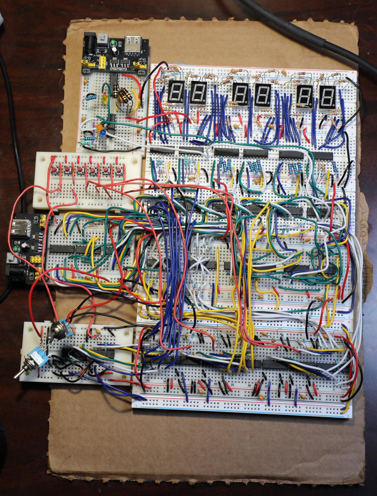

Original Schedule
-----------------
  * March 9, 2025 - RFP002 posted
  * March 16, 2025 - Proposal submitted
  * March 17, 2025 - Contract Awarded
  * March 24, 2025 - Sufficient Research and planing for selected approach completed
  * March 29, 2025 - Sourced parts for selected approach
  * April 11, 2025 - Demonstration of viable prototype
  * April 18, 2025 - Final prototype completed
  * April 25, 2025 - Documentation Complete

Abstract
--------
To be later posted

Design and Procedure
--------------------
### Setup for the Build

First thing to note is that during initial testing, we did not have different power supplys. The ICs require a constant supply of 5 volts within the tolerance range (+,- 0.25V). When we introduced the seven segment into the circuit, the diodes have a necessary voltage drop for operation (around 0.7 volts). With six seven segment displays running simultaneously, the current draw is signification enough to drop overall voltage output from the power source.

We can hypothesize that the current draw was so great enough that the source was reaching its power limit. 

Similar issue was encountered with the 03001. During construction of the motor prototype circuit, LEDs were used for testing and debugging. There was unexpected operation in the construction process that was resolved when the LEDs were removed from the circuit. It was due to the voltage drop across the LEDs. 

The solution to this predicament was simple, add another power source to power the ICs separate from the segment displays. In addition, 100nF capacitors should be placed on the power rails every 2” or so. These capacitors act like bypass capacitors for the ICs. The picture shows this.

Bypass Capacitors
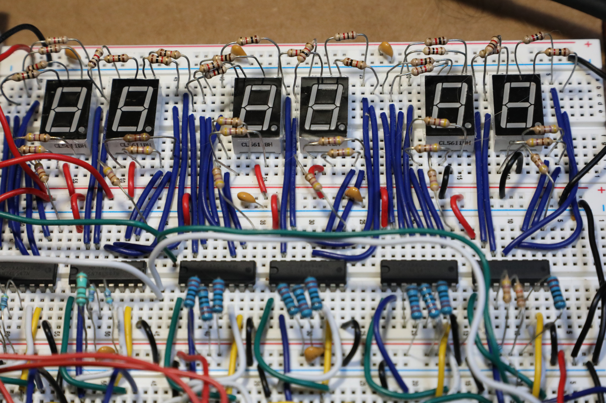

More Bypass Capacitors
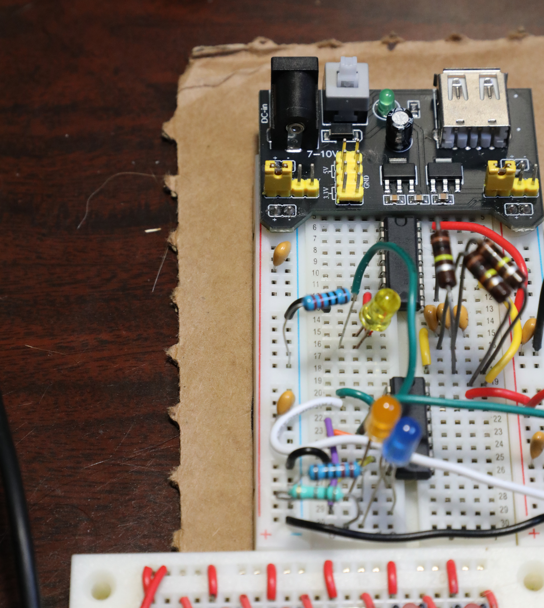

In the Schematic, bypass capacitors are in parallel to all the ICs. The bypass capacitors are used to help regulate the power to the ICs, to prevent spikes in voltage or noise to interfere with operation. While constructing the circuit, if the bypass capacitors were absent, the physical construction of the breadboards allow for significant voltage drop. Seemingly the further away from the source, the lower the voltage would become. We have observed a voltage as low as 4.5V.

### The Envisioned User Interface

The project objective was to solve for the Minimum Complexity Alarm proposal by Marian Scientific. What’s imperative is designing a device capable of relative accuracy for keeping time and for an end user to be able to select a time. 

The approach of the design was to be user friendly and simple. The Electrical team came up with a solution where the user only needs to enter a time via a push button. The Alarm would keep track of hours, minutes, and seconds. All of which are programmable by the user via a push button. 

The choice of using 7400 series and 4000 series TTL was to abstain from using complex machines such as microcontrollers in favor of simple mechanism. 

Pros and Cons (Challenges)

Pro is that we have simple mechanism that satisfies the requirements of the proposal. 

Cons (Challenges)
a microcontroller would be faster to design, a simple body of code can do the trick. But a microntroller has a lot of functionality unutilized for the Alarm-Machine. The simplicity element would be absent.

The team would require weeks of development of knowledge of Latches, Flipflips, registers, shift registers, counters, finite state machines, and combinational logic synthesis techniques. 

Developing a circuit would require a lot of time to construct and debug. 

The Idea of operation is that the user programs the time into the machine and then starts the countdown to zero.

Alarm Machine with a programmed Time:
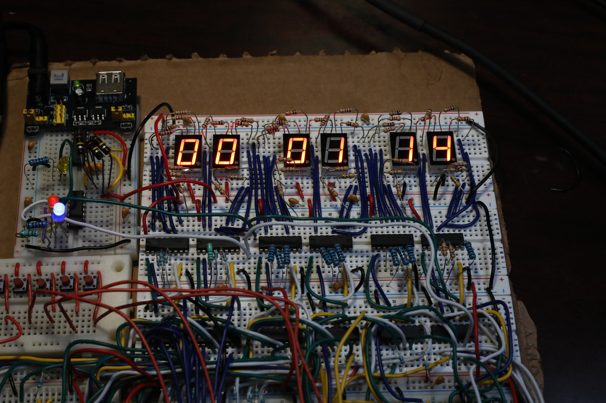

### Implementation

To accomplish the intended function, a way to countdown would be very beneficial. Fortunately there exists the 74X192 chip. 

These chips are decade counters that can be configured to count either up or down and they can be daisy chained together. They possess characteristics such as loading data, have a reset functionality. These are very attractive characteristics that are fortuitous for a functional prototype. We have outputs or inputs that are either active High or active Low. We have used either 7404 or the 74LS00 to accommodate active High or active Low features. 

Alternative Counters

74x193, these are up/down counters but with 16 states that count from 0 t o15. These can by used but would need a modification that requires more chips to load ‘9’ when counting down from ‘0’.

74x163, these are up counters with 16 states. If these had to be used, the operation of the alarm would be performed differently. Such as the alarm would need to count up to a programmed time. 

### Logisim Evolution construction and schematic

Logisim is a free digital circuit construction and editing software. Logicworks 5 is preferable but funding for a license was unavailable and logisim was serviceble. The Advantage of using Logisim (or Logicworks 5) is to test out equipment that was not available to the Electrical Innovation team. The Alternative counters were considered but not ruled out until thorough testing and small construction was performed in Logisim. 

To organize the design presentation, an approach that’s similar to the construction of the prototype will be presented. 

The presentation of the report will organize the Alarm Machine prototype into three stages that keep track of the Hours, Minutes, and Seconds respectively. 

### The Daisy Chain Design

The Daisy Chain Design as represented in the Seconds Stage:
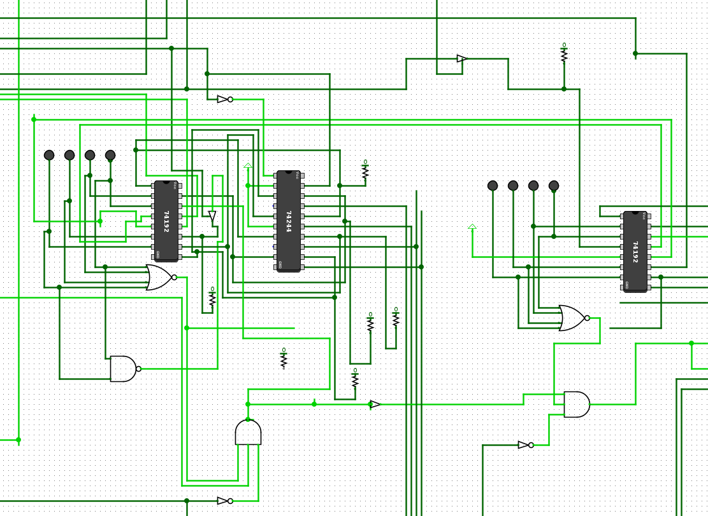

There are many moving parts that one must be aware of and consider all at once, but to start, the team needed to focus on one part at a time. Logisim was used to explore possibilities and test them out before moving on toward necessary ‘stages’ of the overall design. 

The first 74HC192 (the right-most 74192 chip) is configured to count down. To do this, we have to set pin 5, the count up position, to high (5V). And pin 4, the count down position, receives the clock signal. A chip like the 74LS163 requires all of CLK inputs to have the clock signal for synchronization. Synchronization is imperative because otherwise, certain states will be skipped. For example, when counting down from 21 to 19, the state of 20 may be skipped unless a certain configuration is applied. 

On the 74HC192 pin 13 is the Borrow output ( bar_{BO}) and pin 12 is the Carry output (bar_{CO}). These are active Low outputs but it’s irrelevant because they are connected directly to the left 74HC192 pin 4 (count down) and pin 5 (count up) respectively. This is imperative because this is how 74HC192 are cascaded (reference the internet page about the cascaded configuration). When properly cascaded (daisy chained), the configuration will countdown with the left chip acting as the tens place and the right most chip acting as the ones place. 

The operation will appears as such,
[![Countdown_Operation]](https://www.youtube.com/shorts/bH3bNMzcOzc)

The presence of the 74HC244 is fundamental in the operation of the clock. The 74HC244 is a tri-state Octal buffer and Line driver (reference the data sheet). The outputs of the 74HC244 are connected to the inputs of the left 74HC192. Specifically all of the outputs. This operation is necessary in order for the alarm to count down from 1 minute. The alarm counts down from 59 seconds. 

The 74HC244 is an output enable that translates 4 bits of data per output enable. One set of 4 bits are configured 0101 as a binary representation of 5. Pin 1 and pin 19 are active Low enables where when pin 1 is Low, the inputs to pins 2, 4, 6, and 8 are fed to output pins 18, 16, 14, and 12 respectively. Pin 19 is the active Low enable for input to pins 11, 13, 15, and 17 to be fed to output pins 9, 7, 5, and 3 respectively. If the enables are not active, then the outputs are in a hi-impedance state. 

When the countdown operation is active Pin 1 of the 74HC244 is active only. So the first data set (input pins 2, 4, 6, and 8) is fed to the output pins 18, 16, 14, and 12 which are fed to the corresponding inputs of the left 74HC192. When the simulation is running we see that the state of 5 will be loaded into the 74HC192.

Testing and Debugging with LEDs at the Seconds Stage:
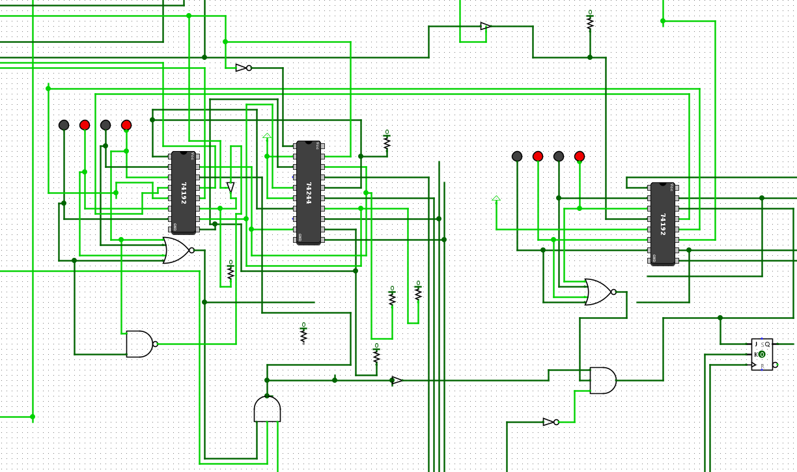

The 74HC244 has pin 18 connected to pin 9, pin 16 connected to pin 7, pin 14 connected to pin 5, and pin 12 connected to pin 3 with a pull down resistor for each pair. Each set of outputs are connected together with their corresponding significant digit. The pull down resistors prevent floating inputs to the 74HC192. The other data (without a pre loaded 0101) is configured to accept a user input. This is accomplished via a bus that accepts user inputs and loads them to all of the 74HC192. 

Seconds Stage from the Alarm Machine Schematic:
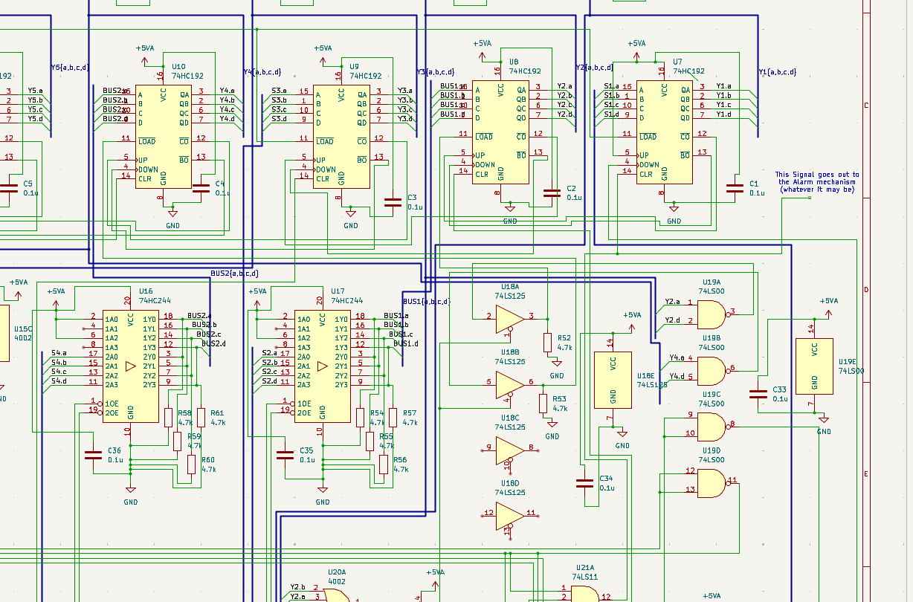

When the 74HC192 counts down, when it reaches 0 the chip restarts at state 9 (show a zoomed version of the chip 74HC192 and the 74HC244). The desired operation is for this chip to start at state 5 instead of state 9. To achieve this, output pin 3 (the least significant bit) and output pin 7 (most significant bit) are fed to a 2 input NAND gate. The output of the NAND gate is fed into a tri state buffer. The output of the tri-state buffer feeds into pin 11 (the load which is active Low). There’s a pull down resistor due to the configuration of the tri-state buffer. 

The Alarm Machine prototype has a Master Load switch and a Master Reset Switch. The 74HC244 accepts the true form of the Master Load into pin 19 (the enable for user input data to be fed) and pin 1 (enable for the pre loaded 0101) accepts the complemented Master Load form. The Master Load true form is fed into the enable of the tri-state buffer. 

So when the master load is a true High, the tri-state buffer will fed the output of the NAND gate to the Load input of the 74HC192, and the 74HC244 is then configured to feed the bit value 0101 into the bit inputs of the 74HC192. But 0101 is only loaded when the output of the 74HC192 is 1001 (state 9). this state is the default restart state when counting down. So when the countdown turns over from 0 to 9, the NAND gate outputs a Low signal, which then feeds that Low signal in the active Low Load input. Therefore 0101 is loaded into the chip. Since the primary 74HC192 Borrow out ( \bar_{BO}) is connected to pin 4 (count down) and Carry Out (\bar_{CO}) is connected to pin 5 (count up), the system has synchronization. This synchronization ensures that there’s a seamless transition from state 0 to state 5 when there’s a turnover. 

This Daisy Chain design is for the Seconds stage of the Alarm Machine prototype. The Minutes and Hour stages are very similar. 
The other stages of the Alarm Machine. 

The Seconds Stage:
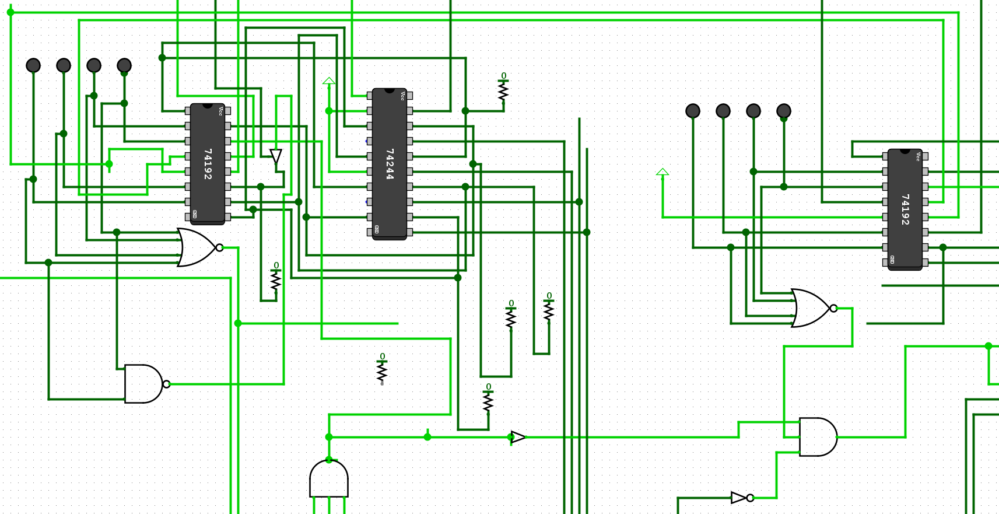

This is the first stage (seconds) of the Alarm Machine. The subsequent two stages are a copy and paste of this stage. The latter stage forgoes the 74HC244 octal tri-state buffer. One of the trickyist implementations of the Alarm Machine is to know when to cease operation of any 74HC192 in the countdown sequence.  

### Countdown Mechanism

Look at the Hours Stage of the Alarm Machine.

The Hours Stage:
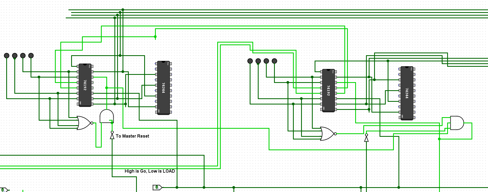

The Left 74HC192 has an output from a 2 input AND gate and goes to pin 14. Pin 14 is the clear operation (Active High) which when active, the outputs will be 0000. The AND gate ensures that Two conditions are met before the chip outputs zero (therefore ceases counting down). 

  *  The Master Reset switch is off (Low), which means the alarm is set and ready to activate when the countdown reaches zero for all the 74HC192s.

  *  All of the outputs of the 74HC192 are Low and the 4 input NOR gate goes High. This activates when the countdown goes to zero.

This functionality is commensurate with a countdown mechanism. For the subsequent 74HC192, we instead have a 3 input AND gate. The purpose is the same but the next input is the output of the 2 input AND gate. So in order to cease the countdown, the following conditions must be met:

  *  The Master Reset switch is off (Low), which means the Alarm is ready

  *  The NOR gate outputs High when the 74HC192 reaches zero.

  *  The AND gate whose output is connected to the previous 74HC192 clear input (pin 14) is HIGH. This indicates that the previous 74HC192 has finish countdown. 

There is a possible 99 hours to be programmed. Once the tenths place reaches zero, it will stay zero. Otherwise it will decrement when the ones places reaches zero and resets to nine. 

This method of operation is repeated for all the 74HC192s. 

The Minutes Stage:
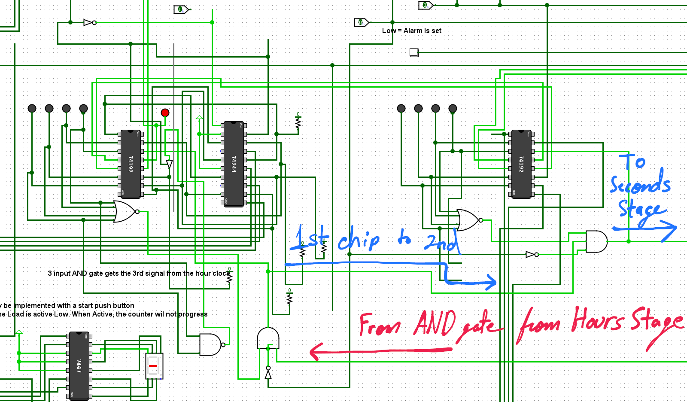

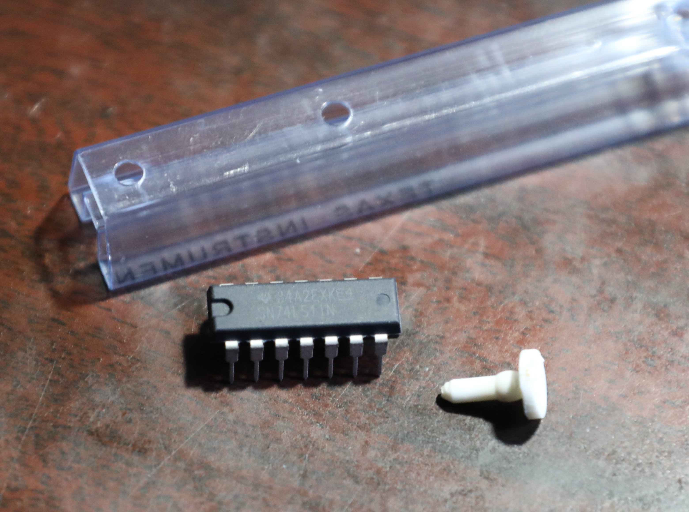

74LS11s are chosen for the 3 input AND gates. The AND gate for the tenths Hours stage is not a 2 input AND gate, so the Master Reset complemented signal is fed to two inputs of the 3 input AND gate. 

Combinational Logic Devices from the Schematic:
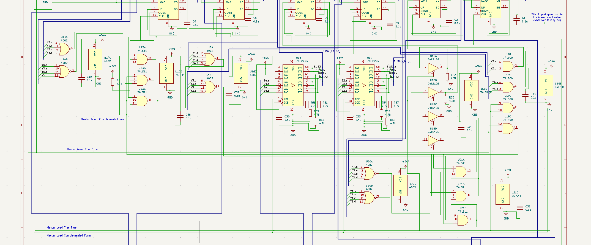

Another problems persists, which is how to load a time. What’s great about the 74HC192 is that it’s a shift register. It can load data and store it. So for the 74HC192 to load data, the data needs to get there.

### The Bus Design

There were two methods of the Alarm Machine to load time. One method is to have the user use push buttons to increment to the correct time via the 74HC192s that interface with the segment displays.

Push Buttons:
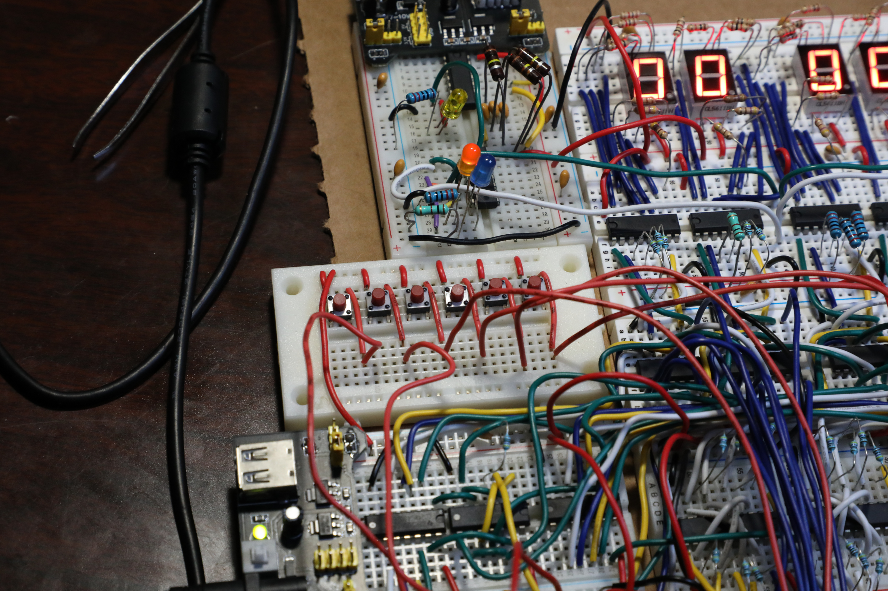

Push Buttons Represented by the Schematic:
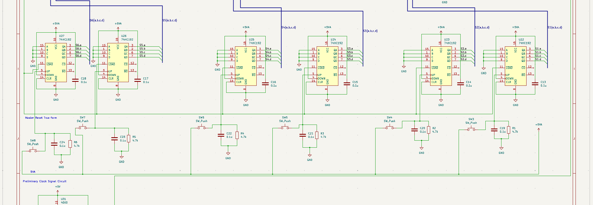

The Second method is to use a type of rotary dial to select a pre loaded time for the Alarm-Machine. To implement this, the Electrical Team has an idea to use the 74HC244 octal tri-state buffers to store the data containing the preloaded alarm times, and interface with the Buses. Possibly a demultiplexer would be used to select the 74HC244 octal tri-state buffers. Unfortunately, There are majors issues that prevented implementation of this feature and will be addressed later.

Unfinished design of the Rotary Dial Implementation:
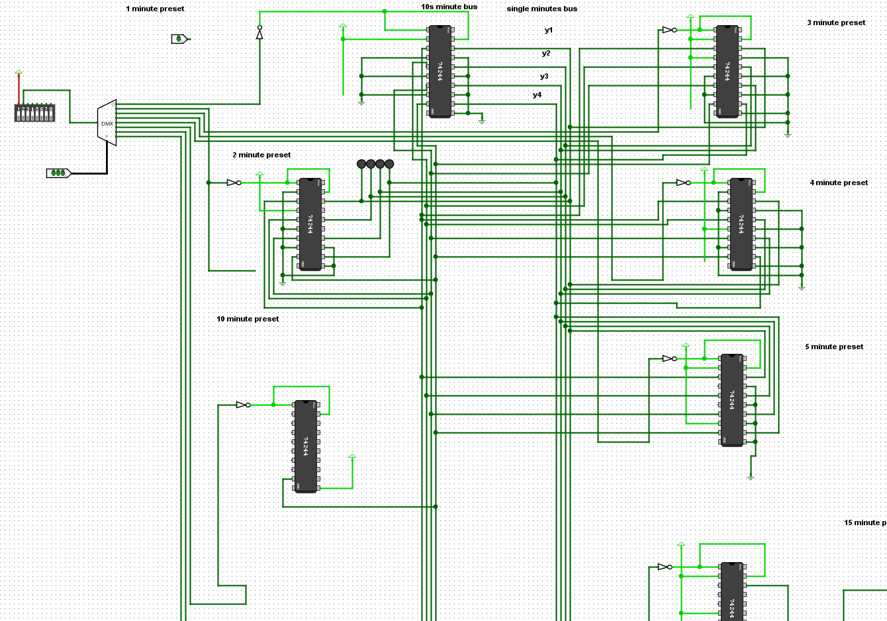

These two methods were the inspiration of the Bus mechanic. Each stage would have its own bus (Hours, Minutes, and Seconds stage.) The respective Buses interface with the data inputs of each 74HC192.

The Bus on the Circuit:
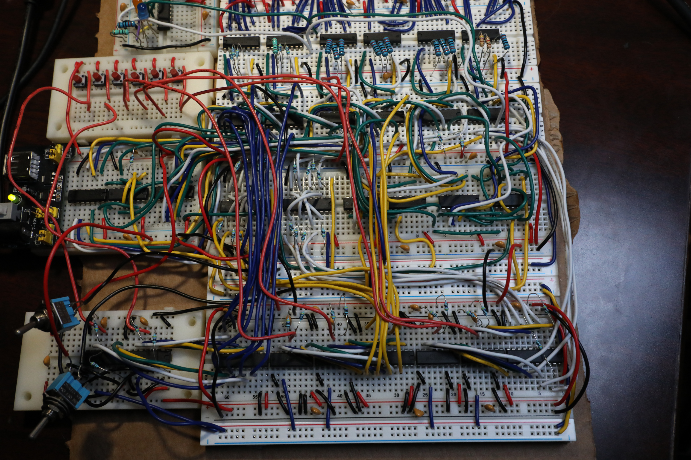

The Bus on the Circuit Schematic:
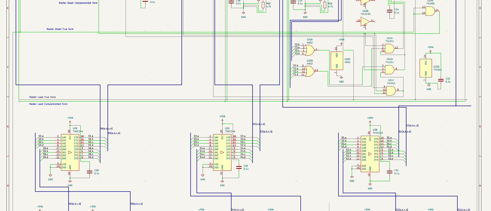

An imperative operation for a working bus implementation requires devices that have a tri-state feature. A Logic gate can be set High or set Low. If a logic gate’s output is set High and that output is connected to another output of a logic gate, it would be disastrous if that output is Low. There would be a short circuit. So the Electrical Team decided to use tri-state buffers to interface with the Bus. When sets of data are not to be loaded onto the bus, the buffers are configured to be in the Hi-Z (high impedance) state. A High or a Low can connect to Hi-Z without worry of a short circuit. 

If the push button method was only to by used, There would be no need for the 74HC244 tri state buffers. (show the pic of the schematic that has the 74hc244 and the two 74192s that connect to it) The 74HC244 provides the tri-state configuration necessary for a Bus that has multiple possible inputs of data. To load a pre configured alarm time with the rotary dial, however it may be implemented, requires pre configured binary data, that represents time for the Alarm, to interface with the Bus for the Seconds stage and the Minutes stage (at least those stages). If the user is using a rotary dial with pre selected times to program the Alarm Machine, the push buttons would not be operational and therefore not load any times.

### The Push Button Method

Push Buttons again:

Ultimately for this design, the Electrical Team decided to use 6 more 74HC192s to keep track of the user inputs from the push buttons. A question arises, why not use the existing 74HC192s to keep track of the user inputs? The Bus and the daisy chain configuration were the primary reasons to use other 74HC192s. 

What’s common for devices that accept a clock input is that they use the rising positive edge of the clock signal to advance or operate their characteristics. So a shift register would advance the data with an applied clock signal. If a real clock signal is used, then the advancement of the shift register will occur in a period of time. If there is only one positive edge trigger to occur, then the shift register will only advance by one state only. So the team decided to use this phenomenon to implement the push button feature. 

These new 74HC192 chips are configured in the up count configuration (pin 4 is connected to power and pin 5 is connected to the push button). When the push button is pressed, each respective pin 5 receives a positive edge signal from the simulated rectangle wave (via the push button). This advanced the counter by one state each time the button is pressed. There is a 100nF capacitor and a 4.7k ohm resistor RC circuit connected to the push button and pin 5.

Push Button Connected to RC Debouncing Circuit
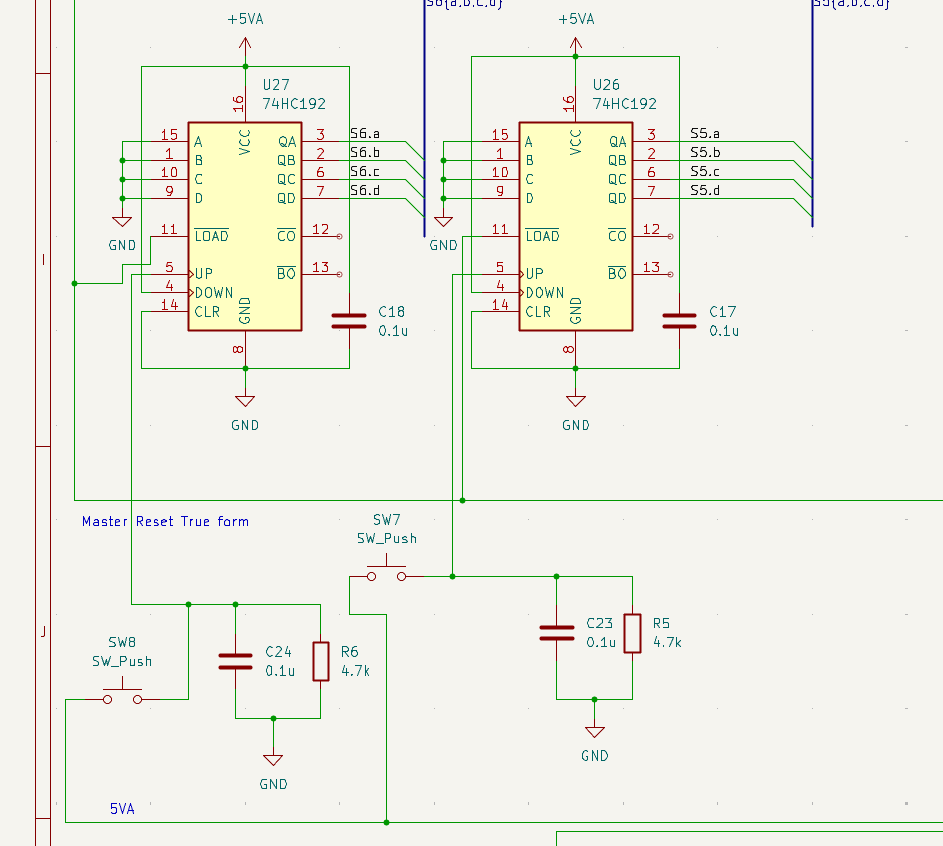

The RC circuit acts as a rudimentary debouncing circuit. Each push button has one. An interesting observation is that when the respective 74HC192 chip doesn’t have a bypass capacitor, then the debouncing doesn’t work and the state is unpredictable. 

The 6 ‘main’ 74HC192 are already daisy chained together and in the countdown configuration. Instead of creating a mechanism to change the up/down configuration and connecting to push buttons, the team used new 74HC192s. The team was already familiar with 74HC192 so using more chips wouldn’t be much of an issue. Even the debouncing circuit was chosen due to already having the parts. 

As of now, the Rotary Dial time select feature is not implemented. So the 74HC244 Octal tri-state buffers have both sets of data feeding to the Bus (the Output Enables are active). If in a future iteration of the Alarm Machine 02001, the Output Enables will be configured active or inactive via a switch similar to how the Load Master switch configures the 74HC244s for the Minute and Second stages. 

If everything works correctly, then when a push botton is pressed, the corresponding Hour, Minute, or Second stage will increment by 1 state. This will be seen in the Seven segment display:

4 Minutes and 31 Seconds programmed into the Alarm Machine:
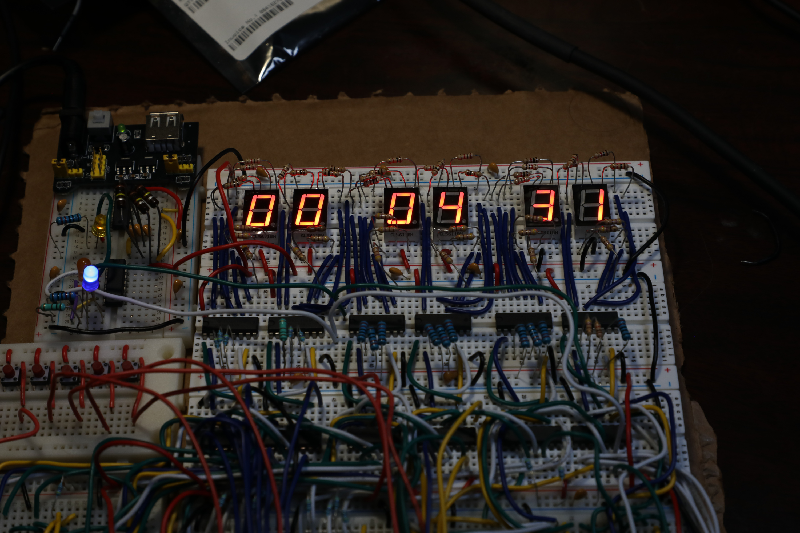

### The Clock and the Alarm

The clock signal was a rudimentary circuit design with the intent of testing rather than accuracy. Consequently, the clock circuit is wildly inaccurate. A 555 timer circuit would be just as serviceable for testing. A CD4060 was chosen because there was a possibility of implementing a highly accurate clock with a crystal. There are built in flipflops to cut the time (from the crystal oscillations) to something closer to 1 second. Inspiration was taken from these sources. (show show show sources of better clock signals)

Ultimately the Team was already late with the project and decided a better implementation of this clock circuit may occur in a future iteration.

For testing purposes the Alarm was a simple blue LED.

The Blue LED, ON indicates Countdown has NOT Finihed:
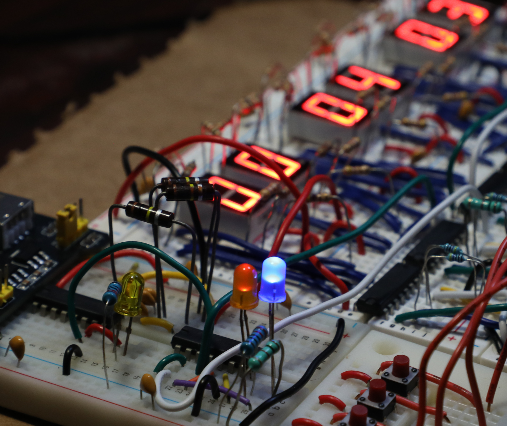

For a buzzer or an actual alarm, this signal may be connected to a speaker circuit. A speaker circuit was not design for this prototype. As such a design can be quite involved and require it’s own project. 

Results
-------

### How to Operate the Prototype? 

There are two switches and 6 push buttons.

The power to the clock must be turned on first

The power to the rest of the circuit must be turned on second

There are two switches:

the set reset switch and the load unload switch

The 1st switch is the set reset switch: set (off), reset (on)

The 2nd switch is the load unload switch: load (off), unload (on)

After the power is on, the first switch must be placed in the reset position (on) to turn off the blue LED

The second switch is placed in the load (off) position. the load position allows the user to push button in a time

The hours, minutes, and seconds can all be programmed into the alarm machine when the second switch is in the load position.

After setting a time, the user may engage the countdown.

To do this:

Set the second switch to unload (on) position

And then set the first switch to the set (off) position. (if this is not done, the alarm will never go off and the countdown will overflow)

### The Accuracy of the Clock Circuit

A CD4060 counter is in a certain configuration that outputs a usable clock signal that is, in theory, has a period close to 1 second. The CD4060 has an oscillator which puts in a signal into many flipflops in series [1]. 

A future stream will be conducted to record the accuracy and be placed in a table here.

These innaccuracies are due to the rudiment clock signal that was used for testing purposes. Ultimately the circuit works. 

Observations and Discussion
---------------------------

We believe this prototype fulfills the requirements of the proposal RFP002 Minimum Complexity Alarm. This prototype fulfills the capabilities of keeping track of time and producing an output capable of waking a human. The major flaws of this design is an inaccurate clock signal. But the prototype can accept a superior clock signal that is very accurate which can be applied in a future iteration. It’s regrettable that this prototype doesn’t feature a functional speaker capable of waking a human, but the prototype has proved the capabilities of sending a signal after the countdown is finished. 

The RFP002 desires designs that feature minimum complexity, novel approaches, user-friendliness, and high timing accuracy. The MS Electrical team believes that this prototype possesses at least minimum complexity and user-friendliness. Arguably this prototype is a novel approach, but this isn’t stressed by the team. The team took inspiration from other project that were clocks made from counters. Those designs were not suitable for desired user friendliness. A countdown cascaded circuit was not among common projects so there was very little reference material. The final design is unique unlike any other seen. But it’s believed that there’s likely a similar circuit in an IC book published in the 1980s. 

The Team believes this is a minimum complexity achievement. The chips and the wiring may be extensive compared to previous projects such as the Motor prototype and the Iron Jar, but in the grand scheme of devices such as phones, computers, microcontrollers, and typical Applications this Alarm Machine prototype is very simple. One counter possibly possesses around 120 NAND gates. 

The push button functionality is very user friendly. It can be argued that a rotary dial is even more user friendly, but the prototype has achieved user friendliness nonetheless. 

### The Choice of Parts

From the proposal, it was promised that finite state machines would be used as the foundation of the prototype. So then a design needed to be made.

### Logisim is used to Chose the parts

ICs are going to be used and Logisim is a free circuit design software that features TTL chips alongside input/output features and Logic gates. Logisim features a simulation with a periodic clock signal that’s useful for testing. 

Logisim was used to test and debug possible designs the team formulated. It was the goal to create a functional design and then order the necessary parts to construct the design. The primary goal was to make a design that worked in Logisim. This goal proved to be misguided. Lots of designs can work in a simulation that simulates ideal conditions. These ideal conditions can supplement methodical design that’s unsuitable for real world construction. Variables like consistent power, resistance in wires, inconsistent High signals, and signal delay can render simulations non executable.

### Problems Encountered with the Design in Logisim

During the design process, a stressful circumstance was present. Keeping up with the proposed deadlines. The Electrical team made a decision that a working simulation was sufficient to order parts to construct the circuit. There was little documentation about cascaded 74HC192s configured for counting down. Without this documentation, the team decided to experiment in Logisim to created a working design that can countdown. A simulated design was created that satisfied the design requirements.

This Design doesn't work with real Components:
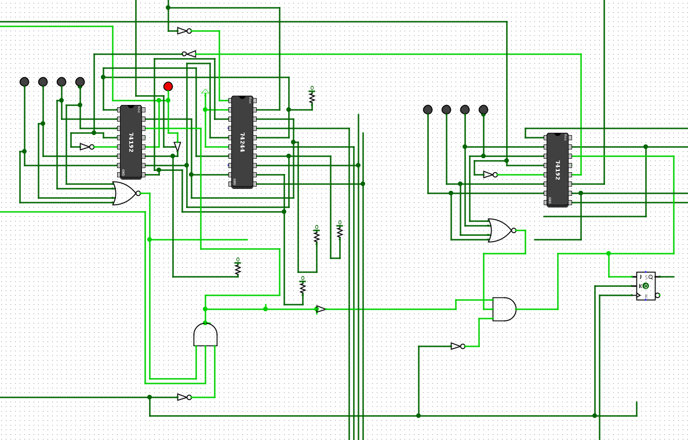

In short, the design that worked in Logisim failed to work with real parts. The goal to make a working design in Logisim was achieved, but that didn’t matter. This was a major failure of the Electrical team. The team wanted to meet milestone goals in the prescribed timely manner as stated in the proposal. This required a working simulation and to order parts to construct that simulation. Essentially, the team has parts for a design that didn’t work. One step forward and four steps back. Didn’t have a working design, didn’t have the parts, spent the budget on parts for a non working design, and missed the deadline. 

Fortunately, the team was able to find an alternative design which has a functional daisy chain design and the design was compatible with all of the parts already purchased. The solution was an understanding of the Borrow out and carry out. 

### Problems Encountered with Construction

One of the expectations of building is there’s always going to be unexpected issues. During the building, it’s prudent to consistently check connection and debug. One misplaced wire can disrupt expected operation. One misplaced wire among many wires can be hard to locate. A multi meter that can measure voltages and track continuity are most useful. 

The Team is tasked to not only design, but build a circuit. So obviously a wrong part was purchased. The first seven segment displays purchased were common cathode. To properly interface with 74LS47s, segment displays with a common anode are required. 

The seven segment displays were drawing too much power. One of the consequences was that the voltage was dropping below tolerances for the chips. (source source source) The chips have an ideal operation voltage at 5V and have a tolerance of +,- 0.25V. The voltage was dropping to about 4V. The solution was to design around two power sources. The First powers source powered clock signal, the 74LS47s and the Seven segment displays. The second power source powered the rest of the circuit. Both power sources share the same ground.

Consistent voltage was another issue. As the components moved further away from the power source, voltage at the chips dropped below the tolerance. A remedy is to use bypass capacitors along the power rails which helps maintain a consistent voltage (put a source source source here). This is conventional practice when using a lot of components. 

Twitch user Whiteshadow108 is a graduate student specializing in Digital Circuits. He advised that all ICs should have a bypass capacitor in parallel. 

### Missing Milestones

Eventually, the Device was completed but many milestones were missed. Specifically missing the working prototype deadline and the completion of the report deadline. The Team spent a lot of time researching about digital circuits, specifically synthesis of logic functions, implementations of logic functions, latches and flipflops, shift registers, counters, tri-state characteristic tables, buses, and finite state machines. This knowledge was invaluable in providing a breath of digital circuits comprehension and feasible ideas to complete the Alarm Machine. Basically, without this research, the team would have no idea how to begin the design. 

Unfortunately, the research portion of the project took too much time and ate into the time allotted for development and construction of the initial prototype. The team anticipated trouble with the construction. So in the ideal situation where construction goes according to plan with no issues, the team anticipated to be finishing construction within the allotted time for writing the report. There were lots of issues. At this point, the project was seen as too ambitious and expectations from the completed project needed to be adjusted. 

Consequently, construction persisted beyond the time allotted for writing the report and went beyond the deadline for the entire project. The dial to load in predetermined times needed to be dropped.

Rotary Dial Concept:

### Future Considerations

  * There are three large considerations for the Alarm Machine prototype. 

  *  Implement the Dial with predetermined times.

  *  Implement a clock signal circuit with a crystal for more accurate timing

  *  Transfer the components to a perfboard and make a housing for the prototype

Conclusion
----------

The Electrical Innovation team believes this project was half successful. The prototype is a complete success despite foregoing the Dial functionality for a later iteration. The failure was completing the project in a timely manner. This project was most certainly too ambitious to be completed within the prescribed schedule as stated in the initial proposal. But a lot of knowledge and capabilities with 7400 series and 4000 series chips along side a disciplined understanding of digital circuits. This undertaking has positioned MS engineers to begin exploring topics in computer architecture. This ultimately will further MS capabilities and general adeptness for future projects. 

For future proposals and projects, there will be more caution and awareness of the potential difficulties of learning new topics for design. But it can’t be denied that future projects that utilize TTL will be far easier to design and build. 

The completion of this project has provided a gateway for the Electrical Innovation team to research and incorporate computer architecture (from a thorough understanding). Future topics from then on can  facilitate the incorporation of topics in computer networks and communication systems engineering.

References
----------

  [1] Texas Instruments, "CMOS 14-Stage Ripple-Carry Binary Counter/Divider and Oscillator". CD4060B Types datasheet, [Revised October 2003]

