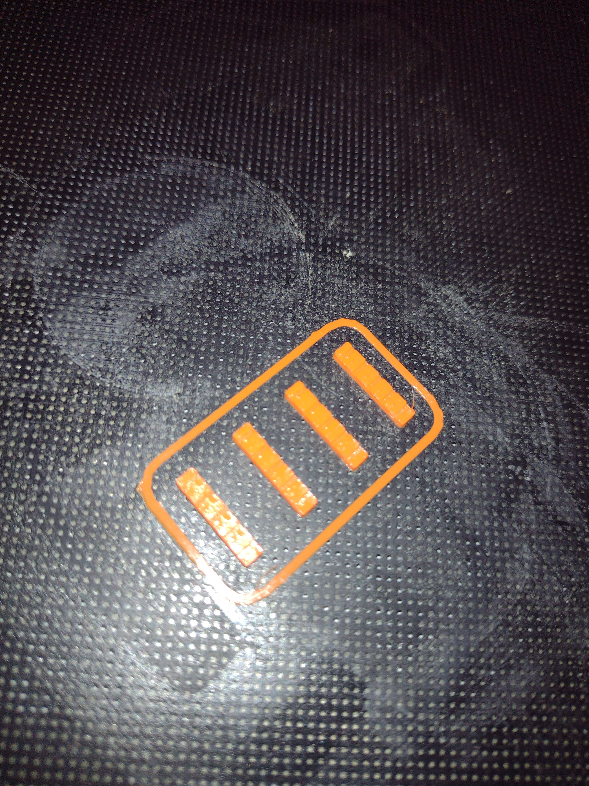
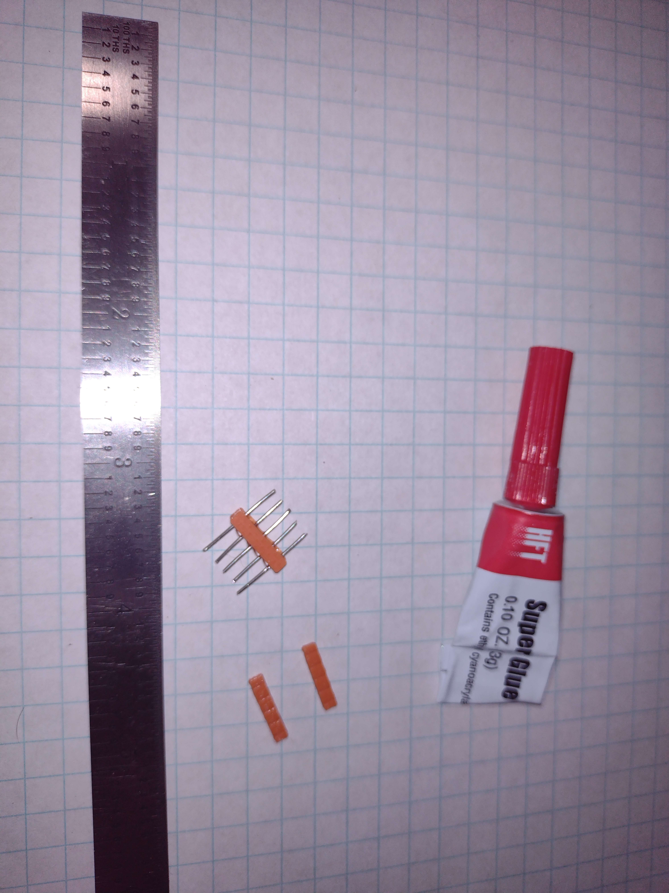
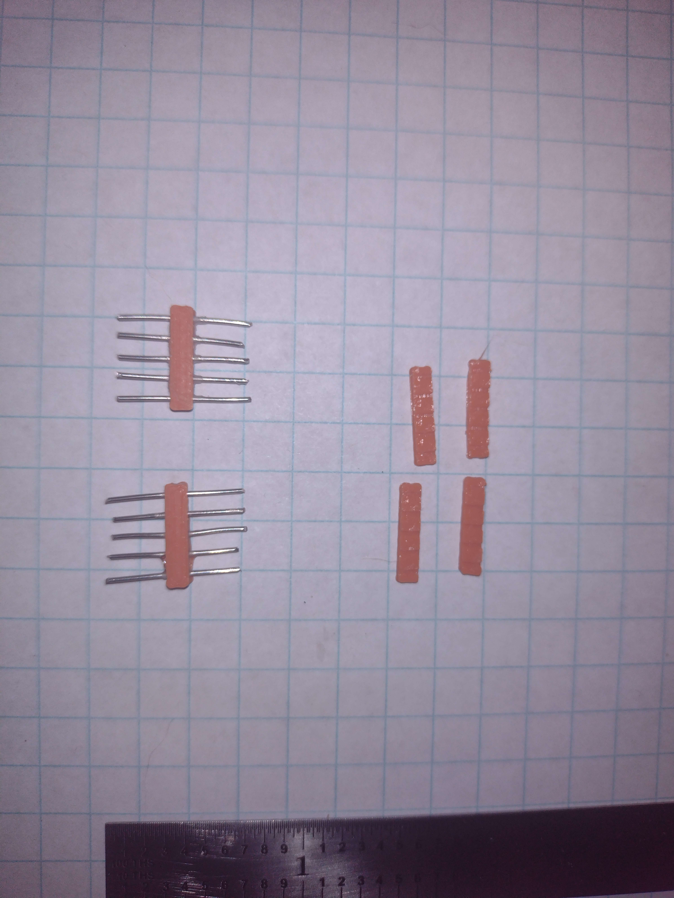

# 02002 - Male Header Pins

These small header pins consist of 2x 3D-printed halves with short lengths of 22 AWG uninsulated bus wire superglued between them. The wires can be of custom lengths; as shown, they are equal lengths on both ends to accept both female headers and breadport ports.

[3d model to print](resources/male_header-Body001.3mf)

[FreeCAD file](resources/male_header.FCStd)

*Matt DiPalma, AMDG*

