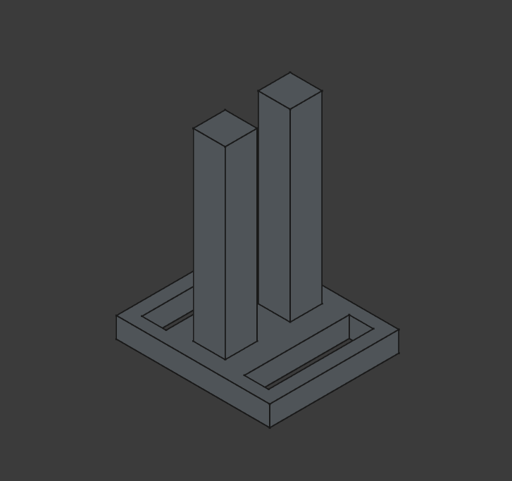
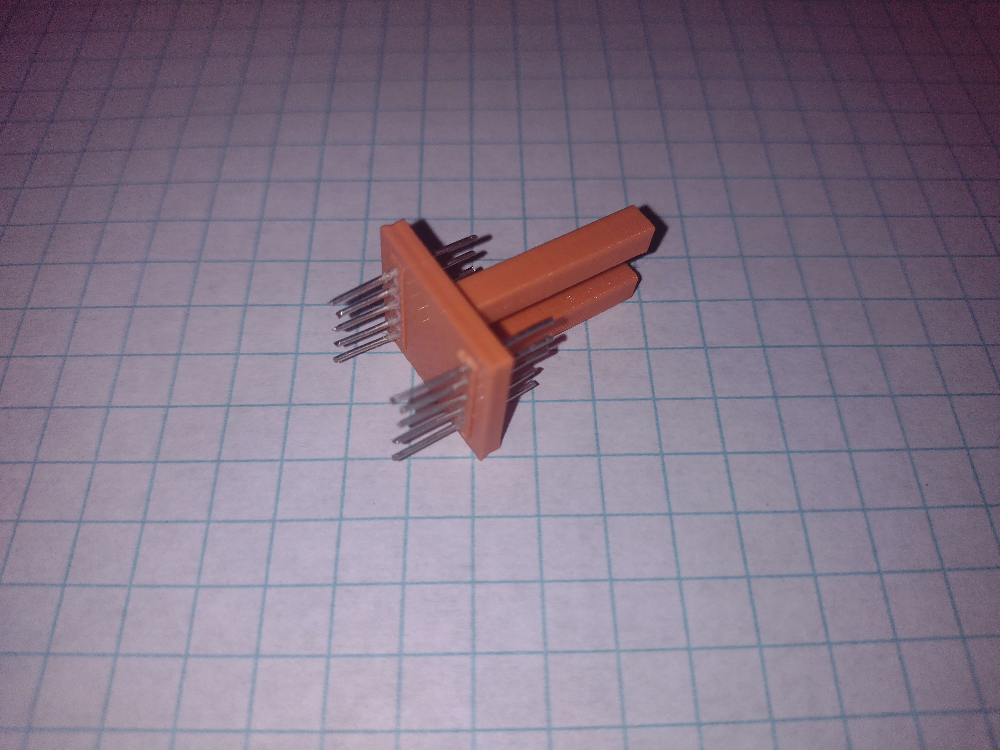
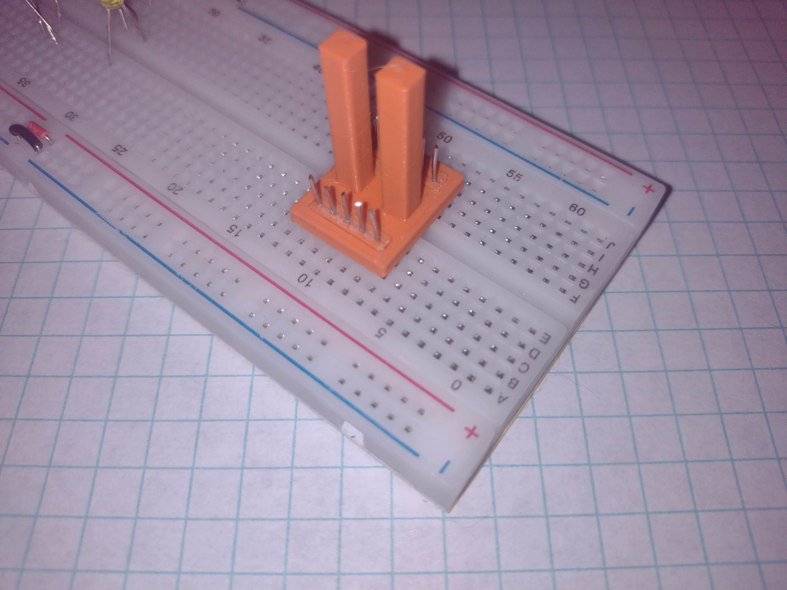

# 02003 - DIP Socket Adapter

This parametric 3D-printable model is an adapter for DIP through-hole header pin segments. It features 2 columns to mount a physical component above a breadboard, simplifying the wiring for homemade electronic components. It accepts the header pin inserts from [02002](../02002%20-%20Male%20Header%20Pins/).

[3d model to print](resources/dual-in-line-package-dip10.3mf)

[FreeCAD file](resources/dual-in-line-package.FCStd)

*Matt DiPalma, AMDG*

