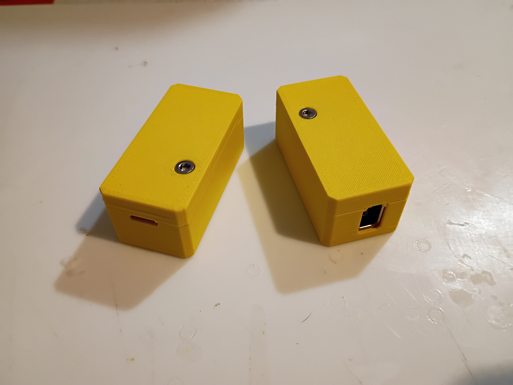
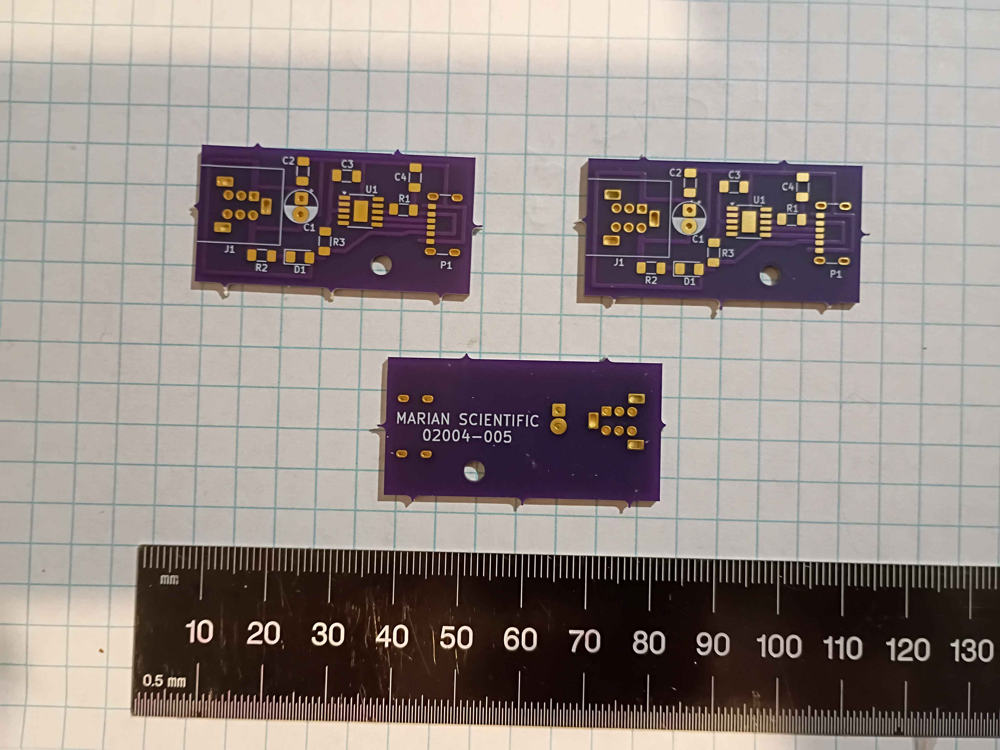
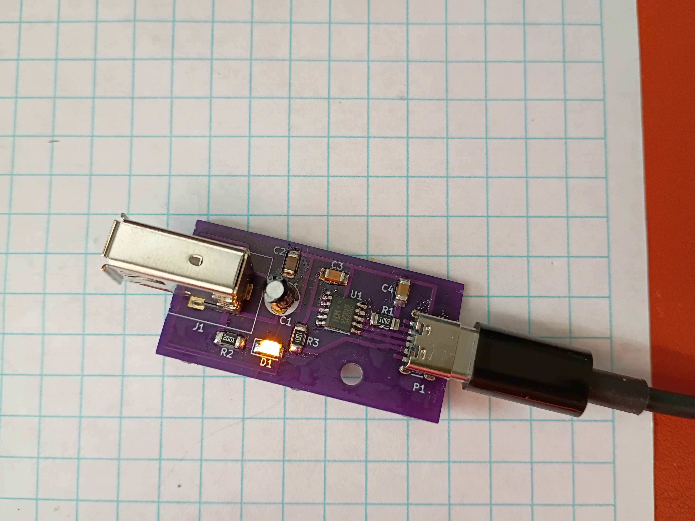
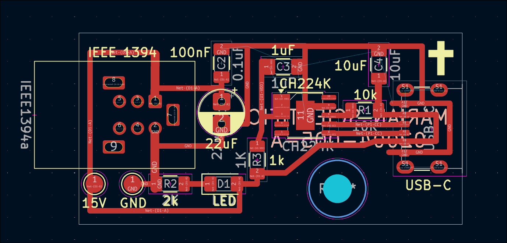
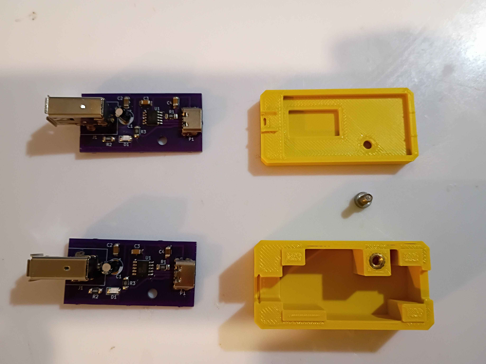

# 02004 - FireWireUSBC-PD

USB-C Power negotiation board and housing assembly for 15V to IEEE 1394 "FireWire" 400 alpha.

Use at your own risk.

## Files
* [02004-005-A, PCB](CAD/02004-005-A/02004-005-A.kicad_pro)
* [02004-007, housing top](CAD/02004-007_and_008/02004-007.3mf)
* [02004-008, housing bottom](CAD/02004-007_and_008/02004-008.3mf)

## BOM
* 02004-005* PCB (single layer, home etch or purchase), options:
    * [Buy Revision "-" on OSHPark](https://oshpark.com/shared_projects/qNKJSW6B)
    * [DIY or order Revision "A"](CAD/02004-005-A/02004-005-A.kicad_pro)
* Housing:
    * 3D print [02004-007, top](CAD/02004-007_and_008/02004-007.3mf)
    * 3D print [02004-008, bottom](CAD/02004-007_and_008/02004-008.3mf)
* Electrical components:
    * 1x FireWire 400 alpha receptacle
    * 1x CH224K USB-PD power delivery sink controller IC
    * 1x USB-C SMD, 6 pin receptacle
    * 1206 SMD resistors
        * 1x 1k
        * 1x ~2k, optional
        * 1x 10k
    * 1206 SMD ceramic capacitors:
        * 1x 100nF
        * 1x 1uF
        * 1x 10uf
    * 1x 22uF electrolytic barrel capacitor
    * 1x 1206 SMD LED, optional
* Mechanical components:
    * 1x M3x4x5 heat set insert
    * 1x M3x~6-8 screw (ideally socket head cap)

## Photos

### 02004-005 PCB

### Optional power LED

### PCB Layout

### Assembly Components
