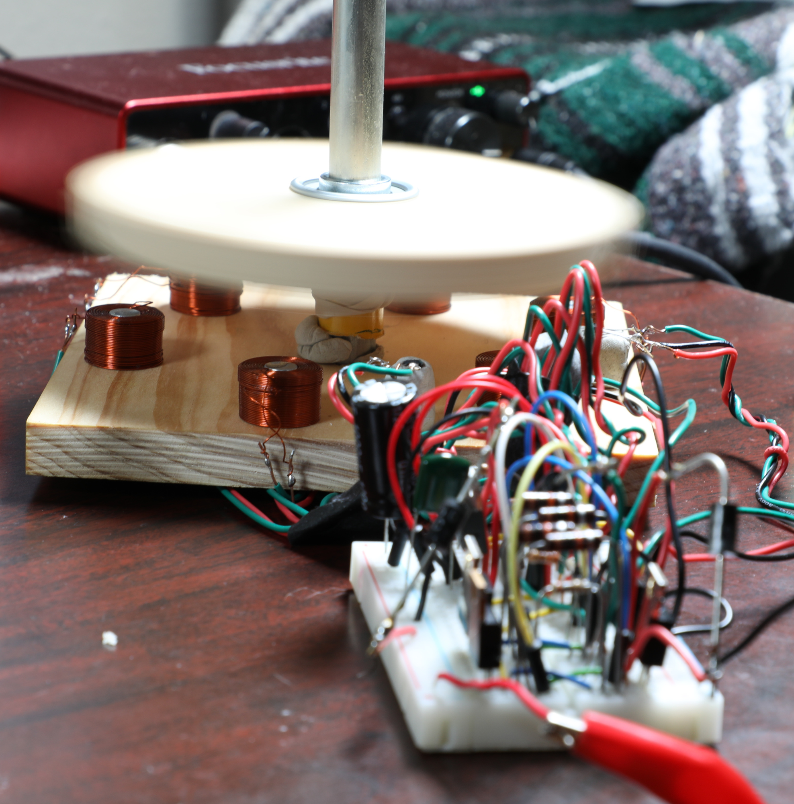
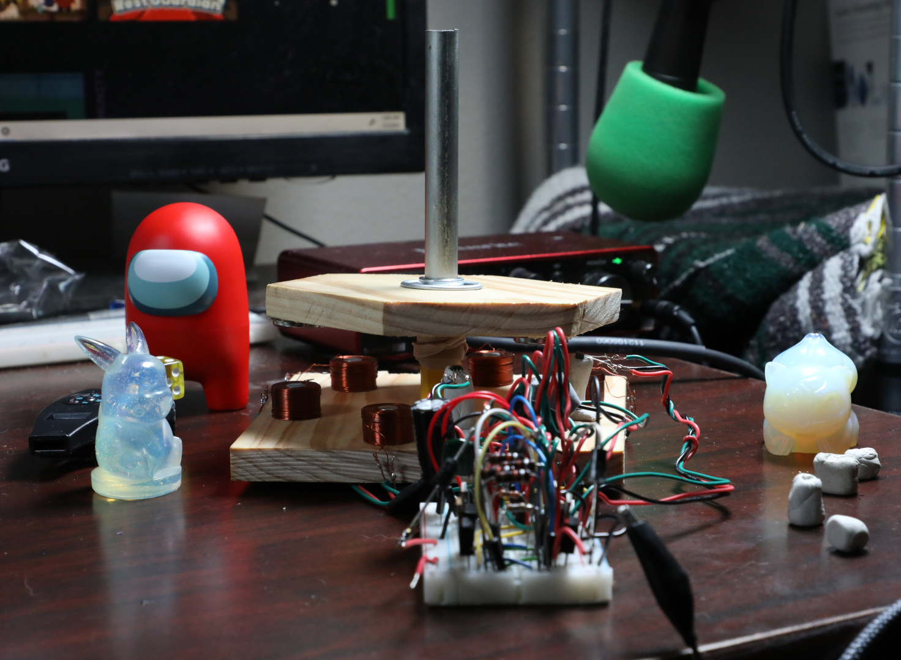
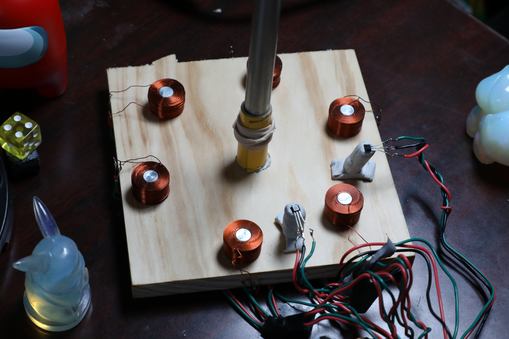
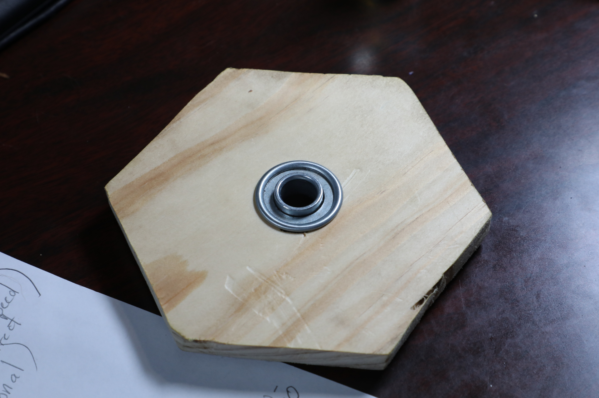
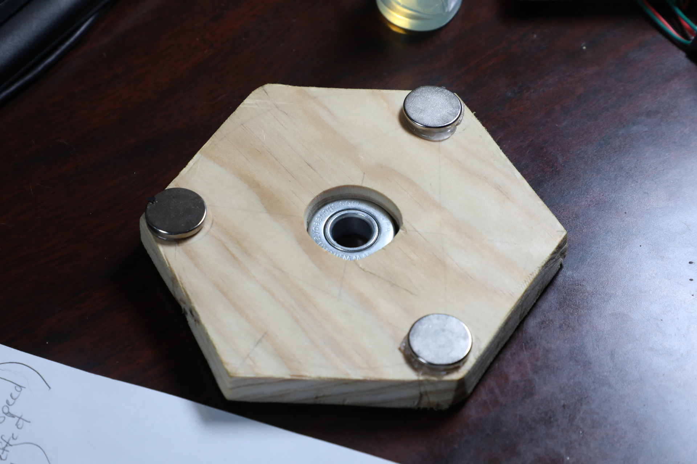

03001 - Motor Prototype
=====================
*Anthony Remark, AMDG*

Original Schedule
-----------------
This project was before common standards/protocol was established for Marian Scientific projects. Thus there is no schedule. What was imperative was that the prototype needed to be functional by January 16, 2025.

Abstract
--------

Develop a functional motor proof of concept that serves as a starting point for future iterations of the design. The particular performance specifications for this motor like torque, RPM and durability are not a priority for the initial prototype Instead, this first motor prototype need only to spin freely under its own power and to self-start.

Objective
---------
The two cooperative subsystems for this project are: the underlying mechanical substructure of the motor (rotor, stator, base, mechanical connections, and fabrication thereof), and the electrical components to operate the motor.

The characteristics of the electrical components are highly coupled to the geometry of the mechanical substructure. As such, selections for the electronic and mechanical components are made simultaneously.

In order to foster a culture of rapid development, an aggressive deadline was established for the design, fabrication, and test of this motor: 2 months. In addition, a preference was set that as many components as possible would be constructed from scratch (stator, shaft, rotor, etc.) in order to gain familiarity with the necessary manufacturing processes, to assist in future design projects.

In his seminal work, [1] Friedrichs documents a variety of simple motor designs, all constructed from scrap materials with limited tools. The “Little Twister” motor (page 90-109) is the inspiration for the present design, although several adjustments to the electrical and mechanical subsystems were made due to component availability and manufacturing simplicity.

The base on which the motor stands also serves as the stator, featuring mounting points for the electromagnets and the Hall effect sensors. This choice increases the stability of the system by removing any compliant junction between the stator and base. This decision eliminates a lot of the mechanical design and uncertainty.

Parts List
----------
Due to the accelerated timeline, all parts were required to be quickly attainable from online sources and local shops. The parts are enumerated below, alongside their costs, for both the mechanical and electrical subsystems. Although the design only calls for a set number of certain components, many components were purchased in excess of the required quantities in order to accommodate any potential unforeseen component failures as well as stock additional components for future design projects. In addition, it is often cheaper to purchase components in relative to bulk.

Place a pic here of the parts

### Mechanical Parts List
The following structural components exceed the necessary quantities to construct the present motor design.

1. M3 - 0.50 x 16 (12 count) - $2.48
2. M3 - 0.50 Hex Nuts (20 count) - $2.28
3. 3mm Flat Washers (25 count) - $2.28
4. #6-32 x 1/2” with Nuts (Flat Phillips) (14 count) - $1.48
5. #6 x 5/8 (Flat Phillips) (18 count) - $1.48
6. 1/2” - 6 - 2 Yellow Pine Board - $4.00
7. 3M Pro Grade Precision 80-grit Sand Paper - $6.68
8. 1/2” x 1-1/8 Radial Bearing (2 count) - $9.18
9. 1/2” x 36 Round Rod Zinc Plated - $9.49
10. 4 pack Corner Iron - $2.99

Total: - $42.34

### Electrical Parts List
The following electrical components exceed the necessary quantities to construct the present motor design. Several of the required components were already in department inventory.

1. 19 x 12mm Electromagnetic Copper coils with 27 AWG wire, 4Ω , 2.32 mH (10 count) - $18.90
2. SR560 Schottky Barrier Rectifier (30 count) - $6.99
3. L7805CV (10 count) with 104 & 334 Capacitors, 470 Ω 1/4W Resistor - $6.99
4. 1000uF 50V 13x25mm Electrolytic Capacitor (10 count) - $8.99
5. 20Pcs A3144 3144 Hall Effect Sensor - $6.99
6. 20 x 3mm round Neodymium Magnets - $18.98
7. MJE3055TJP (4 count) from inventory
8. Single 0.1 uF Capacitor from inventory
9. Breadboard from inventory
10. Assortment of jumpers wires from inventory

Total: - $67.84

Design and Procedure
--------------------
All of Friedrichs’ [1] designs presume some degree of familiarity with standard manufacturing processes. In a partnership with the Mechanical team at Marian Scientific, it was determined that a vertical shaft mounted on a stationary base could act as the stator itself. Without access to the requisite manufacturing facilities, this choice avoided the more intricate and complex design presented by Friedrichs.

### The Stator and Rotor
Figure 1 shows that the base of the motor is square and in contact with a flat and stable surface. The stator
serving as the base solves a lot of stability issues. A 1/2” close-fit hole was drilled in the center of a yellow
pine 1/2”x5-1/2”x5-1/2” board into which a 1/2x6” zinc-plated steel shaft is pressed and optionally secured
with adhesive or putty.

*Figure 1: Prototype 03001*

On the stator are six electromagnetic copper coils equally spaced on a 4-1/2” diameter circle concentric to
the drilled hole for the shaft. The electromagnetic coils have internal M3 threads for attachment to a mating surface. This is shown in Figure 2.

*Figure 2: The Stator for Prototype 03001*

A hexagonal rotor is cut from yellow pine. The hexagon circumscribes a 5-1/2” diameter circle. A 1/2x1-1/8” radial bearing is fitted at the center of the rotor and thus concentric to the 5-1/2” diameter circle. The underside of the rotor has three 20x3mm Neodymium magnets hot-glued near the vertices of the hexagon shape separated by 120°. See Figure 3.

*Figure 3: The Rotor. The Top image depicts the top of the rotor and the Bottom is the underside of the rotor
with the magnets.*

