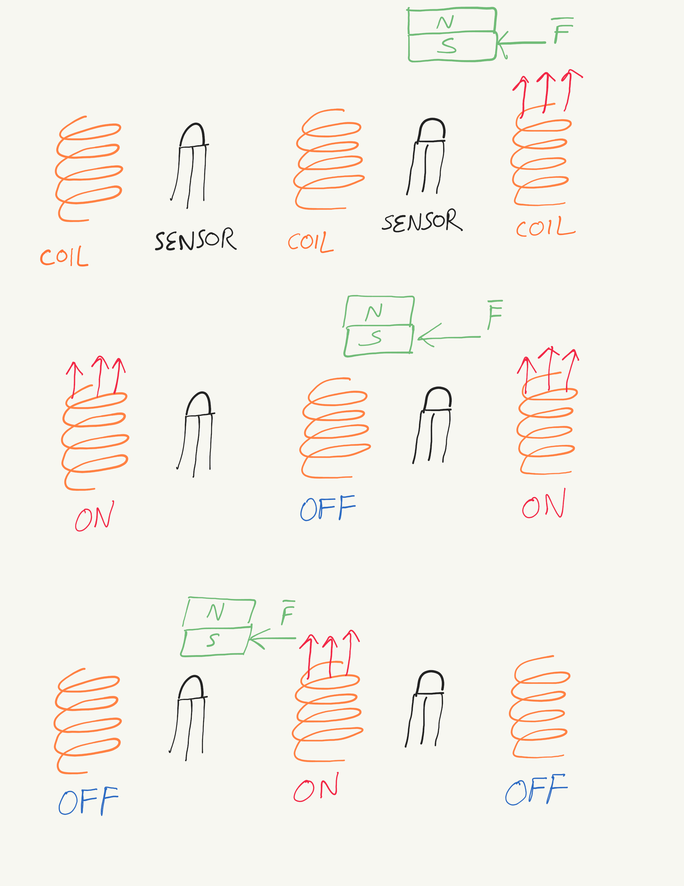
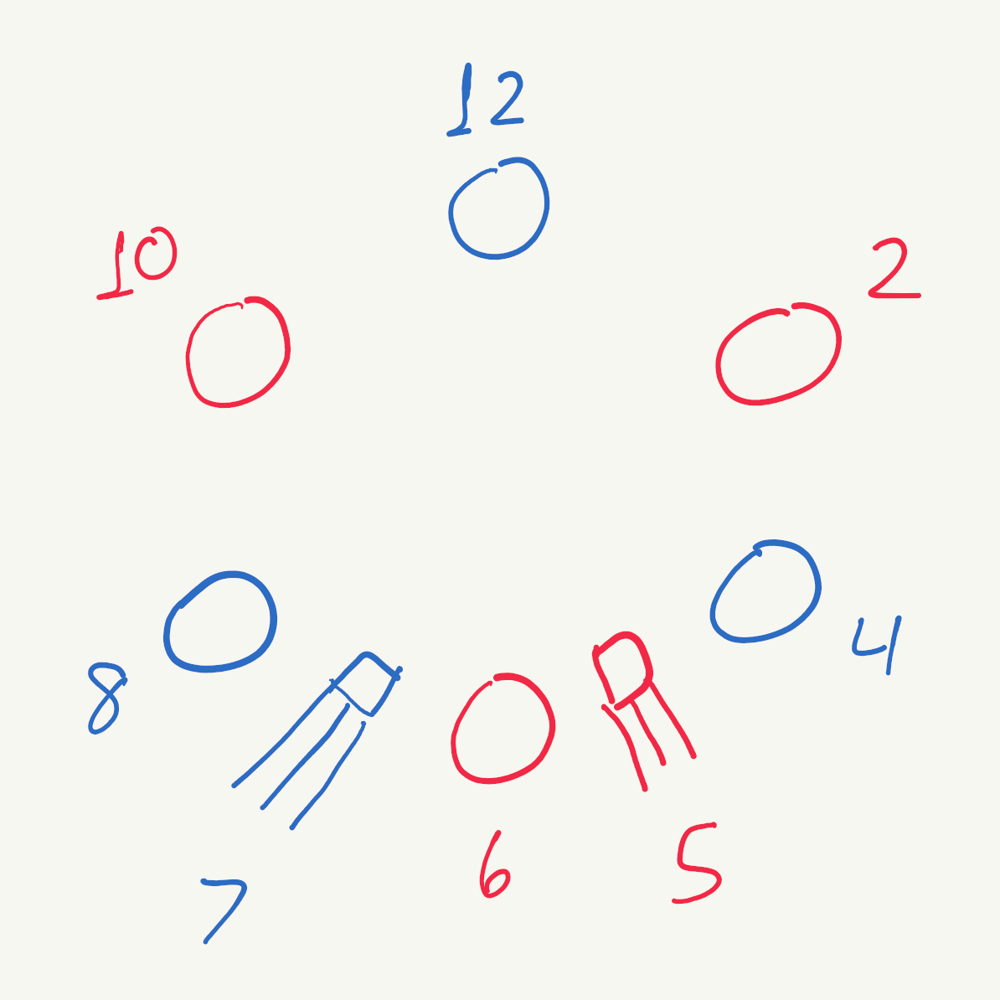
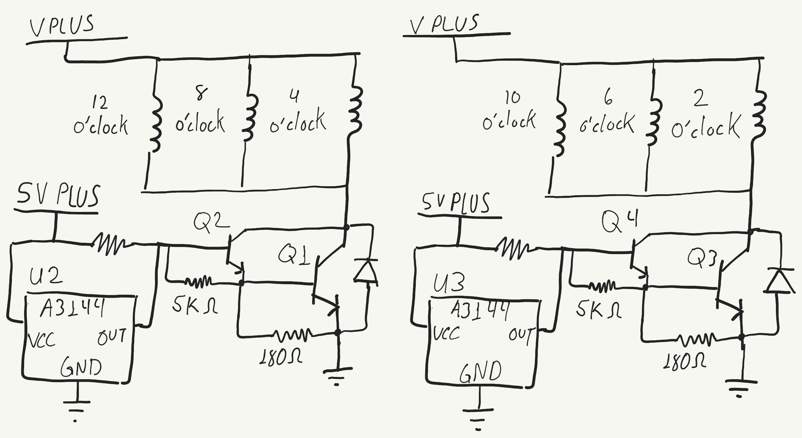
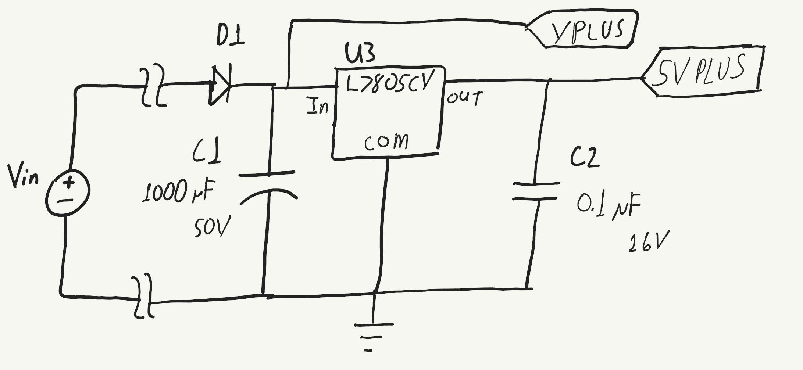
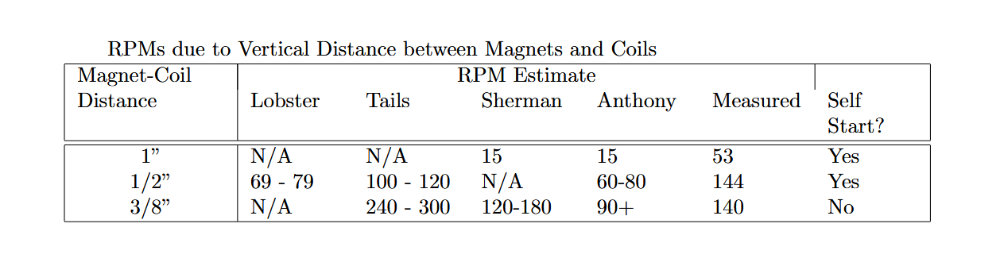

03001 - Motor Prototype
=====================
*Anthony Remark, AMDG*

Original Schedule
-----------------
This project was before common standards/protocol was established for Marian Scientific projects. Thus there is no schedule. What was imperative was that the prototype needed to be functional by January 16, 2025.

Abstract
--------

Develop a functional motor proof of concept that serves as a starting point for future iterations of the design. The particular performance specifications for this motor like torque, RPM and durability are not a priority for the initial prototype Instead, this first motor prototype need only to spin freely under its own power and to self-start.

Objective
---------
The two cooperative subsystems for this project are: the underlying mechanical substructure of the motor (rotor, stator, base, mechanical connections, and fabrication thereof), and the electrical components to operate the motor.

The characteristics of the electrical components are highly coupled to the geometry of the mechanical substructure. As such, selections for the electronic and mechanical components are made simultaneously.

In order to foster a culture of rapid development, an aggressive deadline was established for the design, fabrication, and test of this motor: 2 months. In addition, a preference was set that as many components as possible would be constructed from scratch (stator, shaft, rotor, etc.) in order to gain familiarity with the necessary manufacturing processes, to assist in future design projects.

In his seminal work, [1] Friedrichs documents a variety of simple motor designs, all constructed from scrap materials with limited tools. The “Little Twister” motor (page 90-109) is the inspiration for the present design, although several adjustments to the electrical and mechanical subsystems were made due to component availability and manufacturing simplicity.

The base on which the motor stands also serves as the stator, featuring mounting points for the electromagnets and the Hall effect sensors. This choice increases the stability of the system by removing any compliant junction between the stator and base. This decision eliminates a lot of the mechanical design and uncertainty.

Parts List
----------
Due to the accelerated timeline, all parts were required to be quickly attainable from online sources and local shops. The parts are enumerated below, alongside their costs, for both the mechanical and electrical subsystems. Although the design only calls for a set number of certain components, many components were purchased in excess of the required quantities in order to accommodate any potential unforeseen component failures as well as stock additional components for future design projects. In addition, it is often cheaper to purchase components in relative to bulk.

Place a pic here of the parts

### Mechanical Parts List
The following structural components exceed the necessary quantities to construct the present motor design.

1. M3 - 0.50 x 16 (12 count) - $2.48
2. M3 - 0.50 Hex Nuts (20 count) - $2.28
3. 3mm Flat Washers (25 count) - $2.28
4. #6-32 x 1/2” with Nuts (Flat Phillips) (14 count) - $1.48
5. #6 x 5/8 (Flat Phillips) (18 count) - $1.48
6. 1/2” - 6 - 2 Yellow Pine Board - $4.00
7. 3M Pro Grade Precision 80-grit Sand Paper - $6.68
8. 1/2” x 1-1/8 Radial Bearing (2 count) - $9.18
9. 1/2” x 36 Round Rod Zinc Plated - $9.49
10. 4 pack Corner Iron - $2.99

Total: - $42.34

### Electrical Parts List
The following electrical components exceed the necessary quantities to construct the present motor design. Several of the required components were already in department inventory.

1. 19 x 12mm Electromagnetic Copper coils with 27 AWG wire, 4Ω , 2.32 mH (10 count) - $18.90
2. SR560 Schottky Barrier Rectifier (30 count) - $6.99
3. L7805CV (10 count) with 104 & 334 Capacitors, 470 Ω 1/4W Resistor - $6.99
4. 1000uF 50V 13x25mm Electrolytic Capacitor (10 count) - $8.99
5. 20Pcs A3144 3144 Hall Effect Sensor - $6.99
6. 20 x 3mm round Neodymium Magnets - $18.98
7. MJE3055TJP (4 count) from inventory
8. Single 0.1 uF Capacitor from inventory
9. Breadboard from inventory
10. Assortment of jumpers wires from inventory

Total: - $67.84

Design and Procedure
--------------------
All of Friedrichs’ [1] designs presume some degree of familiarity with standard manufacturing processes. In a partnership with the Mechanical team at Marian Scientific, it was determined that a vertical shaft mounted on a stationary base could act as the stator itself. Without access to the requisite manufacturing facilities, this choice avoided the more intricate and complex design presented by Friedrichs.

### The Stator and Rotor
Figure 1 shows that the base of the motor is square and in contact with a flat and stable surface. The stator
serving as the base solves a lot of stability issues. A 1/2” close-fit hole was drilled in the center of a yellow
pine 1/2”x5-1/2”x5-1/2” board into which a 1/2x6” zinc-plated steel shaft is pressed and optionally secured
with adhesive or putty.

*Figure 1: Prototype 03001*

On the stator are six electromagnetic copper coils equally spaced on a 4-1/2” diameter circle concentric to
the drilled hole for the shaft. The electromagnetic coils have internal M3 threads for attachment to a mating surface. This is shown in Figure 2.

*Figure 2: The Stator for Prototype 03001*

A hexagonal rotor is cut from yellow pine. The hexagon circumscribes a 5-1/2” diameter circle. A 1/2x1-1/8” radial bearing is fitted at the center of the rotor and thus concentric to the 5-1/2” diameter circle. The underside of the rotor has three 20x3mm Neodymium magnets hot-glued near the vertices of the hexagon shape separated by 120°. See Figure 3.

*Figure 3: The Rotor. The Top image depicts the top of the rotor and the Bottom is the underside of the rotor
with the magnets.*

The key principle for this motor is that the magnets are installed with their North poles oriented in the same direction. The electromagnetic coils turn on at the appropriate times to induce a magnetic field that repels the magnets glued to the rotor. The motor timing depends on the coordination of the coils turning on and turning off in relation to the positions of the magnets. The motor is mechanically very simple. A bearing is pressed into the center of the rotor, and this assembly is fitted onto a shaft which is mounted firmly onto the stator. The stator is also the base. With the mechanics defined, focus can be shifted to the circuitry. The motor timing can be optimized to yield greater RPM for the same applied input power.

### The Stator Coils

The coils on the stator are energized/de-energized based on their relative position to the magnets on the rotor as it spins. The coils are energized to oppose the magnetic field surrounding the magnets. In other words, when a coil is on, it repels the very magnet that just passed overhead. And when the coil is off, the magnet is allowed to maintain its inertia. The six coils will be on/off at different positions of the magnets. To detect these relative positions and energize the appropriate coils, we use Hall effect sensors to detect an active magnetic field.

The orientation of the magnets are irrelevant in the design choice if subsequent design is accounted for. For prototype 03001, it does not matter if the North or the South poles of the magnets are facing the coils, but merely that all the magnets have the same orientation. The coil-induced magnetic field will have current going one way or the other to account for the down-facing polarity of the magnets.

The Hall effect sensors are unipolar, meaning that the sensor connects its two electric nodes when it detects a certain polarity magnetic field. The choice of the A3144 sensor requires that the magnets be oriented with their South poles facing the coils because the A3144 is a unipolar Hall effect sensor that detects magnetic South poles. When the Hall effect sensor detects a South magnetic field, it connects the two electric nodes that de-energize a set of coils.

The idea here is that when the coils are off, the inertia of the rotor will be left unhindered. As the magnet passes, the coils will turn back on and engender a repulsive magnetic field again which repels the magnet, imparting additional torque on the rotor, and thus continuing the rotation of Prototype 03001. This is illustrated in Figure 4.

*Figure 4: Magnet passing over sensors and coils. In part (a) the right coil is inducing a magnetic field that’s repulsive to the South pole of the green magnet which creates a force indicated by Ð→ F . In part (b), the center coil is OFF and gives significant inertia from the repulsive force due to the right coil being ON. In part (c), the magnet passes over the left-most sensor and so the center coil turns ON and the other coils turn OFF. We create another repulsive force on the magnet via induced south facing magnetic field*

Figure 4, depicts the symmetry of the magnetic forces in the present concept. Because of the symmetrical configuration of the coils and the magnets, the number of sensors can be reduced to just two. Due to symmetry, we have a periodic operation.

To achieve this, three of the coils are configured to be operational (ON) when their corresponding common sensor does not detect a South magnetic field emanating from the magnets on the rotor. The other three coils are tied to the other sensor. From Figure 5, note that the 6 o’clock, 10 o’clock, and 2 o’clock coils are tied to the 5 o’clock sensor. And the 12 o’clock, 4 o’clock, and 8 o’clock coils are tied to the 7 o’clock sensor.

*Figure 5: The Blue circles represent the coils in those positions on the stator that are tied to the blue sensor. The Red circles represent the coils in those positions tied to the red sensor. These hall effect sensors turn off their respective coils when a south facing magnetic field is detected over the respective sensor*

In order to relatively isolate the magnetic fields produced by adjacent magnetic components, the magnetic components were positioned on the circumference of a 4-1/2” diameter circle on both the rotor and the stator. A more-compact system could yield higher RPM and lower inertia, but would also reduce motor torque.

### The Circuit

With the requirements in place for the stator coils and the rotor magnets, a complementary circuit needs to be designed. The electromagnets need power, and the sensors need more stable power, with a degree of isolation between the components.

*Figure 6: The Stator Circuit. The Inductors represent the coils at their positions as described in Figure 5*

The coils need power and high current flow to induce powerful fields needed to have good motor timing. But the Hall effect sensors also need a stable 5V power source for operation. BJTs were included to interrupt the current flow within the coils. They provide good isolation from different parts of the circuit so as to not fry the Hall effect sensors. Not just any BTJs will do, so MJE3055 power transistors were selected because of their power and current capabilities and their high speed operation.

To power the sensors and the coils, the power circuit was modeled after Friedrichs [1] page 101 (See Figure 7). The power circuit involves a voltage regulator as the core operation. A protection diode is connected to the supply power in case the power supply were to ever be inverted. The power then goes to the coils and into the voltage regulator. The idea here is that the input voltage varies but the voltage being supplied to the sensors is a constant 5V, no matter the input (unless the input is less than 6V or so).

*Figure 7: The Power Circuit, responsible for supplying power to the coils and power to the sensors. The voltage regulator isolates the coils and the sensors.*

As shown in Figure 7, the 1000 uF capacitor counteracts the noise created from the rapid switching on/off of the coils. V PLUS powers the Coils and 5V PLUS powers the sensors.

Results
-------
The motor was tested was to determine the RPM while looking as a function of the vertical gap between the rotor and the stator, and consequently the distance between the magnets and the coils. The hypothesis is that a smaller gap yields a higher RPM. One of the issues is that the sensors need to be a set distance away from the magnets to detect the magnetic field from the magnets. So the sensors are placed about a maximum distance of 1/2”. These test are limited to a power supply of max 12V and 500 mA. A variance of power delivery would allow for more involved tests of torque and RPMs.

*Table 1: Motor RPM as a function of Vertical Distance between Magnets and Coils. Other viewers gave their estimate of RPM when available.*

As predicted, when the magnets got vertically closer to the coils, a higher RPM was observed. When the magnets and coils were 1” vertical distance apart, the motor had trouble maintaining rotation. Perhaps if higher voltage and current were delivered, this issue would be mitigated. Stream viewers were in disagreement of RPM, but all their estimates are tabulated in Table 1.

Discussion
----------
The biggest challenge was deciding on what motor design to pursue. The team researched topics such as three-phase motors, brushed motors, and brush-less motors. Other topics included magnetic principles, magnetic circuits, and generators, among other electric machinery topics. It was quite the open field. It is easy to see and judge what has already been created, but in the creation process, it’s fiercely more daunting to stare at a blank document writer. Preemptive research and settling on a decision took more time than estimated. This left only about three weeks to build and debug the prototype after a final design was chosen.

One things that the team learned was that a structured system of creation/design was helpful to keep the project on schedule.

Whichever design that was chosen, what mattered most was that the electrical process underlying the operation was well understood, and not just merely copied from Friedrichs [1]. A sophisticated understanding of the electrical phenomenon is necessary to make adjustments on the fly to any inspiration from other engineers and the specific components available. The primary inspiration from Friedrichs posed a lot of limitations. From the mechanical point of view, it was a daunting task to precisely recreate Friedrichs Little Twister Motor within a period of three weeks. Instead, a slightly different approach was taken for the mechanical design to facilitate a relatively quick construction with fewer parts.

When it came to the electrical circuit design, not all of Friedrich’s components could be sourced, as they were largely sourced from scrap the author had on hand. And even in the text, there was a lot of “artistic interpretation” of what was done. Component availability and manufacturing equipment was assessed to ultimately determine the motor design. For example, the 2SD1415 components called out by Friedrich in his circuit were replaced with equivalent circuitry to fulfill the needs of the operation as a whole.

The team did not have access to a power supply capable of 36V output or a source that can deliver more than 500 mA. Because of the power source limitations, the coils chosen had a ferrous core that facilitated an induced concentrated magnetic field.

### Efficiency Issues

If more robust manufacturing capabilities were available at the Houston facility, the machining of our motor prototype parts would satisfy tighter tolerances and yield better efficiency.

The choice of yellow pine 1/2” thick pine was chosen by intuition, but was ultimately a great compromise between rigidity and ease of fabrication. In addition, beside being relatively cheap, it was light, contributing to a higher RPM. This leads to the realization that our motor prototype does not have great torque. A light touch from one finger can stop rotation altogether.

A final potential issue might include the interference between adjacent magnetic fields as a function of the “coil diameter”. The RPM of the motor is likely highly dependent on this magnet spacing, but this hypothesis cannot be efficiently tested without constructing another prototype.

### Unforseen Issues

In large part, all design criteria and qualitative expectations were met by this motor prototype. However, there were issues that halted the build process and needed immediate attention. First, the shaft was not orthogonal to the stator. This was due to inadequate drilling of the one half in hole due to insufficient manufacturing facilities. To resolve this, filler material was used to orient and balance the shaft. Second, the heat generated from the two of the power transistors connected to the coil experience high current and got quite hot very quickly, limiting the motor operation time. A heat sink would help to alleviate this constraint.

Conclusion
----------

Despite all of the manufacturing difficulties, mechanical limitations, and the electrical compromises, this motor prototype was a complete success. As stated earlier, this prototype is intended to serve as a basis for future iterations and development of a more robust and sound solution to motor needs. This endeavor illuminated a lot of “holes” and “oversights” in the design process that needed to be revealed and adjusted for a more productive and efficient process in the future. Such a project management system itself is an iteration of efficiency.

It is obvious that a more robust manufacturing and machining facility would not only improve the current design but allow for more design considerations that were otherwise overlooked or ignored for this project. For the not-so-obvious, a more disciplined approach to design may have considered multiple circuits to accommodate different mechanical configurations. The present design was the result of a lot of compromises. The same thing can be said for the mechanical design.

On the other hand, the building process was quite efficient. Once the design was chosen and the parts were in-house, the build only took a week to complete. Obviously there were some unexpected issues in the build, but they were quickly resolved. The Electrical Innovations team believes that this is largely due to the design choice and the anticipations of the build and issues that would likely occur. Any unexpected issue that would have been catastrophic for an on-time arrival is an unforeseen design flaw in the electrical sections. In fact, the largest amount of time during fabrication was dedicated to the assembly of the coil circuitry. The circuit needed testing and debugging during assembly to ensure that every component was operating as expected.

In the future, it will be worthwhile to investigate a three-phase motor and make use of the advantages of this of that configuration. With the incorporation of 3D-printing technology in the manufacturing process, the possibilities of alternate configurations including three-phase geometries are more easily realizable. More intricate and complicated parts for a three-phase motor build will be facilitated and therefore an endeavor to substantiate knowledge of three-phase electric machinery can be seriously considered. Even without 3D-printing technology, we in the MS Electrical Innovations team have a desire to study more about manufacturing processes and learn relevant skills that can help lead to better engineering products.

We are looking forward to follow-on projects in this field and ongoing cooperation with other groups at Marian Scientific.

References
----------
[1] Friedrichs, H.P. (2020). Marvelous Magnetic Machines: Building Model Electric Motors from Scrap. United States: Artisan Ideas

[2] Chapman, S. J. (2002). Electric Machinery and Power System Fundamentals. United Kingdom: McGraw-Hill

