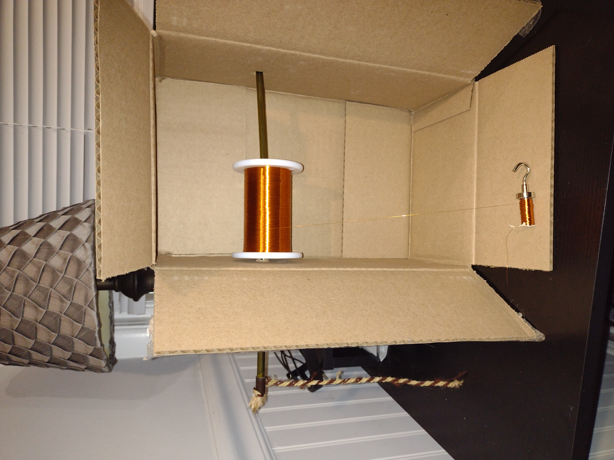
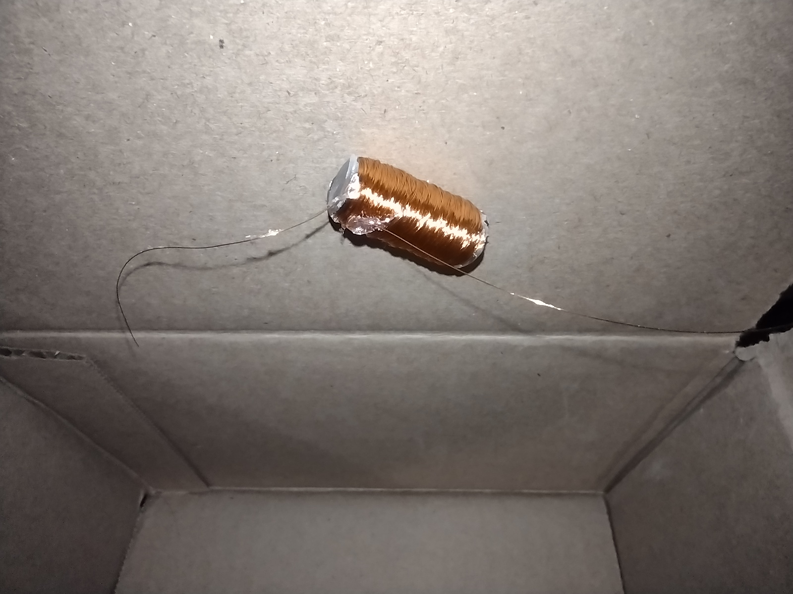
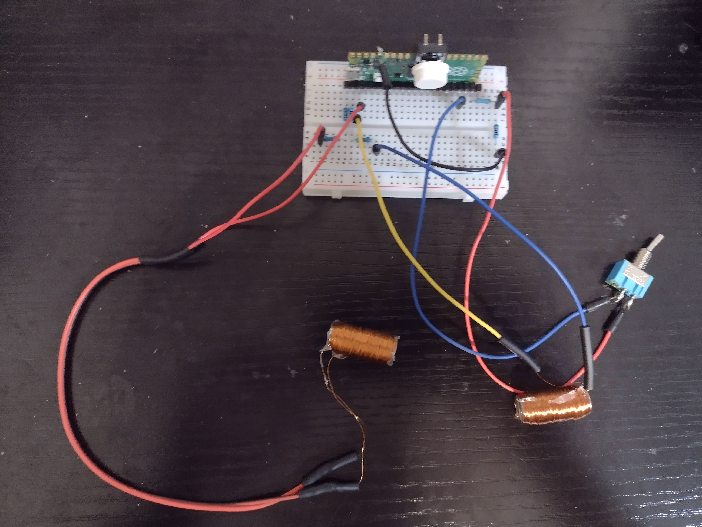
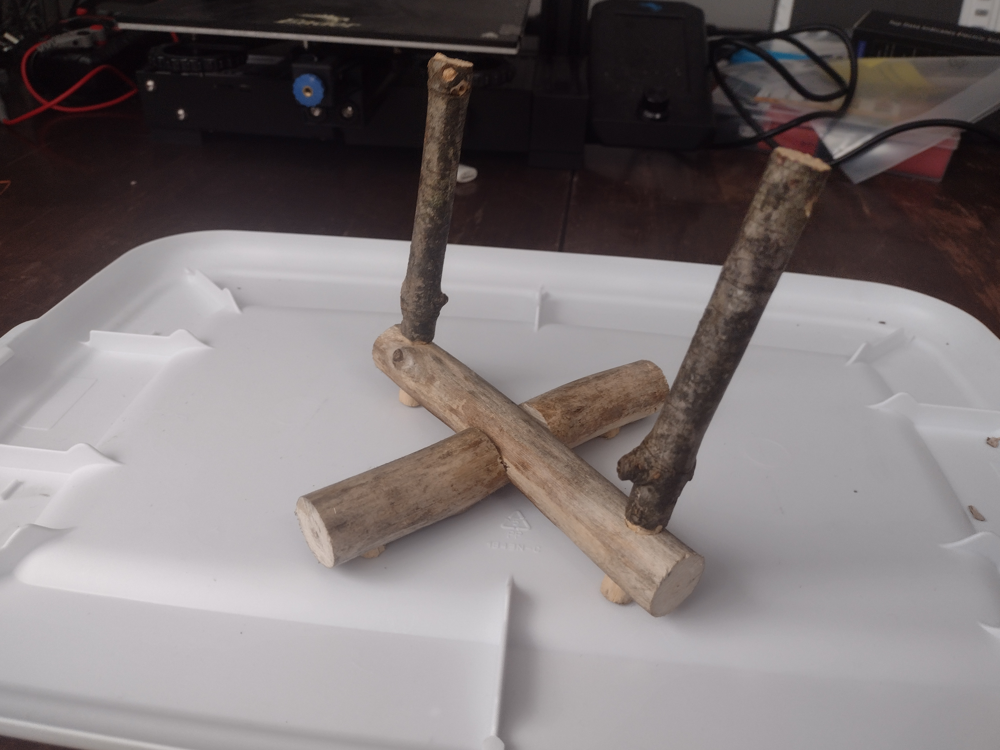
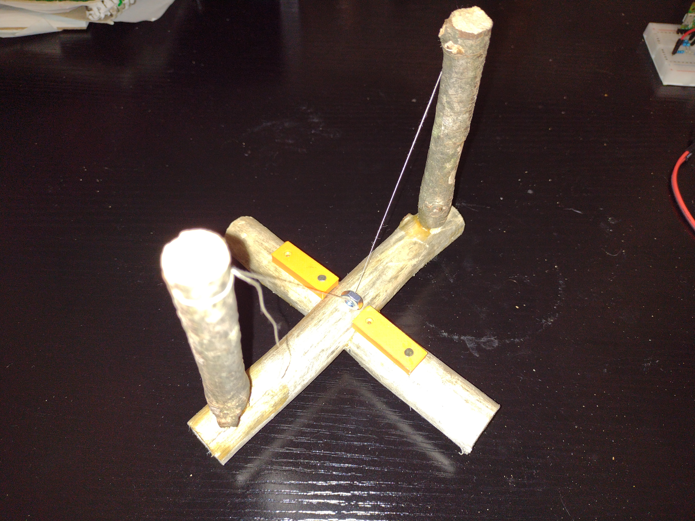

03002 - Low-power Electromagnetic Visual Indicator (LEVI)
========================
*Matt DiPalma, AMDG*


Schedule
--------
  * February 19, 2025 - RFP001 posted
  * February 19, 2025 - proposal submitted
  * February 22, 2025 - contract awarded
  * March 9, 2025 - prototypes complete
  * March 14, 2025 - documentation complete

Abstract
---------
As part of an ongoing effort to design and fabricate a human-observable output for a low-power GPIO pin state, this project investigates the possibility of using an easily-manufactured electromagnet to generate two visually-detectable outputs: the deflection of a crude compass needle and the motion of a suspended mass. The project was a success, and various data and observations were collected.

Click for video of Concept A:

[](https://www.youtube.com/watch?v=tD9r4Nutd2k )

Click for video of Concept B:

[](https://www.youtube.com/watch?v=AwjTqBJ5iOk)

Objective
---------
The maximum GPIO pin source current limitation of 10-20mA on modern microcontrollers is very limiting as far as homemade, human-observable outputs are concerned. Without the ability to leverage common, cheap, mass-produced electronic devices like motors, buzzers, or LEDs, the number of candidate output devices begins to dwindle. Many promising technologies exist that leverage capacitance to drive motors, emit light via electroluminescence, or induce microscopic strains via piezoelectrics may have very low power net requirements, but are understood to have requisite voltages that exceed microcontroller logic levels by factors of 100+. Without the ability to use semiconductor devices to amplify voltage in a conventional way, these output technologies are rendered impossible (although a primitive reed relay may have been feasible, and a variant of this was included as an unpursued third concept in the original [LEVI](https://github.com/marian-scientific/proposals/tree/Christ/RFP001%20-%20HOHMO/submitted%20proposals/LEVI) proposal).

Electromagnets are one technology that can effectively leverage limited voltage and current levels because their induced magnetic fields scale with Ampere-turns, that is, the product of the current running through the wire and the number of turns. With a suitably high number of turns, a stronger field (albeit quite weak in absolute terms) can indeed be generated. And although most humans lack the ability to directly observe magnetic fields with their own senses, it is possible to use the magnetic field to attract or reorient a lightweight magnetic object which, in turn, can be visually detected by a human observer. A weak homemade electromagnet was experimentally validated in the [13001](https://github.com/marian-scientific/reports/tree/Christ/13001%20-%20GPIO%20Electromagnet) investigation at Marian Scientific.

This prototype effort was also an opportunity for the organization to pursue usage of 3D-printed and naturally-sourced, eco-friendly components, where possible, as alternatives to metallic or conventional wooden components with complex and involved supply chains, in accordance with [MP07](https://github.com/marian-scientific/wiki/wiki/MP07-%E2%80%90-Vertical-Integration).

Parts List
----------
The materials required for the construction of each 03002-001 electromagnet are:
* 36 AWG enameled copper "magnet" wire (McMaster # 7588K27)
* 3/8"-diameter stainless steel rod (alloy 416) (McMaster # 89095K56)
* hot glue
* 600-grit sandpaper
* jumper cables (additional extension wire optional)
* heat-shrink tubing

The materials used in the construction of the compass for Concept A are:
* 0.032"-diameter stainless steel wire (alloy 430) (McMaster # 	89065K81)
* approx. 7/8"-diameter wooden stick
* PLA for 3D printing 1x cup
* water
* hot glue

The OpenSCAD code to generate the cup for the compass:
```
$fn=100;
OD=32;
wall_thickness=1;
base_thickness=5;
height=15;

difference(){
    cylinder(h=height,d=OD);
    translate([0,0,base_thickness]){cylinder(h=2*height,d=OD-2*wall_thickness);}
    };
```

The materials used in the construction of the pendulum apparatus for Concept B are:
* thread
* misc. stainless steel nut
* misc. wooden sticks for the frame
* PLA for 3D printing 2x electromagnet support chassis
* wood glue
* nails/glue for positioning electromagnet support chassis

The OpenSCAD code to generate the electromagnet support chassis:
```
$fn=100;

difference(){
    cube([30,10,10],center=true);
    translate([0,0,10]) {rotate([0,90,0]) {cylinder(h=50,d=22,center=true);}};
    translate([10,0,0]){cylinder(h=50,d=1,center=true);}
    translate([-10,0,0]){cylinder(h=50,d=1,center=true);}
    };
```

Design & Procedure
------------------
### Electromagnets
Two 03002-001 electromagnets were fabricated and used in the implementation of both Concept A (electromagnetic compass visual indicator) and Concept B (electromagnetic pendulum visual indicator). They were each constructed by cutting 1" lengths of the 3/8"-diameter stainless steel rod using a hacksaw. The resulting sharp corners were filed to remove sharp burrs that otherwise pose a risk of cutting skin and/or the thin wire used downstream in the construction of the electromagnets.

A temporary wire-winding jig was constructed that suspended the coil of magnet wire in a way that could be ergonomically unraveled while the electromagnets were wound.

A small piece of tape was affixed to both ends of the rod in order to prevent any wire wound around the rod from sliding off either end. A strong permanent magnet with a hook (conventionally used for hanging various items) was then stuck to one of the ends of the small steel rod segments, in order to provide a handle by which each rod could be rotated in order to wind the coil around it. 



Leaving enough lead of magnet wire (2-3") free on both ends, 1000 turns of the 36 AWG magnet wire were wound around each rod, taking care to wind the coil neatly and evenly, such that the diameter was relatively constant along the entire length of the electromagnet.



A small region of the enamel at the end of both leads on each electromagnet was abraded off using the sandpaper. The leads were then connected to jumper wires by solder and each joint was strengthened with heat-shrink tubing. 

### Test Circuit & Code
The circuit implemented to test whether or not the prototypical visual indicators would function correctly leveraged a Raspberry Pi Pico and its GPIO pins, which are capable of outputing roughly 15 mA of current at a 3.3V logic level, in line with the design specifications outlined in the [RFP](https://github.com/marian-scientific/proposals/tree/Christ/RFP001%20-%20HOHMO). The circuit itself is trivial. The two electromagnets, each having a resistance of roughly 50 ohms, were wired each in series with 200 ohms of additional resistance, and connected between a GPIO (output) pin and a ground pin of the microcontroller. As such, a current of roughly 13 mA could be actively toggled on/off through either of the electromagnetics, activating their respective magnetic fields. A switch was also connected to another GPIO (input) pin for the purpose of switching between the active electromagnets. 



The code required for this test circuit, to be uploaded to the Pico, is [attached to this report](resources/double-electromagnet-test.c), leveraging the Pico C SDK.

### Concept A - Electromagnet Compass Visual Indicator
A small cup was 3D-printed and filled with water. A stick, having a thickness less than the inner diameter of the cup, was sliced into a  1/4" thick wafer. A notch was cut into the wooden disk, and a small length of stainless steel wire was glued into the notch. The wooden disk was then placed into the cup of water. This disk setup acts as compass needle, though one not inclined to reorient to point along Earth's magnetic field lines.


The electromagnets were then placed next to the cup, oriented radially, with roughly 60 deg spacing between them. A piece of paper with "0" and "1" written as output indicators was placed opposite the electromagnets.

The microcontroller was turned on, and the switch was flipped multiple times to test the function of the prototype.

### Concept B - Electromagnet Pendulum Visual Indicator
The below frame was constructed. The exact dimensions of the frame structure are not expected to be critical for its proper function. 



Simply, the frame suspends a magnetic stainless steel nut from two vertical posts by a thin thread, giving it enough clearance to swing freely above whatever frame structure is below it. The frame should also position the two electromagnets in such a way that their magnetic fields, when activated, would draw the steel weight towards them in the most efficient way possible.



One key detail of this apparatus is that it requires a small piece of tape to be applied to the ends of the electromagnets that are closest to the suspended weight. The critical function of this small piece of tape is described in the Conclusions below.

The microcontroller was turned on, and the switch was flipped multiple times to test the function of the prototype.

Results & Observations
----------------------
Both prototypes were successful in generating a visual output, albeit a small one. Videos of the prototypes working are linked in the Abstract section.

The compass indicator was significantly slower in its response time, as the needle had to slowly swing back and forth and equilibrate oriented along the active electromagnet. The pendulum indicator was able to render its visual output almost immediately.

Contrarily, the pendulum indicator required a lot of fine tuning of the electromagnet positions relative to the suspended weight, making it significantly more challenging to get working. The compass indicator was very much plug-n-play, and only took a matter of seconds to lay out a working configuration.

Conclusions
-----------
* Electromagnetism is an effective phenomenon for rendering a visual output with very minimal power and current requirements, requiring a very simple apparatus to visualize the changing magnetic fields.
* An electromagnet can be easily and quickly fabricated. Their geometries and electronic characteristics can easily be customized, as well as their core material.
* One ferromagnetic core material that has repeatedly shown to be effective is 416 stainless steel.
* The crude wire-winding jig depicted and described in this report significantly helped facilitate the construction of the electromagnets.
* The solder joints connecting the ends of the this 36 AWG magnet wire to the ends of the extension wire / jumper wire, although reinforced with heat-shrink tubing, seem qualitatively susceptible to fatigue-induced failure, although no such failure was experienced. It would be preferable if these magnets were potted in some type of epoxy resin, including the solder joint with a much more robust lead wire, such that only the thicker wire was exposed and capable of bending.
* Both of these visual indicators leveraged a very small magnetic attractive force. To amplify the effect of this small force, all other counteracting forces needed to be minimized or removed altogether. In the case of the compass indicator, the only force opposing the reorientation of the needle is friction against the water. In the case of the pendulum indicator, only a small component of gravity.
* The small piece of tape placed on the ends of the electromagnet in the for the pendulum electromagnetic visual indicator served a critical purpose. Normally, when these electromagnets are activated and deactivated, they maintain a small residual magnetic field, that is actually strong enough to keep the suspended weight weakly attached to the non-active electromagnet. Because the strength of the electromagnet decreased with the square of the distance away from it, even a small piece of tape is enough thickness to degrade this residual attraction to the degree necessary to allow an activated opposing electromagnet to pull the weight off the deactivated electromagnet.