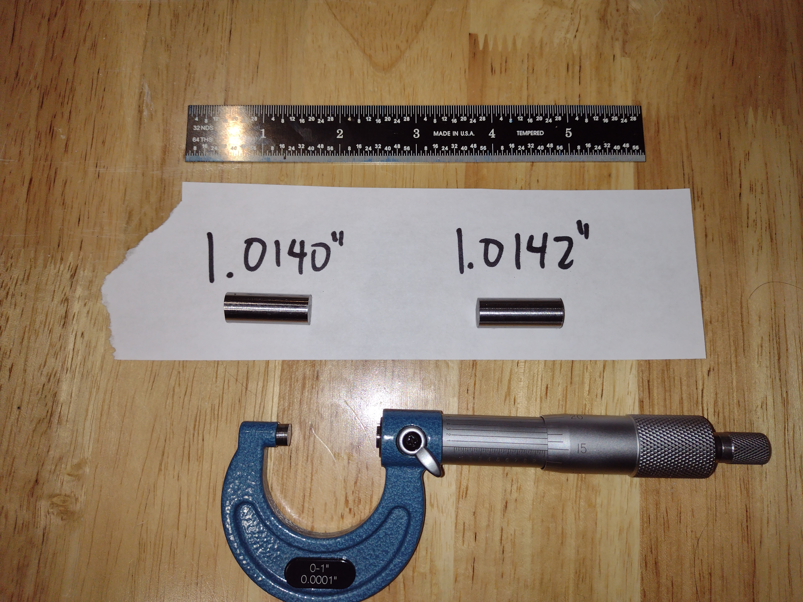

# 03002 - Progress Tracker

### February 19, 2025

* [RFP](https://github.com/marian-scientific/proposals/tree/Christ/RFP001%20-%20HOHMO) announced.
* [Proposal](https://github.com/marian-scientific/proposals/tree/Christ/RFP001%20-%20HOHMO/submitted%20proposals/LEVI) written and submitted.

### February 22, 2025

* [Contract](https://github.com/marian-scientific/proposals/blob/Christ/RFP001%20-%20HOHMO/submitted%20proposals/EVALUATION_CRITERIA.md) awarded.
* 2x 1"-long 3/8"-diameter stainless steel (416) cylinders cut and measured (used for Concepts A & B)

* Very-basic coil-winding-rig cobbled together (used for Concepts A, B & C)

* First (of at least two) 1000-turn electromagnet wound with 36 AWG wire, with enamel removed & leads soldered. Resistance measured at roughly 50 ohms.

* Tested electromagnet @ 3.3V, 200 ohms supplemental circuit resistance, so around 13mA, quantitatively much stronger than the 300-turn 30 AWG version tested in investigation [13001](https://github.com/marian-scientific/reports/13001%20-%20GPIO%20Electromagnet).

### February 23, 2025

* (This) reporting structure created as a template for all future projects.

### February 24, 2025

* Cup found to serve as container for DIY compass.
* Steel wire in inventory to use for needle for DIY compass.
* OpenSCAD code to generate ring to be 3D-printed for floating needle support for DIY compass:

```
$fn=100;
OD=29;
ID=20;
thickness=3;

difference(){
    cylinder(h=thickness,d=OD,center=true);
    cylinder(h=2*thickness,d=ID,center=true);
    };
```

### February 26, 2025

* Brainstorming done for required materials for Concept B
* OpenSCAD code to generate basin to be 3D-printed for DIY compass in respect of the new [MP07](https://github.com/marian-scientific/wiki/wiki/MP07-%E2%80%90-Vertical-Integration):

```
$fn=100;
OD=32;
wall_thickness=1;
base_thickness=5;
height=15;

difference(){
    cylinder(h=height,d=OD);
    translate([0,0,base_thickness]){cylinder(h=2*height,d=OD-2*wall_thickness);}
    };
```