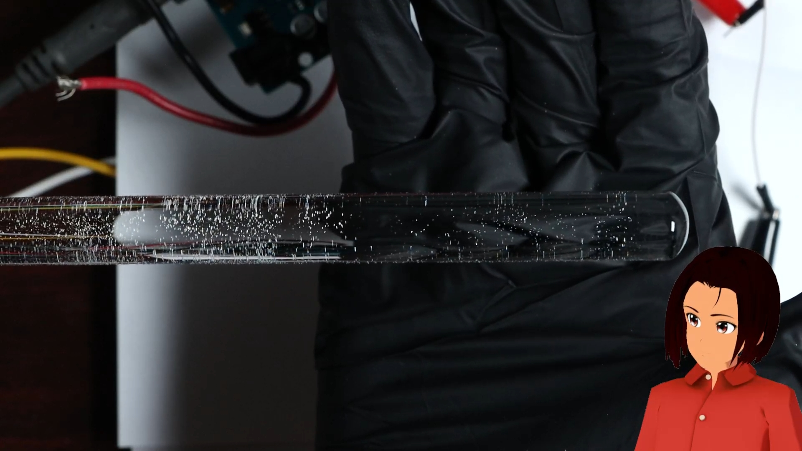
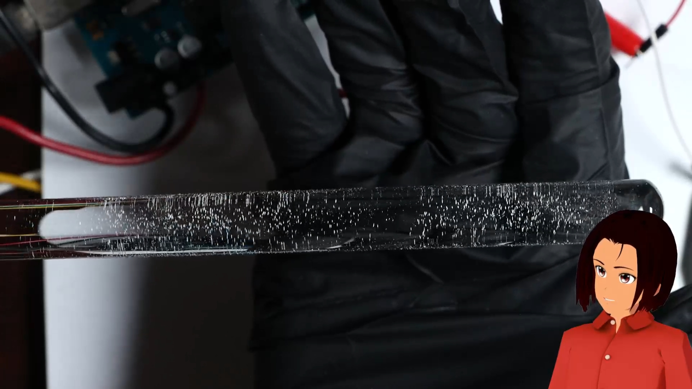
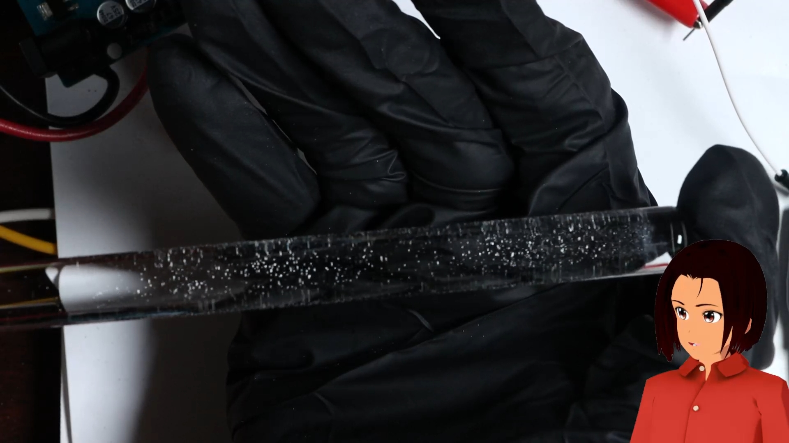
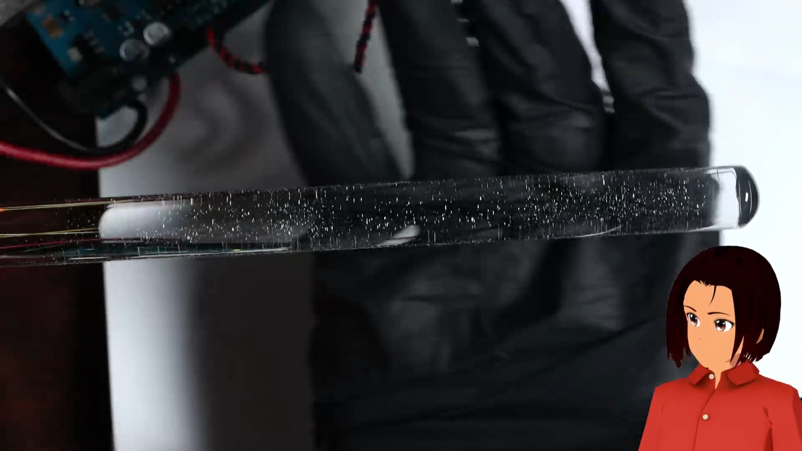
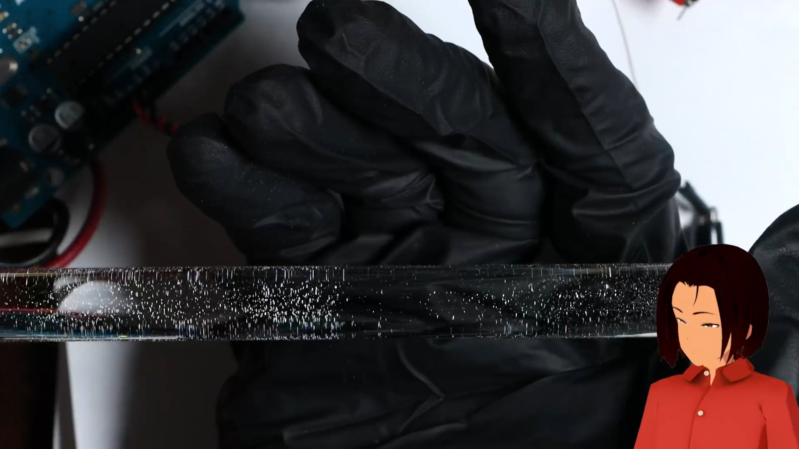
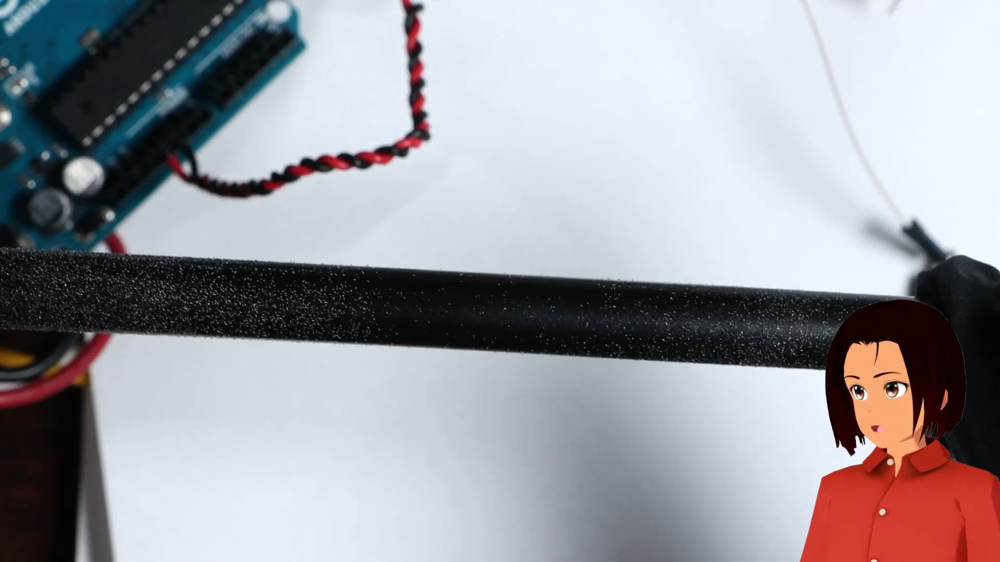
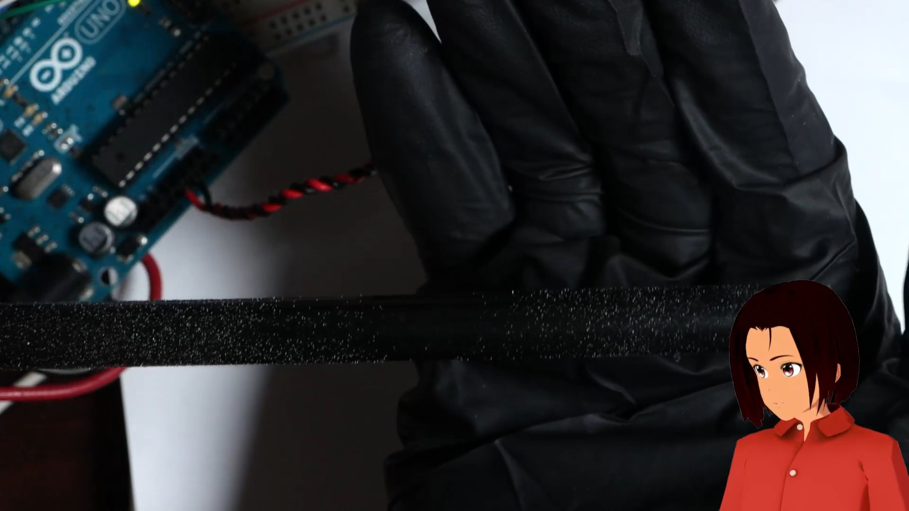
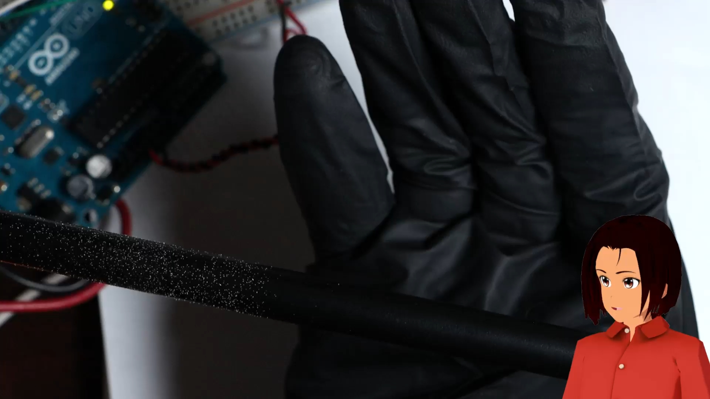
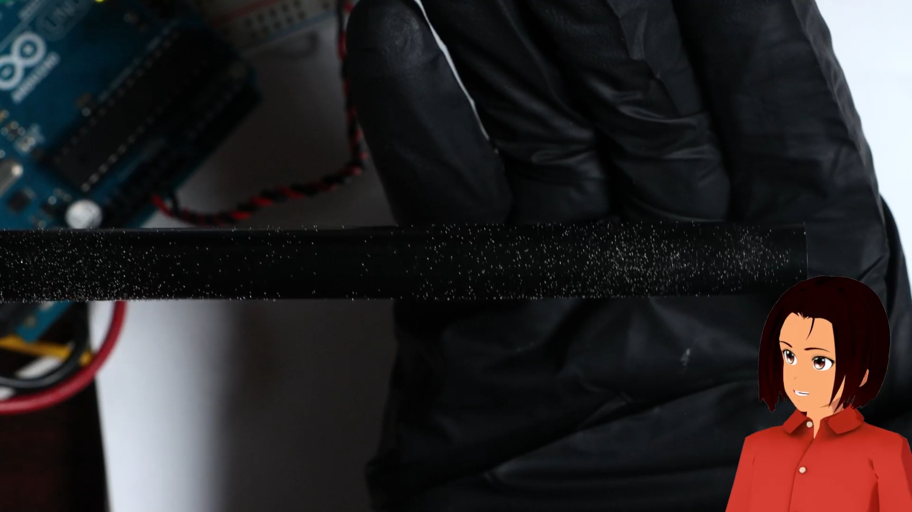
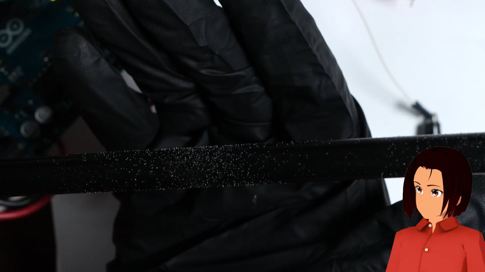

03003 - Iron-Jar
========================
*Anthony Remark*
*report assisted by Matt DiPalma, AMDG*

Schedule
--------
  * February 19, 2025 - RFP001 posted
  * February 21, 2025 - proposal submitted
  * February 22, 2025 - contract awarded
  * February 27, 2025 - Sourced all necessary parts
  * March 21, 2025 - prototypes complete
  * March XX, 2025 - documentation complete

Abstract
---------
As part of an ongoing effort to design and fabricate a human-observable output for a low-power GPIO pin state, this project investigates the possibility of leveraging weak electrostatic charges applied to iron filings in order to manually measure a GPIO voltage level. While this goal was not met, various data and observations were collected that will benefit future endeavors at Marian Scientific. The phenomenon as observed from a Leydan Jar experiment was the inspiration for the 03003 Iron Jar Project.

PUT A PICTURE HERE

*The Iron Jar experiment setup for the Results section*

Objective
---------
In general, a microcontroller’s GPIO does not have the voltage or current output capabilities to drive large equipment or devices that require lots of power. Amplifier circuits and voltage multipier circuits all require semiconductor devices and capacitors manufactured in massive sophisticated facilities, so without such capabilities, the search for a human observable phenomenon goes back to physics experiments seen in an introductory electromagnetics class. Even with a limited voltage, the effects of charge can still be observed. This prototype attempts to leverage the properties of electrostatics to manually detect a GPIO output level with only a small array of primitive equipment.

The historical Leyden Jar experiment is essentially a capacitor constructed with two conducting metals separated by a jar, with the jar itself serving as the dielectric. There is an electrode (historically a chain) submerged in water in the jar that charges the inner conductor, causing the outer conductor to accumulate an opposing charge through the ionized air. This charge is accumulated onto the jar. One of the severe limitations of a microcontroller GPIO is the limited amount of voltage it is capable of sourcing, but the electric charge that accumulates on a jar can likely be harnessed to demonstrate a human-perceptible phenomenon.

Unfortunately, after some preliminary testing of the concept, the reduced voltage levels combined with the capacitor "plate" separation distance associated with the jar wall thickness, diminished the ability for the underlying physics to render a human-observable output. The experiment was then pivoted to leverage off-the-shelf capacitors wired in parallel with planar contact surfaces onto which iron filings could be applied. It is expected that filings of different charges react differently in the presence of objects of much stronger electrostatic charge, and this will yield a reliable quantification methodology for experimentally (and manually) measuring a GPIO output level.

### Going into more detail
There are several concepts to the leyden jar experiment. They all incorporate a change in electric charge on the capacitive conductors. Some utilize iron fillings to demonstrate the change in charge. The iron filings are used to indicate the change in charge that is due to a GPIO of a microcontroller. 


(take a pic of the two mcdonalds cups with the attached copper tape)

in the caption, say that concept 1C was tested. If this concept were to fail, the other proposed concepts need not be tested because they wouldn’t succeed in place of 1C. It was believed that these alternative concepts could facilitate observable changes more readily. 

There was an honest attempt to substantiate the concepts in the proposal, but when enacted, there were unacticipated issues. It was envisioned that the water would facilitate the travel of the iron filings towards the outer conductor. But reality was more messy than anticipated. The cups weren’t believed to be able to concoct a sufficiently large amount of capacitance. The copper tape on mcDonalds cup are a crude construction of a capacitor and a large amount of voltage would be necessary to get observable changes in charge. 

The water was believed to hinder the travel of the iron filings. It was believed water would easily change the charge of the iron filings, which it may have, but the iron filings did not travel towards the outer conductor as anticipated. It was anticipated that the iron filings would spreadout across the bottom of the cup to reach the extent of the geometery of the outer conductor. Opposite charge wants to come together and the leyden jar (in this case the mcdonalds cup) serves as the dielectric. It’s believed the iron filings didn’t spread out because the total voltage level wasn’t high enough. Gravity is obviously keeping the iron filings in place, so the charge must become high enough to overcome gravity. The charge may have been high enough but the water was impeding possible movement of the iron filings. 

At this point the team had several options, 

1) increase the voltage. The issue is that the team believed the concept was theoretically sound but not implementable with such low voltages.

2) get rid of the water and thus find a different way to charge the iron filings. Maybe a chemist could have helped.

3) find a different concept. The team did this one.

With the same materials already accumulated, the team designed another concept to produce a Human-Observable phenomenon that can be tested. The concept of the leyden jar was maintained, but a different approach was taken. Instead of building a leyden jar for testing, the team rigged up separate copper conductors that are serially connected through three 1000uF capacitors in parallel. 


The capacitors overcome the need for a carefully manufactured leyden jar. The two conductors will have equal and opposite charges. One can place iron filings on the conductors and those filings will obtain the same charge on the respective conductors. So the filings can then be tested for that charge. 

This approach yielded unexpected results that were nonetheless human-observable. 


Parts List
----------
The materials required for the experiment are as follows:
* Copper Foil Tape: $10
* Fine Iron Filings 100g: $10
* Glass/Ebonite Rod and associated charging cloths: $33
* Breadboard: $5
* Nitrile Gloves: $7
* Texas Instruments Buffers: $10 ($1 each)
* Alligator Clips & jumpers: (in inventory)
* 3x 1000uF capacitors: (in inventory)
* Sheet of printer paper: (in inventory)
* Arduino Uno Rev3 and misc. electronic components for test: (in inventory)

MAYBE PUT A PICTURE HERE OF SOME OF THE COMPONENTS, I'M SURE YOU HAVE ONE


Design & Procedure
------------------
The actual experimental procedure for this investigation evolved over the course of multiple attempts at detecting the weak electrostatic forces described above. The following procedure reflects the final attempt at experimentally validating whether or not this electrostatic phenomenon could be manually detected with the equipment specified above.

Two strips of copper foil tape were affixed to a piece of paper with significant separation between them. Using alligator clips, these "contacts" were connected in parallel with the aforementioned capacitors, although the efficacy of this inclusion was not experimentally validated at this time. Iron filings were to be gently distributed on each contact surface, in addition to a region of the paper on which no copper foil tape was applied. One of these contacts was then connected to an output with voltage and current levels representative of that which a hobbyist microcontroller is capable of producing, and the other was connected to ground, in the traditional sense of a capacitative element.


*Here's the Setup from before.*


*This is a Diagram of the Setup for the Iron Jar Experiment. The Iron Filings are placed appropriately.*

The Arduino charges the capacitors (via interfacing with a circuit). The charges accumulate on the plates. These charges can transfer to the iron filings on the plate. The hypothesis is that the conductors in this configuration accumulate enough charge for a human observable phenomenon. The capacitors are not discharged immediately so a multimeter can measure the electric potential to see if there is charge present. The white paper also acts as a dielectric between the two conductor plates.


*A Diagram featuring a charged Glass Rod approaching the Iron Filings.*

If the GPIO is Low, Both conductors are discharged and are without an opposite charge. The hypothesis says the conductors are at 0V and so would be the white paper the neutral iron filings lay on.

The general approach to detecting the applied output voltage was very simple. An ebonite (hard rubber) rod was rubbed with a woolen cloth, in order to acculate a negative charge, and a glass rod was rubbed with a silk cloth in order to accumulate a positive charge. When these rods were brought briefly above the iron filings, a lot of them would be attracted to the rods and stick to them. The operating principle is that the negatively charged ebonite rod would attract a greater density of iron filings from the positively charged capacitative contact than from the negative contact, and the inverse would be true for the positively charged glass rod. In such a way, it was anticipated that the GPIO output voltage level applied to a given contact could be manually measured.

So the Electrical Innovation team decided that an Ebonite Rod (rubbed with wool cloth to negative charge) and a Glass Rod (rubbed with a silk cloth to positive charge) will be used to determine if Iron Filings are charged or not. So if the conductor of interest is positively charged (thus charging the iron filings) and a glass rod is also positively charged, then most of the iron filings should not be attracted to the glass rod. 


*The Glass rod attracted Iron Filings onto itself*

While qualitative observations can be blindly made to suggest the efficacy of this electrostatic approach, a "double-blind" study was conducted to experimentally determine whether or not the approach was truly successful, and not merely an instance of confirmation bias. To conduct this experimental validation, and to determine for certain that the electrostatic effects in question could indeed be generated by a standard microcontroller GPIO output, an Arduino-based testing apparatus was constructed.

The test apparatus consists of the Arduino connected to the output capacitor array on GPIO #10 through a buffer. It is also connected to an optional LED for the purposes of displaying the GPIO output level, either high or low. A push-button is connected to the microcontroller for input purposes. The CD4010 acts as a non-inverting buffer which protects the Arduino microcontroller from the discharge of the capacitors. The experiment may have unintentional issues which might cause damage, so to avoid this possibility, even if remote, a buffer is used. 

PUT A PICTURE HERE OF YOUR ARDUINO + BREADBOARD SETUP.


The test apparatus functions essentially by the Arduino generating a random GPIO output state for both the output capacitor array and an optional LED indicator and keeping this state hidden from the operator until the end of the trial. When the push-button is pressed, a new random GPIO state is determined and the appropriate output pins are set accordingly.

The trial would use charged rods to pick up charged or uncharged iron filings. There is a control consisting of iron filings that are not charged. The end of the rod will hover over the iron filings placed on the respective conductor. The conductor may be the positive end of the capacitors or the negative end of the capacitors. The end of the charged rod (ebonite or glass) will hover over the filings on the conductor. The filings in the middle on the paper are not charged and will be considered the control variable in our trials. 

Control Variable:
The iron filings in the middle of the paper. These are presumably uncharged.

Tested variable:
The iron filings on the conductor. Are these filings able to be charged? Are they able to be picked up by the charged rod? Does demonstrate that the GPIO was able to charge a capacitor whereas the iron filings being more attracted to the rod represents the human observable phenomenon?

The code used to conduct this experiment is included below:
```
void setup() {
  // put your setup code here, to run once:

  // This is for the push button
  pinMode(13, OUTPUT); // This has the LED
  pinMode(12, OUTPUT); // For the Test output Nodes LED indicator
  pinMode(11, INPUT);  // This is for the push button
  pinMode(10, OUTPUT); // This is for the Test output Nodes
   
}

void loop() {
  // put your main code here, to run repeatedly:

  // perhaps the button should be pressed twice to restart
  // the loop
  int sensor = digitalRead(11);


  // Set the output low initially
  digitalWrite(12,LOW);
  
  // If the button is pressed
  if (sensor > 0){

  digitalWrite(13,HIGH); // turn on the LED when the button is pressed
  
  // Select a number between 1 and 10
  int randnumber = random(1, 11);

  // we want the output to be high
  if (randnumber > 5){
    digitalWrite(12,HIGH); // LED is on and shows output is High
    digitalWrite(10,HIGH); // the node is high
    delay(10000); // hold for 10 seconds
  }

  // If the output is low, no capacitance
  if (randnumber <= 5){
    digitalWrite(12,LOW); // LED for Node shows low
    digitalWrite(10,LOW); // make the node low
    delay(10000); // hold for 10 seconds

  }
  }
  
  digitalWrite(13,LOW); // turn off the LED 
  

}

```

Five trials were conducted of the experimental procedure described above. For each trial, the ebonite rod was rubbed approximately 30 times with the wool cloth in order to negatively charge it, and it was slid gently, while rotating it, over the filings sprinkled on the positively charged capacitor contact and the control, at a height of roughly between 1/4 and 1/2-inch. The qualitative density of the iron-filings that stuck to the rod from the capacitor contact were compared with that from the control in order to make an educated guess on the GPIO output level. If the filings attracted from the positively charged contact were more densely distributed than the control, then the GPIO level was expected to be "high". If the densities were approximately equal, the output was expected to be "low". Similarly, the glass rod was rubbed with the silk cloth approximately 30 times, and the same experimental procedure was applied to the negatively charged contact, and the opposite expectations were to be made.

The optional RED LED indicates the state of the GPIO, and consequently whether or not the capacitor is charged. For the trials to adhere to the double blind trials. The LED will be disconnected and a multimeter will be used to measure the voltage on the conductor. For example if a positive charge is being measured on the positive conductor, then if the multimeter reads approximately 5V, the iron filings should be charged and according to the hypothesis the charged rod should read a human observable phenomenon. Because of the capacitors, the charge will maintain itself unless deliberately discharged. 

This facilitates the double blind trials and a double blind trials is more objective because the observable density of iron filings on the charged rod is not influenced a priori via the RED LED.

The Electrical team acknowledges there are issues with the design of the experimental trials. Consistency with the density of distribution of the iron filings placed on the white paper or the conductor is estimated with human perception not with precision tools. The measurement of the charged on the rods are not measured with precision tools either. The trials involve a human perceptive of results in a somewhat coarse way rather than a precise manner. 

Results & Observations
----------------------

The program waits for the button to be pressed. Then the Arduino will either charge the capacitor or discharge the capacitor (if it’s already charged). The hypothesis says the conductor connected to the positive plate should be positively charged. 

What’s important to full fill Human observable phenomenon is that a change can be observed. So an observation must be consistent with the hypothesis. A multimeter is used to measure the voltage on the positive side conductor for confirmation or inconsistencies of the hypothesis. 

### Trial 1
The right end of the glass rod represents the charged rod attracting the iron filings on the conductor. The middle of the glass rod represents the charged rod attracting the iron filings on the white paper. The white paper is not charged so the iron filings are not charged.


*The density of the iron filings on the left is greater than the density on the right.*

This Result suggests the Conductor is positively charged (the capacitors are charged). So the GPIO should be High. But when measured by the multimeter, the conductor did not have a charge, it was 0V which means the GPIO must be low. If the GPIO was High, then the capacitors should have been charged and they wouldn’t discharge until the GPIO is set to Low via the programming (when the button is pressed and GPIO is randomly set High or Low).

### Trial 2
The middle of the rod (left side on the figure/picture below) and the end of the rod (the right side of the picture below) have similar densities. The hypothesis suggests that the conductor was not charged and the GPIO is Low. The viewers agreed.


*The densities on the left side and the right side are the same*

The multimeter says the conductor was not charged via a reading of 0V. So the GPIO is Low.

### Trial 3
The densities appear to be the same, so the hypothesis suggests the conductor is not charged and the GPIO should be Low. The viewers did not give an opinion on this trial.


*The densities of the iron filings on the left and the right appear to be the same.*

The multimeter read approximately 5V which indicate the GPIO yielded a High output.

### Trial 4
It appears as both densities are the same, so the hypothesis suggests that GPIO should be Low.



*The Densities on the left and right appear the same.*

The multimeter reads 0V, so the GPIO is Low. This is consistent with the hypothesis.

### Trial 5
This appears as if the density is greater at the center versus the density at the edge of the rod. So the hypothesis suggests the GPIO is High.


*It's clear the density on the left (center of the glass rod) is greater than thedensity on the right (edge of the glass rod)*

The multimeter read 0V, so the GPIO was actually low.

# Ebonite Rod Trials
The rest of the trials remain the same except now the ebonite rod will be used and rubbed with a wool cloth. When rubbed, the ebonite rod is negatively charged. So to further expand on the established hypothesis, since conductor of interest is positively charged when the GPIO is High, when the ebonite rod is charged and supplants the glass rod in the trials, the ebonite rod should have a higher density concentration towards the edge of the rod versus the control.

This is because the iron filings should be positively charged and more attracted to the negatively charged ebonite rod moreso than the control iron filings which should have no charge according to the hypothesis. 

### Trial 6
The center (control) is more dense than the edge of the ebonite rod.


*The left (center) is more dense than the right (edge).*

This result should not be possible. Members of the Electrical Innovation team suggest this means the control is more positively charged than the conductor. Which should not be possible under the established hypothesis. A re-evaluation of the situation suggests that perhaps the node that represents the electric potential of the conductor is of lower potential compared to the white paper control potential. Therefore with this possibility, the team suggests that when the control density is greater than the edge density, the GPIO must be Low.

With this in mind, the Team predicts the GPIO is Low under this observation of the trial. The multimeter reads 5V so the GPIO was actually High. 


### Trial 7
Visually both the center and the edge of the ebonite rod have the same density. The hypothesis remains the same but in some unforseen manner the electric potential of the conductor must be lower than the control.


*The densities on the left and the right are similar.*

The Trial suggests that the GPIO must be High. The hypothesis states that when the conductor is high, there is more positive charge to accumulate on the iron filings, therefore the positively iron filings will be more attracted to a negative potential source as compared to the control. The control will still be attracted to the ebonite rod and is used as a comparison for the variable element. In other words there is a percievable difference with the variable element when the GPIO is High or Low. 

But the multimeter reads 0V which indicate the GPIO is Low.

### Trial 8
The densities are the same, so the GPIO should be High.


*The densities appear to be the same.*

The Multimeter read 0V, so the GPIO is Low.

### Trial 9
The center of the ebonite rod has a density of iron filings, but the edge has no iron filings. This is an unusual result which suggests a performative malfunction upon the experimenters. If the hypothesis is applied anyway, the GPIO should be Low.


*The left side (center of rod) has iron filings but the right side (edge of rod) has no iron filings. This is an unusual result.*

The multimeter read 5V, which indicates the GPIO is High.

### Trial 10
The densities are the same, so the hypothesis predicts the node is positively charged, or a GPIO of High.



*The densities are seemingly similar.*

The multimeter read 0V, so the GPIO is Low.


The results of the five trials are compiled below.
| Trial   |  Opinion  |  Description | Truth  |
|:--------|:---------:|:------------:|:------:|
| 1       | H         | Center       | L      |
| 2       | L         | Same         | L      |
| 3       | L         | Same         | H      |
| 4       | L         | Same         | L      |
| 5       | H         | Center       | L      |


The Results of the Ebonite Rod Trials are compiled below
| Trial   |  Opinion  |  Description | Truth  |
|:--------|:---------:|:------------:|:------:|
| 6       | L         | Center       | H      |
| 7       | H         | Same         | L      |
| 8       | H         | Same         | L      |
| 9       | L         | Center       | H      |
| 10      | H         | Same         | L      |


Discussion
----------

The glass rod trials were not predictive and inconclusive other than the comprehension of the variable elements at play are in question. The ebonite rod trials were exactly predictive in the opposite manner. At least it was 100% wrong on the coin flip. 


The Trials that used the glass rod were not predictive. In the first 5 trials with the glass rod, the iron filing density concentration (observations) inform the team’s prediction. In the first 5 trials, there is no suggestion there is a correlation between the observations and the truth. 

Quite possibly there may be mis-attributes or misunderstanding about the application of the hypothesis. Essentially that would mean the experiment isn’t robustly designed. Another possibility is that the hypothesis is wrong in addition to a poorly designed experiment. Maybe there needs to be more trials done which might reveal a stronger correlation of the truth (a case where 35% of the trials will be wrong). 

The trials are not predictive, but then there’s a problem. It’s a mystery where to begin to figure out why the experiment failed. The Electrical team is aware that designing experiments is a complicated process that isn’t always clear cut. Perhaps an iterative approach may be a good strategy. This idea led to performing the Trials again but with the ebonite rod rubbed with wool. The hope is that there will be something revealing about the experiment setup after performing the trials with the ebonite rod. So when the trials were finished, the ebonite rod produced results that were consistent but in an unexpected way.

Looking at the results from the table, the guessing of the GPIO was consistently incorrect. The outcome was the exact opposite of the guess. So apparently this means that there is a Human observable phenomenon but it wasn’t deliberately concocted. It’s as if it happened by accident. 

So one wonders why are the ebonite results the way they are. Why are the glass rod results the way they are? Iron filings are not ions themselves unless there’s a chemical reaction to induce it. So they have charges on them. A fact overlooked is the material content of the iron filings themselves whereas such can influence the transfer of charge. 

What certainly does not happen is the iron filings accept charge into their atom structures and behave like charges. The hypothesis was constructed as if the iron filings would behave similarly to charge. Such an oversight could explain why the ebonite trials had iron filings at higher densities in the center versus the edge. It was thought that there’s a possibility that the control had a higher potential versus the positive conductor due to poor experiment design. Quite possibly the truth could be that the control indeed had 0V as expected but the observed results were due to the unexpected nature of how charges interact with these specific iron filings. These specific iron filings have mix of materials to make them stable and ferromagnetic for magnetic observations common in an introductory physics class on electromagnetics. 

In a future interation of this experiment could cast the control variable at the negative conductor of the leyden jar setup. This way, the electric potential of the control will not be in question. Another method can be that the control will be an independent conductor that is grounded and removed from the leyden jar itself. It was through convenience that the control iron filings where placed on the dielectric (white paper). 

If the ebonite trials were conducted again with the suggestions for managing the control variable, the independent variable (iron filings on the positive end conductor) may produce the same results. If so, it would buttress the claim that the materials in the iron filings influence how charge reacts and changes the expectation from the original hypothesis. 

For the next experiment, the hypothesis is that the iron filings do not behave like the charges themselves. This is more likely than the other possibility which is that the control in the original trials did not have zero potential (the control had lots of problems to be regarded as reliable). 


Conclusions
-----------

The glass rod trials trials produced results that were not conclusive and not satisfactory of the human observable phenomenon requirement. It’s a mystery as to whether the experiment itself had a bad design or the rationale behind the behavior of charges was in question. After the original glass rod trials were performed, a member of the team suggested to redo the trials with the ebonite rod in order to uncover the mystery behind the unpredictable results. These ebonite rod trials inadvertently met the requirements of the human observable phenomenon problem.

The ebonite rod results were 100% incorrect to a two answer question. This means that the experiment was incorrect all the time but consistently incorrect. So if the prediction were to be updated to be the opposite prediction, then observers can reliable predict the GPIO output without an LED or multimeter reading verification. This solves the human observable problem. 

One can ask how can the design be refined? 

The team believes that a more robust understanding of the experiment and hypothesis is required. Marian Scientific is always interested in methods of refining its products for a more consistent and robust performance. If resources, time, considering other projects at hand, and other project schedules permit, it would be a worthwhile to perform more experiments to update the hypothesis which would lead to a better design.

From the results, it’s not in question that the experiment design has problems. To address these problems, a few questions must be answered. The hypothesis suggested that the iron filings would behave similarly as positive charges. The hypothesis also suggested how positive charges would behave. The team thinks the rationale behind the behavior of charges is sound, but verification is welcome. Consequently, it is prudent to conduct further investigation as if this behavior needs to be verified. It is not assumed to be correct.

The team believes following through with an iterative experiment that takes in the suggestions in the discussion section would reveal if the results of this experiment are more influenced by the material makeup of the iron filings rather than a flawed comprehension of the behavior of charges in the original hypothesis. 

The experiment design itself is the solution to the Human observable phenomenon. So further experimentation will produce a better experiment and solve the Human observable phenomenon problem more reliably and maybe more efficiently. 


* Electrostatics is a challenging phenomenon to leverage for rendering a visual output with very minimal power and current requirements, especially with primitive equipment used for the measurements in this study.
* Design of experiments is challenging to control for all variables (both in experimental plan and the execution itself).
* Although the test apparatus controlled for confirmation bias, there are other things to control for, like number of rubs and height of rod as it was translated over the capacitor contacts.
* PUT SOME THINGS THAT YOU LEARNED HERE
* Buffer usage is easy and good idea (expand on this)
* 
