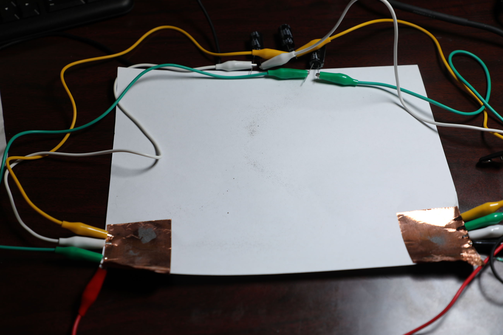
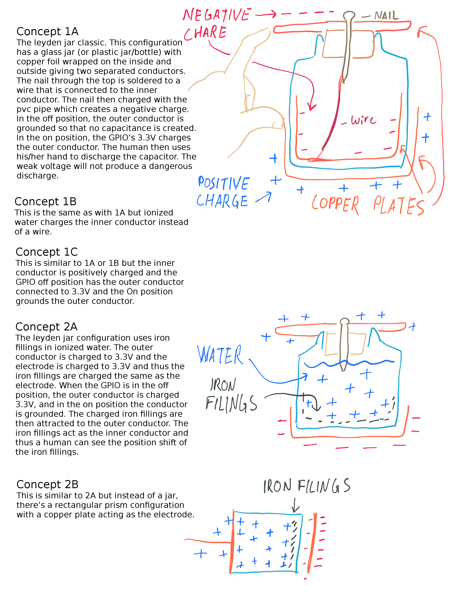
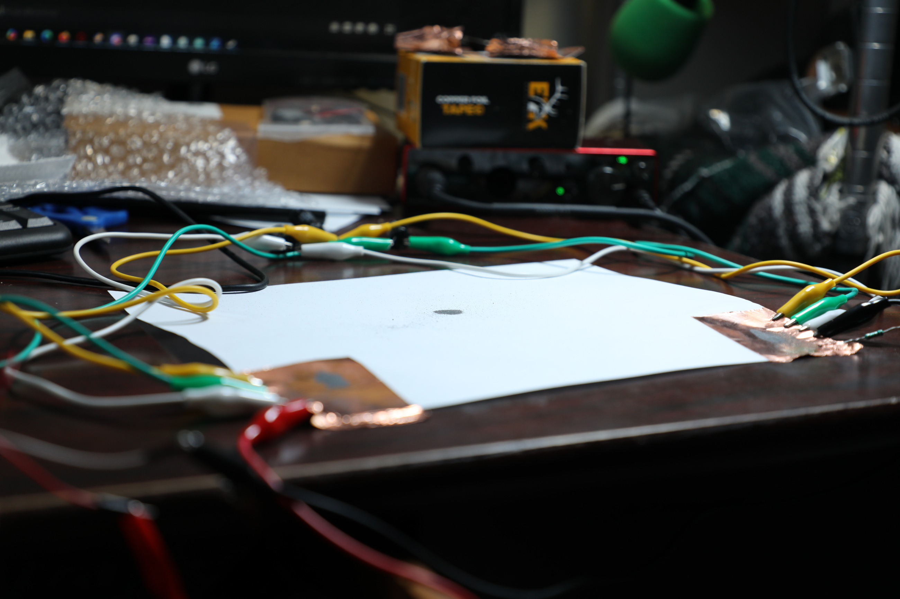
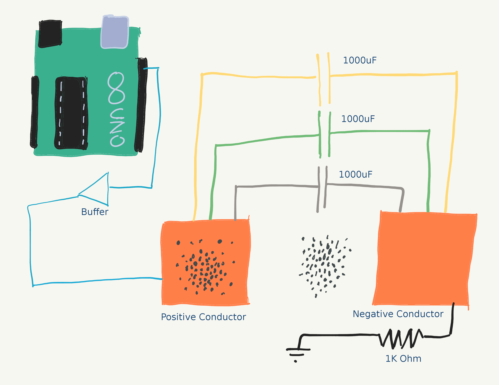
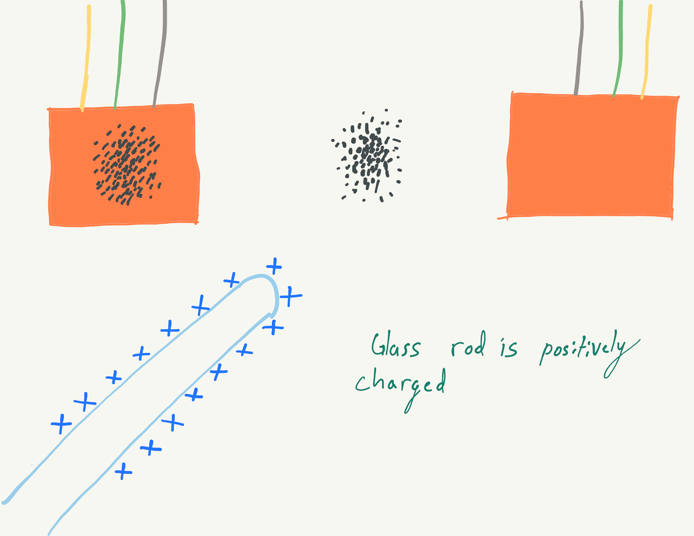
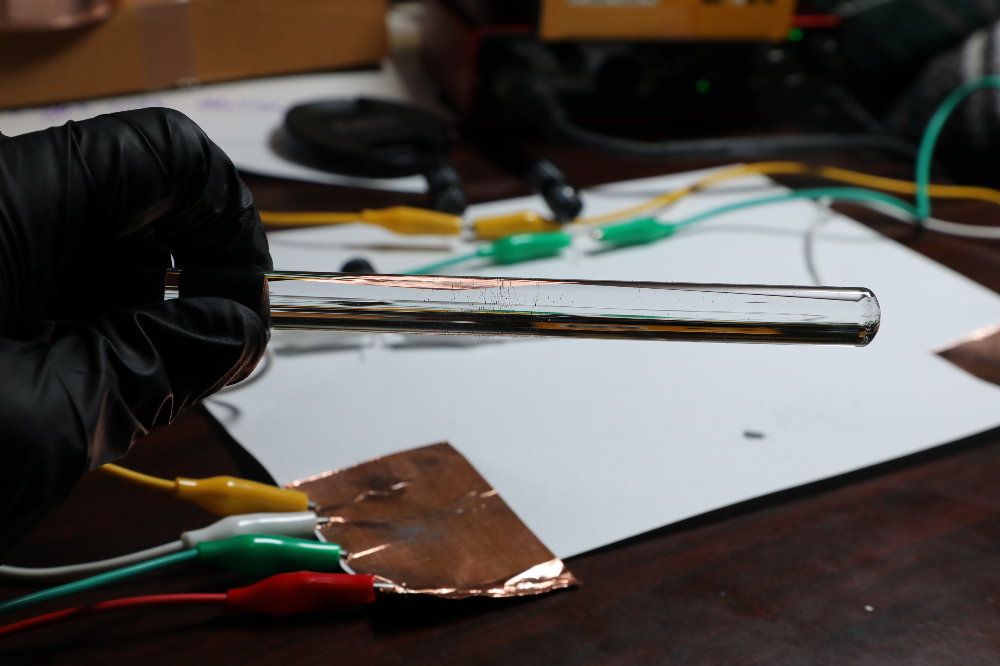

03003 - Iron-Jar
========================
*Anthony Remark*
*report assisted by Matt DiPalma, AMDG*

Schedule
--------
  * February 19, 2025 - RFP001 posted
  * February 21, 2025 - proposal submitted
  * February 22, 2025 - contract awarded
  * February 27, 2025 - Sourced all necessary parts
  * March 21, 2025 - prototypes complete
  * March XX, 2025 - documentation complete

Abstract
---------
As part of an ongoing effort to design and fabricate a human-observable output for a low-power GPIO pin state, this project investigates the possibility of leveraging weak electrostatic charges applied to iron filings in order to manually measure a GPIO voltage level. While this goal was not met, various data and observations were collected that will benefit future endeavors at Marian Scientific. The phenomenon as observed from a Leydan Jar experiment was the inspiration for the 03003 Iron Jar Project.

PUT A PICTURE HERE

*The Iron Jar experiment setup for the Results section*

Objective
---------
In general, a microcontroller’s GPIO does not have the voltage or current output capabilities to drive large equipment or devices that require lots of power. Amplifier circuits and voltage multipier circuits all require semiconductor devices and capacitors manufactured in massive sophisticated facilities, so without such capabilities, the search for a human observable phenomenon goes back to physics experiments seen in an introductory electromagnetics class. Even with a limited voltage, the effects of charge can still be observed. This prototype attempts to leverage the properties of electrostatics to manually detect a GPIO output level with only a small array of primitive equipment.

The historical Leyden Jar experiment is essentially a capacitor constructed with two conducting metals separated by a jar, with the jar itself serving as the dielectric. There is an electrode (historically a chain) submerged in water in the jar that charges the inner conductor, causing the outer conductor to accumulate an opposing charge through the ionized air. This charge is accumulated onto the jar. One of the severe limitations of a microcontroller GPIO is the limited amount of voltage it is capable of sourcing, but the electric charge that accumulates on a jar can likely be harnessed to demonstrate a human-perceptible phenomenon.

Unfortunately, after some preliminary testing of the concept, the reduced voltage levels combined with the capacitor "plate" separation distance associated with the jar wall thickness, diminished the ability for the underlying physics to render a human-observable output. The experiment was then pivoted to leverage off-the-shelf capacitors wired in parallel with planar contact surfaces onto which iron filings could be applied. It is expected that filings of different charges react differently in the presence of objects of much stronger electrostatic charge, and this will yield a reliable quantification methodology for experimentally (and manually) measuring a GPIO output level.

### Going into more detail
There are several concepts to the leyden jar experiment. They all incorporate a change in electric charge on the capacitive conductors. Some utilize iron fillings to demonstrate the change in charge. The iron filings are used to indicate the change in charge that is due to a GPIO of a microcontroller. 



(take a pic of the two mcdonalds cups with the attached copper tape)

in the caption, say that concept 1C was tested. If this concept were to fail, the other proposed concepts need not be tested because they wouldn’t succeed in place of 1C. It was believed that these alternative concepts could facilitate observable changes more readily. 

There was an honest attempt to substantiate the concepts in the proposal, but when enacted, there were unacticipated issues. It was envisioned that the water would facilitate the travel of the iron filings towards the outer conductor. But reality was more messy than anticipated. The cups weren’t believed to be able to concoct a sufficiently large amount of capacitance. The copper tape on mcDonalds cup are a crude construction of a capacitor and a large amount of voltage would be necessary to get observable changes in charge. 

The water was believed to hinder the travel of the iron filings. It was believed water would easily change the charge of the iron filings, which it may have, but the iron filings did not travel towards the outer conductor as anticipated. It was anticipated that the iron filings would spreadout across the bottom of the cup to reach the extent of the geometery of the outer conductor. Opposite charge wants to come together and the leyden jar (in this case the mcdonalds cup) serves as the dielectric. It’s believed the iron filings didn’t spread out because the total voltage level wasn’t high enough. Gravity is obviously keeping the iron filings in place, so the charge must become high enough to overcome gravity. The charge may have been high enough but the water was impeding possible movement of the iron filings. 

At this point the team had several options, 

1) increase the voltage. The issue is that the team believed the concept was theoretically sound but not implementable with such low voltages.

2) get rid of the water and thus find a different way to charge the iron filings. Maybe a chemist could have helped.

3) find a different concept. The team did this one.

With the same materials already accumulated, the team designed another concept to produce a Human-Observable phenomenon that can be tested. The concept of the leyden jar was maintained, but a different approach was taken. Instead of building a leyden jar for testing, the team rigged up separate copper conductors that are serially connected through three 1000uF capacitors in parallel. 



The capacitors overcome the need for a carefully manufactured leyden jar. The two conductors will have equal and opposite charges. One can place iron filings on the conductors and those filings will obtain the same charge on the respective conductors. So the filings can then be tested for that charge. 

This approach yielded unexpected results that were nonetheless human-observable. 


Parts List
----------
The materials required for the experiment are as follows:
* Copper Foil Tape: $10
* Fine Iron Filings 100g: $10
* Glass/Ebonite Rod and associated charging cloths: $33
* Breadboard: $5
* Nitrile Gloves: $7
* Texas Instruments Buffers: $10 ($1 each)
* Alligator Clips & jumpers: (in inventory)
* 3x 1000uF capacitors: (in inventory)
* Sheet of printer paper: (in inventory)
* Arduino Uno Rev3 and misc. electronic components for test: (in inventory)

MAYBE PUT A PICTURE HERE OF SOME OF THE COMPONENTS, I'M SURE YOU HAVE ONE


Design & Procedure
------------------
The actual experimental procedure for this investigation evolved over the course of multiple attempts at detecting the weak electrostatic forces described above. The following procedure reflects the final attempt at experimentally validating whether or not this electrostatic phenomenon could be manually detected with the equipment specified above.

Two strips of copper foil tape were affixed to a piece of paper with significant separation between them. Using alligator clips, these "contacts" were connected in parallel with the aforementioned capacitors, although the efficacy of this inclusion was not experimentally validated at this time. Iron filings were to be gently distributed on each contact surface, in addition to a region of the paper on which no copper foil tape was applied. One of these contacts was then connected to an output with voltage and current levels representative of that which a hobbyist microcontroller is capable of producing, and the other was connected to ground, in the traditional sense of a capacitative element.


*Here's the Setup from before.*


*This is a Diagram of the Setup for the Iron Jar Experiment. The Iron Filings are placed appropriately.*

The Arduino charges the capacitors (via interfacing with a circuit). The charges accumulate on the plates. These charges can transfer to the iron filings on the plate. The hypothesis is that the conductors in this configuration accumulate enough charge for a human observable phenomenon. The capacitors are not discharged immediately so a multimeter can measure the electric potential to see if there is charge present. The white paper also acts as a dielectric between the two conductor plates.



*A Diagram featuring a charged Glass Rod approaching the Iron Filings.*

If the GPIO is Low, Both conductors are discharged and are without an opposite charge. The hypothesis says the conductors are at 0V and so would be the white paper the neutral iron filings lay on.

The general approach to detecting the applied output voltage was very simple. An ebonite (hard rubber) rod was rubbed with a woolen cloth, in order to acculate a negative charge, and a glass rod was rubbed with a silk cloth in order to accumulate a positive charge. When these rods were brought briefly above the iron filings, a lot of them would be attracted to the rods and stick to them. The operating principle is that the negatively charged ebonite rod would attract a greater density of iron filings from the positively charged capacitative contact than from the negative contact, and the inverse would be true for the positively charged glass rod. In such a way, it was anticipated that the GPIO output voltage level applied to a given contact could be manually measured.

So the Electrical Innovation team decided that an Ebonite Rod (rubbed with wool cloth to negative charge) and a Glass Rod (rubbed with a silk cloth to positive charge) will be used to determine if Iron Filings are charged or not. So if the conductor of interest is positively charged (thus charging the iron filings) and a glass rod is also positively charged, then most of the iron filings should not be attracted to the glass rod. 


*The Glass rod attracted Iron Filings onto itself*

While qualitative observations can be blindly made to suggest the efficacy of this electrostatic approach, a "double-blind" study was conducted to experimentally determine whether or not the approach was truly successful, and not merely an instance of confirmation bias. To conduct this experimental validation, and to determine for certain that the electrostatic effects in question could indeed be generated by a standard microcontroller GPIO output, an Arduino-based testing apparatus was constructed.

The test apparatus consists of the Arduino connected to the output capacitor array on GPIO #10 through a buffer. It is also connected to an optional LED for the purposes of displaying the GPIO output level, either high or low. A push-button is connected to the microcontroller for input purposes. The CD4010 acts as a non-inverting buffer which protects the Arduino microcontroller from the discharge of the capacitors. The experiment may have unintentional issues which might cause damage, so to avoid this possibility, even if remote, a buffer is used. 

PUT A PICTURE HERE OF YOUR ARDUINO + BREADBOARD SETUP.


The test apparatus functions essentially by the Arduino generating a random GPIO output state for both the output capacitor array and an optional LED indicator and keeping this state hidden from the operator until the end of the trial. When the push-button is pressed, a new random GPIO state is determined and the appropriate output pins are set accordingly.

The trial would use charged rods to pick up charged or uncharged iron filings. There is a control consisting of iron filings that are not charged. The end of the rod will hover over the iron filings placed on the respective conductor. The conductor may be the positive end of the capacitors or the negative end of the capacitors. The end of the charged rod (ebonite or glass) will hover over the filings on the conductor. The filings in the middle on the paper are not charged and will be considered the control variable in our trials. 

Control Variable:
The iron filings in the middle of the paper. These are presumably uncharged.

Tested variable:
The iron filings on the conductor. Are these filings able to be charged? Are they able to be picked up by the charged rod? Does demonstrate that the GPIO was able to charge a capacitor whereas the iron filings being more attracted to the rod represents the human observable phenomenon?

The code used to conduct this experiment is included below:
```
void main(void);
```

Five trials were conducted of the experimental procedure described above. For each trial, the ebonite rod was rubbed approximately 30 times with the wool cloth in order to negatively charge it, and it was slid gently, while rotating it, over the filings sprinkled on the positively charged capacitor contact and the control, at a height of roughly between 1/4 and 1/2-inch. The qualitative density of the iron-filings that stuck to the rod from the capacitor contact were compared with that from the control in order to make an educated guess on the GPIO output level. If the filings attracted from the positively charged contact were more densely distributed than the control, then the GPIO level was expected to be "high". If the densities were approximately equal, the output was expected to be "low". Similarly, the glass rod was rubbed with the silk cloth approximately 30 times, and the same experimental procedure was applied to the negatively charged contact, and the opposite expectations were to be made.

The optional RED LED indicates the state of the GPIO, and consequently whether or not the capacitor is charged. For the trials to adhere to the double blind trials. The LED will be disconnected and a multimeter will be used to measure the voltage on the conductor. For example if a positive charge is being measured on the positive conductor, then if the multimeter reads approximately 5V, the iron filings should be charged and according to the hypothesis the charged rod should read a human observable phenomenon. Because of the capacitors, the charge will maintain itself unless deliberately discharged. 

This facilitates the double blind trials and a double blind trials is more objective because the observable density of iron filings on the charged rod is not influenced a priori via the RED LED.

The Electrical team acknowledges there are issues with the design of the experimental trials. Consistency with the density of distribution of the iron filings placed on the white paper or the conductor is estimated with human perception not with precision tools. The measurement of the charged on the rods are not measured with precision tools either. The trials involve a human perceptive of results in a somewhat coarse way rather than a precise manner. 

Results & Observations
----------------------
The results of the five trials are compiled below.
| Tables   |      Are      |  Cool |
|:---------|:-------------:|:-----:|
| col 1 is |  left-aligned | $1600 |
| col 2 is |    centered   |   $12 |
| col 3 is | right-aligned |    $1 |

PUT OTHER OBSERVATIONS AND RESULTS HERE.

PUT SOME PICTURES HERE OF YOUR RODS WITH FILINGS ON THEM, WITH CONTROL.


Conclusions
-----------
* Electrostatics is a challenging phenomenon to leverage for rendering a visual output with very minimal power and current requirements, especially with primitive equipment used for the measurements in this study.
* Design of experiments is challenging to control for all variables (both in experimental plan and the execution itself).
* Although the test apparatus controlled for confirmation bias, there are other things to control for, like number of rubs and height of rod as it was translated over the capacitor contacts.
* PUT SOME THINGS THAT YOU LEARNED HERE
* Buffer usage is easy and good idea (expand on this)
* 
