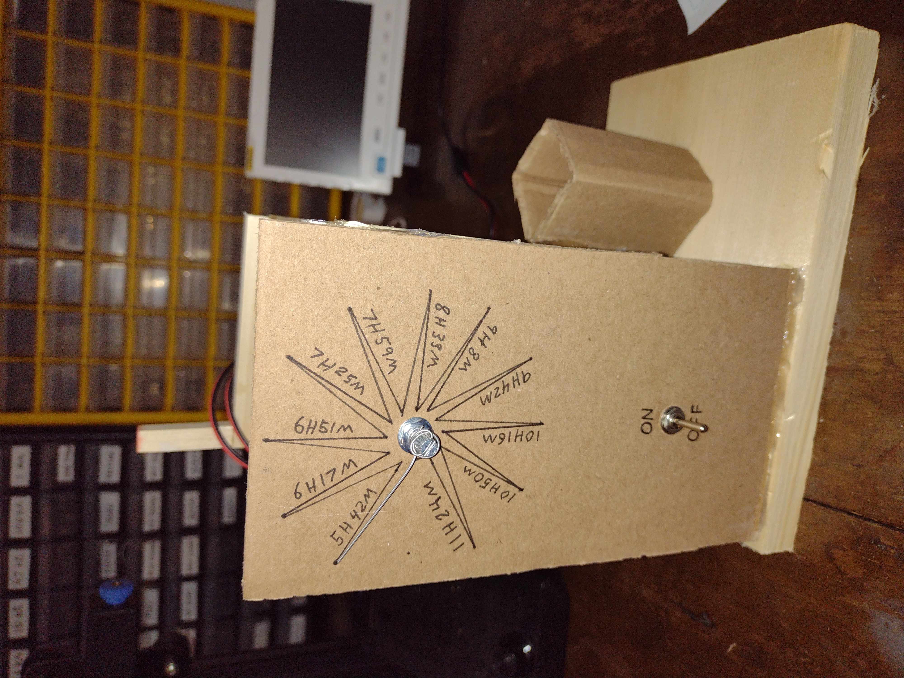
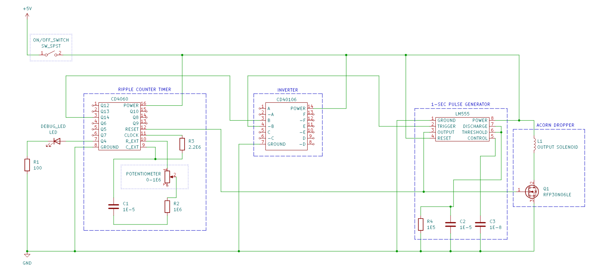

03005 - Variable-Time Ball Drop (VTBD)
======================================
*Matt DiPalma, AMDG*

Schedule
--------
  * March 9, 2025 - RFP002 posted
  * March 15, 2025 - proposal submitted
  * March 17, 2025 - ontract awarded
  * March 21, 2025 - source-by date for all prototype raw materials
  * March 28, 2025 - underlying technology demonstrators due
  * April 11, 2025 - final prototypes complete
  * April 18, 2025 - documentation complete

Abstract
---------
This project investigates various mechanisms that show potential for the purpose of estimating the passage of time with varying degrees of accuracy and home-producibility: sunlight detection, water evaporation, and an RC-timer based electric circuit. Though data was collected for all of the phenomena, the RC-timer based circuit had a timing accuracy that far exceeded the others. Therefore, a circuit was designed, built, and tested that leveraged a RC timer and a binary ripple counter to implement a simple alarm. The output indicator for this alarm was also extremely simple: a hand-wound solenoid that, when activated, drew in a steel pin, allowing an acorn to fall into a cup, producing an audible sound. The demonstration prototype is capable of creating alarm delays of between 5.5 and 11.5 hours, which is appropriate for the purpose of an alarm clock.

Click for video of Variable-Time Ball Drop alarm:

Objective
---------
There are many objectives of this investigation. The primary objective is to prototype minimal implementations of a timer and integrate them alongside a simple output indicator to form a primitive alarm.

All of the designs considered for this investigation leveraged electrical components, though some required a greater number of components of higher complexity. To be clear, primitive versions of components like resistors, capacitors, and inductors can, if absolutely necessary, be produced in the home workshop, whereas components that leverage semiconductors are not reasonable to self-source. The objective of limiting the number and complexity of electrical components is especially beneficial to limit dependency on a wide and often import-heavy supply chain.

This project is also a foray into the development of a device with a degree of human interaction, as the device will contain a set of inputs that set the alarm time delay. This is the first project at Marian Scientific with such a criterion.

This investigation is also an opportunity to use various microcontroller devices for data collection, something that has not been pursued at Marian Scientific. The data collected in the course of this project spans a wide range of topics, from light-dependent resistor (LDR) voltage output through the day/night cycle, evaporation rates & conductivities for various solutions, and thresholds for various transistor devices.

Another goal of this project is to use more commonplace materials such as wood, cardboard, and otherwise naturally harvested materials, wherever possible, in accordance with [MP07](https://github.com/marian-scientific/wiki/wiki/MP07-%E2%80%90-Vertical-Integration). For example, as will be later described, a simple acorn was used in place of a manufactured ball, limiting a dependency and making the prototype more eco-friendly and cheaper.

The prototype also continued to pursue self-sourced electromagnets for the purposes of output indication. This parallels the efforts of [13001](https://github.com/marian-scientific/reports/tree/Christ/13001%20-%20GPIO%20Electromagnet) and [03002](https://github.com/marian-scientific/reports/tree/Christ/03002%20-%20Low-power%20Electromagnetic%20Visual%20Indicator) at Marian Scientific.

Lastly, this project was an opportunity to pilot the new reporting format at Marian Scientific (see [PROGRESS_TRACKER.md](https://github.com/marian-scientific/reports/blob/Christ/03005%20-%20Variable%20Time%20Ball%20Drop/PROGRESS_TRACKER.md)), which involved detailing summaries of daily tasks with photo, video, and other evidence, alongside a running tally of labor hours spent on the project. This serves many purposes. First, it serves as an excellent journal of tasks completed, which makes compiling this final report extremely straightforward, while being a great record of tasks completely and observations made, which can be referenced in the future. Second, it enables future project labor estimates to be more accurately made by serving as a basis of comparison. Finally, it allows for a formal archive of all endeavors relative to the project scope. As such, this report does not need to exhaustively regurgitate all steps of the investigation and design process, as that list already exists in the accompanying progress tracker document. To this end, this report will focus primarly on the downselected prototype, with only a brief summary of the investigations made on the alternate configurations.

Parts List
----------
The materials required for the construction of the solenoid are:
* 28 AWG enameled copper "magnet" wire
* 2.5" plastic tube (repurposed thick drinking straw)
* hot glue
* 600-grit sandpaper
* solid core wire
* heat-shrink tubing

The materials required for the construction of the output indicator are:
* 10mm square wood rod (dimensions unimportant)
* 3/4" wood project panel (dimensions unimportant)
* cardboard (dimensions unimportant)
* plastic tube (same diameter as required above)
* hot glue / PVA glue
* 0.032"-diameter stainless steel wire (alloy 430) (McMaster # 	89065K81)
* acorn

The materials used in the construction of the RC timer circuit:
* resistors: 100, 1e5, 1e6, & 2.2e6 ohms
* capacitors: 2x 1e-5, 1e-8 farads
* switch
* potentiometer: 0-1e6 ohms
* LED (debugging only)
* CD4060 ripple counter IC
* CD40106 inverter IC (or NOT gate)
* 555 timer IC
* RFP30N06LE N-channel MOSFET
* solid core wire
* 5V power supply

The materials used in the construction of test setup for the unpursued Concept B:
* GM5539 light-dependent resistor
* MCP3008 ADC
* RPI 4 or Zero for data collection
* misc. electronic components

The materials used in the construction of test setup for the unpursued Concept C:
* small dishes
* paper towel
* water (tap and salt)
* MCP3008 ADC
* RPI 4 or Zero for data collection
* misc. electronic components

Design & Procedure
------------------
### Output Indicator

Using the same solenoid-winding jig and general process as [03002](https://github.com/marian-scientific/reports/tree/Christ/03002%20-%20Low-power%20Electromagnetic%20Visual%20Indicator), 500 turns of 28 AWG magnet wire were wound around a short length of plastic tube. The ends of the wires were sanded to remove the coating and extension wires were soldered to the ends, the joints being protected by heat-shrink tubing.

When a short length of thin steel wire was placed inside the plastic straw, and 5V at 175mA were applied to the solenoid, the steel wire was successfully drawn in. 

video:

Under 5V and 700mA, it was capable of drawing in a length of 1/8" much heavier steel cylinder.

video:

The below frame structure was created using wood, cardboard, and glue. Here is a demonstration of the output indicator being manually triggered.

video:

A user interface faceplate was created for concept A, to be described later. It features a switch and a potentiometer clamped into a marked cardboard panel.

### Concept A - Electronic timer

As an investigation of Concept A using a CD4060 binary ripple counter with an RC timer, various data was collected using a digital input pin on a RPI. This data is included in Appendix A.

After this concept was downselected, a final circuit was assembled per [this Marian Scientific schematic](https://github.com/marian-scientific/reports/blob/Christ/03005%20-%20Variable%20Time%20Ball%20Drop/resources/03005_circuit_diagram.pdf), a portion of which is reproduced below.

When Q14 is taken as the output for the CD4060, the alarm is capable of firing after delays between 5 hours and 42 minutes and 11 hours and 24 minutes, values that were determined after tests. If another output pin is used, these delays can be reduced by an associated power of two.

### Concept B - Sunlight detector

As an investigation of Concept B using a light-dependent resistor, various data was collected using a transistor, an ADC, and digital input pin on a RPI. This data is included in Appendix B.

This LDR was connected to the output indicator as a proof of concept, and the video is shown below. However, this would likely not reflect an accurate passage of time, but it might be capable of letting you know when the sun rises or sets.

video:

### Concept C - Evaporative timer

As an investigation of Concept C using wire leads embedded in paper towels soaked with tap or salt water, various data was collected using a transistor, an ADC, and digital input pin on a RPI. This data is included in Appendix C. This was deemed highly ineffective as a means of accurately tracking the passage of time, though it may be useful for determining soil moisture levels, as conductivity dropped to zero when the towels became completely dry, which is a condition that many plants actually benefit from (wet/dry cycles).

Results & Observations
----------------------
After some debugging, the final concept A prototype was highly successful and repeatable in timing a user-set delay and subsequently triggering the output indicator. As a trial, one night I set the time delay such that it would go off between 5:50 and 6:00AM (this is not as simple as setting an alarm clock, because you are setting a delay, not a time, and you are doing so with limited graduations for the input potentiometer). The next morning, the acorn dropped into the cup at 5:54AM. With all of the inaccuracies of the manufacturing, tolerances in the electronic components, and inherent issues with RC circuit timing accuracy, the alarm went off at the appropriate time, and it was able to wake me up, though I am a light sleeper. If I was a heavy sleeper, dropping a heavier ball onto a pie tin, instead of a cardboard cup, would produce a much louder sound.

Concept B, leveraging a light-dependent resistor, did not represent an efficient mechanism of quantifying a delay of time, even one closely related to awaking in the morning, like a sunrise. However, this component has many better use cases involving light detection, which is obviously the purpose for which it exists.

Concept C, leveraging evaporation, was also not an effective time-passage quantification approach, regardless of the electrolyte. Though this may be appropriate for detecting moisture more explicitly, even hobby-grade soil moisture sensors use capacitance, not conductivity. Perhaps this technique will be used in future endeavors at Marian Scientific for purposes of moisture detection.

Conclusions
-----------
* The 28AWG-wound solenoid seemed able to handle current draws of at least 700mA for at least several seconds at a time, which is apparently way higher than the wire is rated for, though that may be for continued use.
* 555 timers are easy to configure to generate a pulse of a target width in monostable mode, though they are triggered by a falling edge, which generally requires a signal to be inverted, in applications like these.
* If user-interface markings are to be made for switches, buttons, or the potentiometer, they should be made before the electronic components are installed, and perhaps they should be printed out neatly on a sheet of paper, as it was quite a challenge to trace precise angles after the potentiometer had already been installed in the cardboard faceplate.
* Never trust the nominal values of electronic components. Instead, measure the desired quantity of interest (in this case, the time delay) and calibrate accordingly.
* Electrolysis taking place on conductivity probes, degrading the connection and limiting the application for brief periods of time. Perhaps I need not have constantly probed the resistance, and should have only briefly checked it once every few minutes or so. That would also have saved power.
* Cloudy days often shaded the light sensor affecting the resistance substantially, limiting the application of the light sensor for fine data collection. However, it still may be useful if the threshold is set very low.

Appendix A
-----------

Below are selected output pin traces for the CD4060 ripple counter timer with the maximum potentiometer resistance set. The elapsed cycle time was 11 hours, 22 minutes, & 25 seconds for pin Q14. 

Restarted the data collection with the potentiometer at the minimum setting. The expected time is half the above, and the elapsed time was 5 hours, 42 minutes, & 17 seconds.

Appendix B
-----------

Light sensor data was collected over the course of 3 night/day cycles. The ADC values, and inverted transistor output are plotted below. As their name suggests, these sensors would be especially useful at detecting light.

Appendix C
-----------

Water evaporation data was collected over the course of 3 days. The ADC values are plotted below. Note that the tap water evaporated significantly faster than the salt water, but both featured the same characteristic taper off at the end of their cycles. That could be potentially useful at determining when a plant is beginning to dry out.

