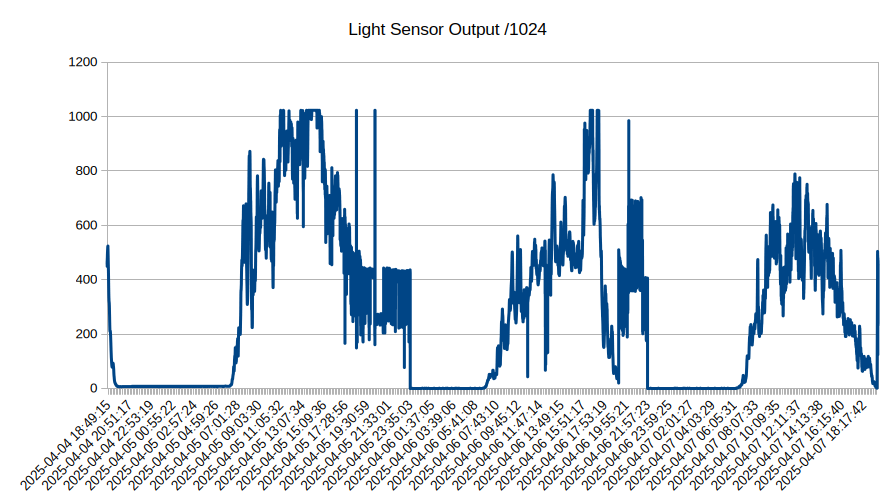
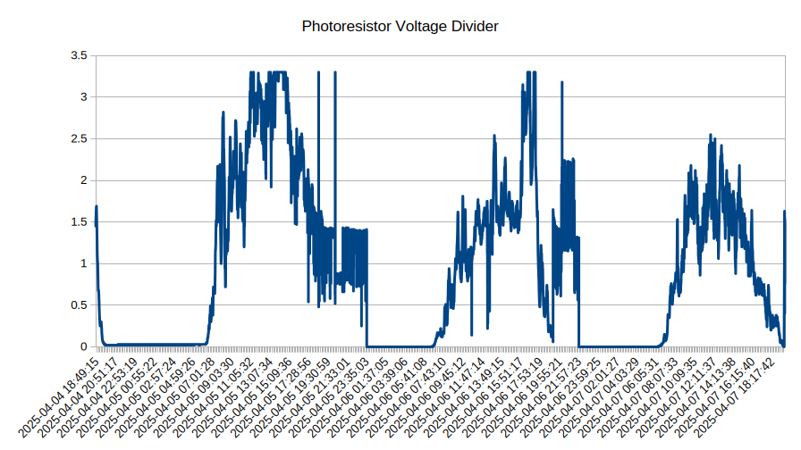
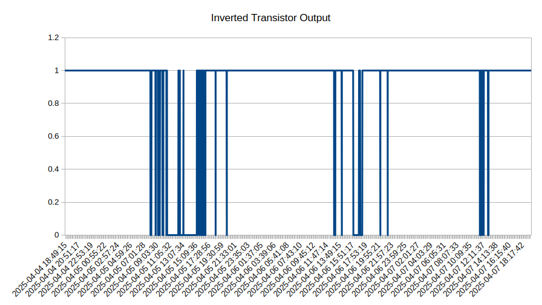
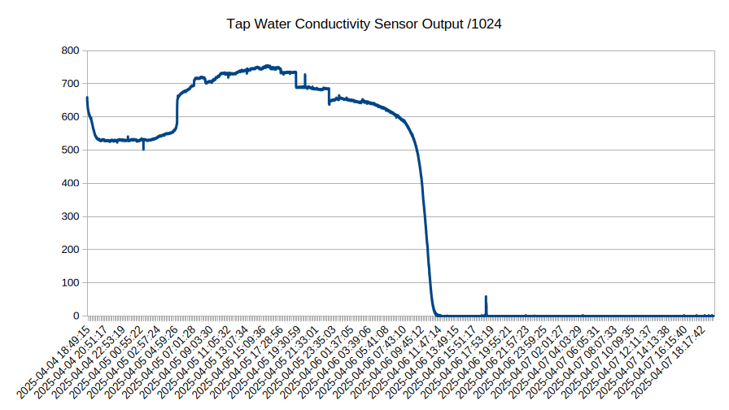
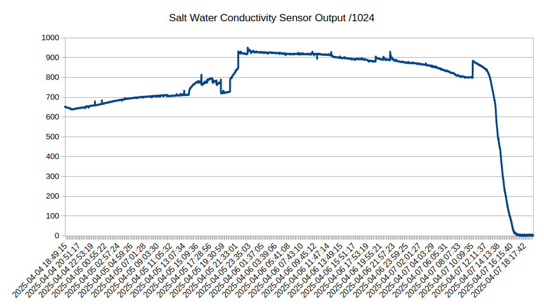
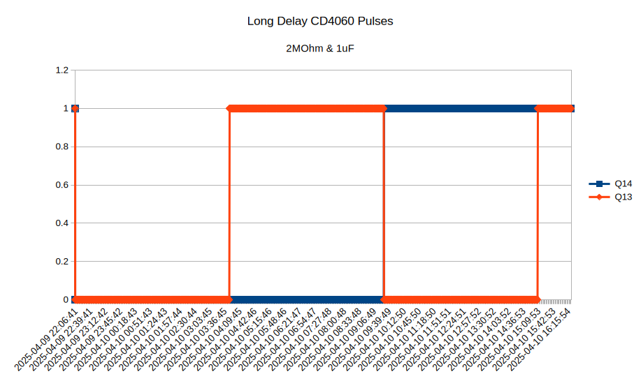
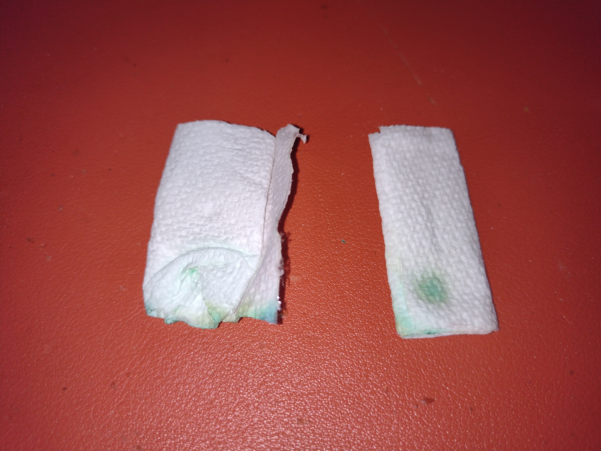
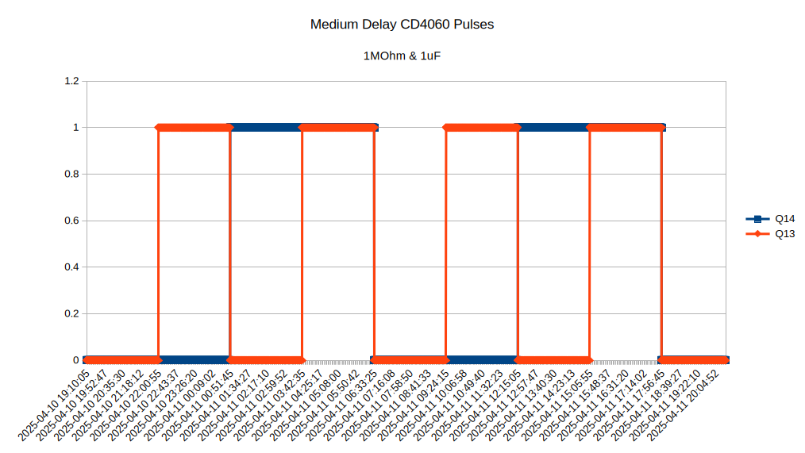

# 03005 - Progress Tracker

### March 9, 2025:
* [RFP](https://github.com/marian-scientific/proposals/tree/Christ/RFP002%20-%20MCA) announced.

### March 15, 2025:
* [Proposal](https://github.com/marian-scientific/proposals/tree/Christ/RFP002%20-%20MCA/submitted%20proposals/VTBD) written and submitted.

### March 17, 2025: 0.5 hours (0.5/60)
* [Contract](https://github.com/marian-scientific/proposals/blob/Christ/RFP002%20-%20MCA/submitted%20proposals/EVALUATION_CRITERIA.md) awarded.
* Most required components and raw materials inventoried or ordered.

### March 18, 2025: 0.5 hours (1/60)
* Created this project directory
* LDR (apparently GM5539) measured 2 kOhms in light, 3 MOhms in dark, but that doesn't exactly match the spec sheet.

### March 19, 2025: 0.5 hours (1.5/60)
* Booted up old RPI4 as testbed for the sensors
* Created and tested below Python code to record sensor data on pin 2

```
import time
from datetime import datetime
import os
import sys
import RPi.GPIO as GPIO

orig_stdout=sys.stdout
f=open('out.txt','w')
sys.stdout=f

GPIO.setmode(GPIO.BCM)
pin=2
GPIO.setup(pin,GPIO.IN)

while(1):
    print(datetime.now(),", ",GPIO.input(pin))
    time.sleep(30)

sys.stdout=orig_stdout
f.close()
```

### March 20, 2025: 0 hours (1.5/60)
* can actually use shell redirection to simplify the above and remove all the sys stuff, and do python xxx.py > out.csv

### March 21, 2025: 3 hours (4.5/60)
* trialed and errored a working light sensor circuit with a BJT and a voltage threshold, with outputs both via LED and GPIO input to RPI4 (voltage divider with 1.7 V threshold, very close to LED anyway)

### March 22, 2025: 3 hours (7.5/60)
* wound solenoid with 500 turns of 28 AWG magnet wire around a plastic straw. soldered extension and breadboard leads to the solenoid
* tested the solenoid with 5V at 175mA, capable of drawing a thin 430 alloy stainless plunger, see video

video:
[](https://www.youtube.com/watch?v=aOZ0N7JlEQg)

### March 23, 2025: 1 hour (8.5/60)
* purchased materials for the frame of the output indicator
* retested the solenoid with 5V at 700mA, which should be safe for short bursts on this 28 AWG wire, and the solenoid was now able to draw in a 1/8" steel cylinder with a considerable amount of force, see video

video:
[](https://www.youtube.com/watch?v=GkqKA8dyDBk)

### March 24, 2025: 0.25 hours (8.75/60)
* cut and marked some square dowels for construction of output indicator frame
* purchased low resistance resistors

### March 25, 2025: 1.25 hours (10/60)
* tested out steel wire to copper hole scontact liding resistance for automatic mechanical circuit shutoff
* working voltage divider threshold circuit using nMOS transistor
* continued to construct output indicator frame using 2-part epoxy to connect square wooden dowels

video:
[](https://www.youtube.com/watch?v=oyGqoSqluK0)

### March 26, 2025: 0.5 hours (10.5/60)
* continued to assemble frame structure using two-part epoxy and square wooden dowels
* identified better voltage divider resistor for a more realistic photoresistor light sensitivity: 47 kOhms

### March 27, 2025: 1.5 hours (12/60)
* continued to epoxy frame structure
* connected MCP3008 ADC to RPI and collected ADC sensor data from photoresistor voltage divider using Python script
* learned how to use SCP to copy files from computers on the network

video:
[](https://www.youtube.com/shorts/1sxHGp5eQOo)

### March 28, 2025: 1.5 hours (13.5/60)
* completed frame structure for the output indicator
* create output indicator test circuit
* tested output indicator

video:
[](https://youtube.com/shorts/EjQzM-X2TaQ)

### March 29, 2025: 2.5 hours (16/60)
* purchased various RPI Zero 2W and associated components from Microcenter (to be used for sensor data collection and future projects)
* debugged installation issues with the headless RPI-OS. verifying issue, just skip it

### March 30, 2025: 1.0 hours (17/60)
* Primitive timing circuit with CD4060BE chip

video:
[](https://www.youtube.com/watch?v=KJ5FcJH2ZSo)

### March 31, 2025: 2.0 hours (19/60)
* Set up pi zero repository on Marian-Scientific
* Some assembly programming on the pi zero to get my bearings
* Preliminary attempts to get ADC working over SPI on the pi zero for the data collection. It seems to lock up after roughly 20 seconds though, seemingly because of the SPI.

### April 1, 2025: 1.5 hours (20.5/60)
* Shifted to C code to fix the issues I was getting with lock up on SPI. ADC and GPIO-read code uploaded to [pizero](https://github.com/marian-scientific/pizero/tree/Christ/mcp3008_test) repository. Working example shown below:

video:
[](https://youtube.com/shorts/rSSYnsBe2oQ)

### April 2, 2025: 1 hours (21.5/60)
* Deconstructed C direct-register blink-type executable into assembly for the pi zero 2 w; see [pizero](https://github.com/marian-scientific/pizero/tree/Christ/asm_blink_test) repository.

### April 4, 2025: 2 hours (23.5/60)
* Hooked up evaporation sensors (one in tap water, one in salt water) and photoresistor to ADC and began logging data using the pi zero 2 w. See [03005](https://github.com/marian-scientific/pizero/tree/Christ/03005) repository. Data collected overnight to use for calibration of sensors.

### April 5, 2025: 1 hours (24.5/60)
* Continued collecting sensor data to use for calibration of sensors.
* Determined 555 timer in monostable mode will be enough to toggle off the solenoid after the trigger signal to prevent it from burning itself up. 555 timers on order.

### April 6, 2025: 1.5 hours (26/60)
* Sensor data collection still underway. Tap water probe dried up first. Salt water probe still damp. Blue/green electrolysis (chlorine?) residue on cathode terminal of paper towel.
* Received 555 timer shipment. Created 1-second monostable pulse generator circuit in short below.

video:
[](https://youtube.com/shorts/XP2j5APPI_w)

### April 7, 2025: 1.5 hours (27.5/60)
* Sensor data collection complete. Data plotted and uploaded to resources directory and attached below. Raw data also uploaded.
* Photoresistor hooked up to pulse generator output and output indicator, see video below.
* Need to confirm the circuitry, because the solenoid still seems to hold the pin even after the pulse should have gone low.











video:
[](https://youtube.com/shorts/p0xjpmv5IzE)

### April 8, 2025: 1 hours (28.5/60)
* The solenoid current draw (>700 mA) on the 555 timer was way above the amount it could handle, so it was getting stuck at 1V and wasn't able to get to its pulse voltage level, and that's why it wasn't turning off or releasing its pin yesterday. Now I hooked it up to a n-channel MOSFET to drive the solenoid instead. See video below.

video:
[](https://youtube.com/shorts/dIT7h7QP-OQ)

### April 9, 2025: 1.5 hours (30/60)
* Created circuit (below) with the CD4060 ripple counter IC to time between 5.5-11.5 hours (using a 1 megaohm potentiometer in series with a 1 megaohm resistor as Rx and a 1uF capacitor as Cx). Hooked it up to the RPI zero with some C code to record outputs of Q13, Q14, and Q4 to time the exact duration of this pulse on the maximum potentiometer setting (11.5 hours). Will repeat for the minimum setting tomorrow to create a linear interpolation on a dial for the potentiometer knob.


### April 10, 2025: 1.0 hours (31/60)
* Collected data and generated plot for the CD4060 ripple counter timer with the maximum resistance from above. The elapsed time was 11 hours, 22 minutes, & 25 seconds. See plot of outputs Q13 and Q14 below.
* Restarted the data collection with the potentiometer at the minimum setting. The expected time is half the above, so 5 hours, 41 minutes, & 13 seconds.
* The dried paper towels from the evaporative timing test had the bluish/green tint around the positively charged contact. The applied voltage was 3.3V, for reference. See photo below.





### April 11, 2025: 0.5 hours (31.5/60)
* Collected data and generated plot for the CD4060 ripple counter timer with the minimum resistance from above. The elapsed time was 5 hours, 42 minutes, & 17 seconds. That is only a minute and 4 seconds longer than the expectation from yesterday. This is likely due to the small potentiometer resistance at the minimum setting not being truly zero. See plot of outputs Q13 and Q14 below.

