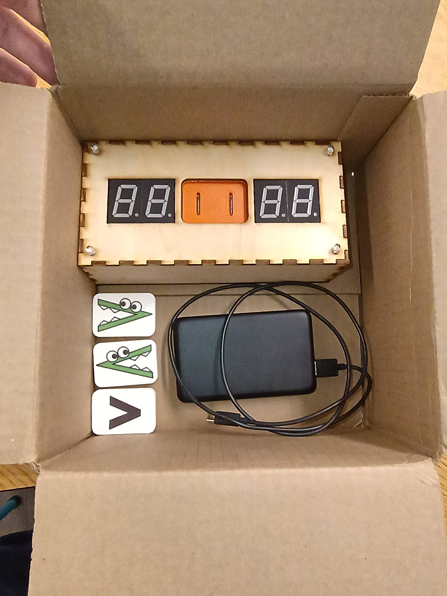
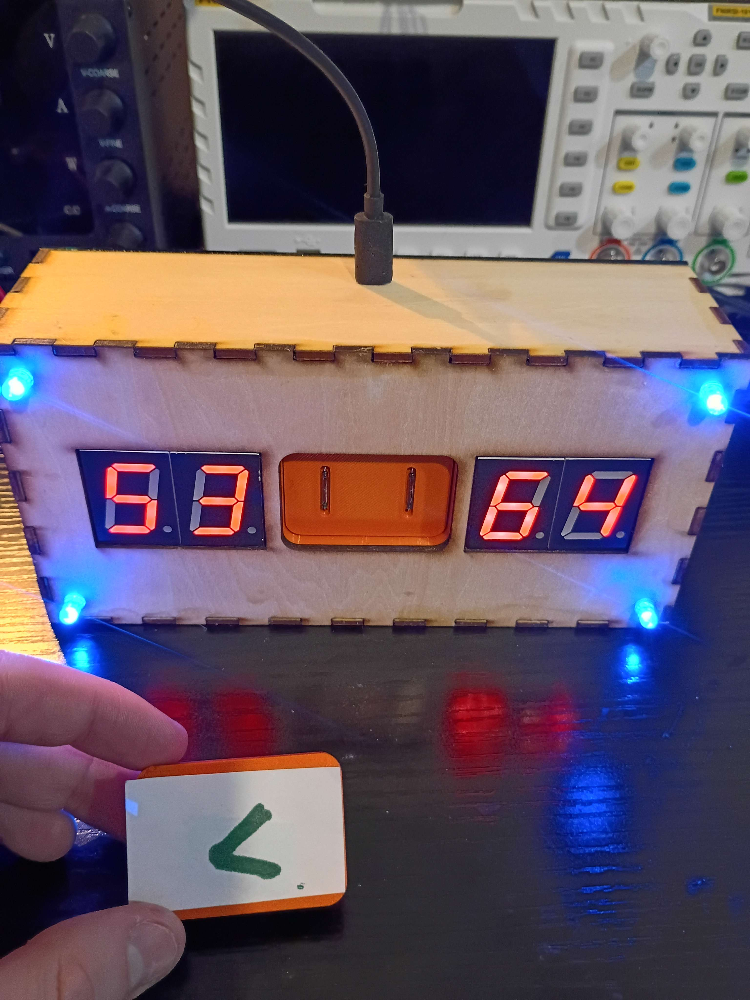
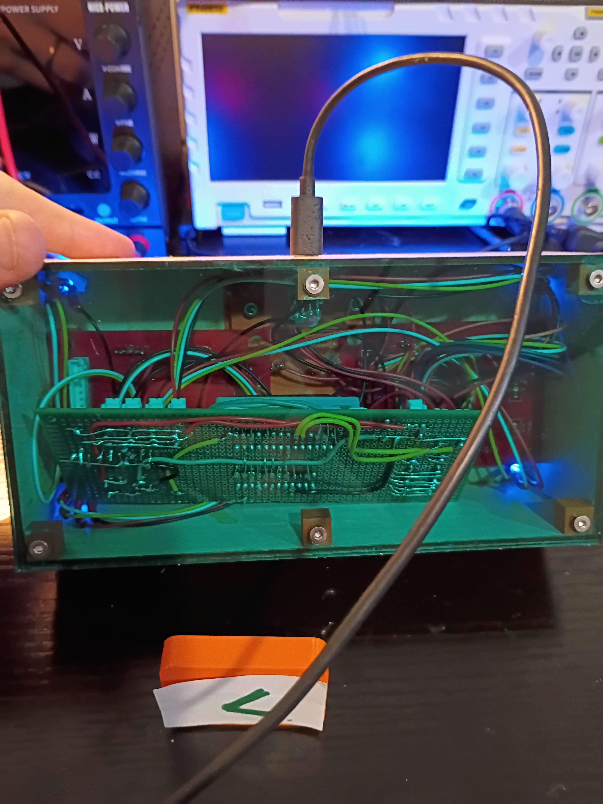
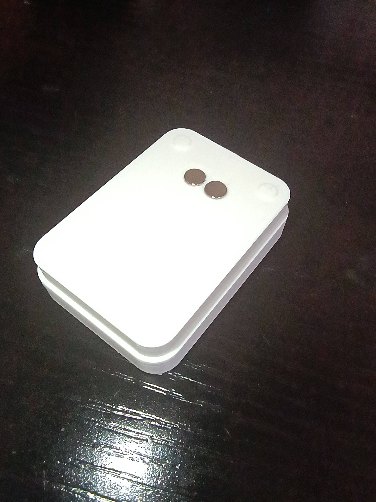
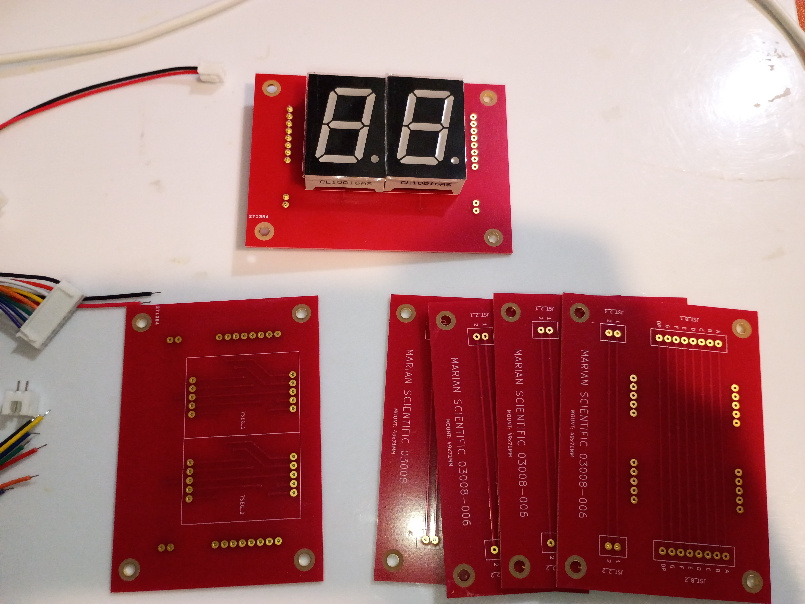

# 03008 - xMM1

First early childhood education mathematics manipulative to teach inequalities (greater than & less than). 

Uses an ATMEGA328P (for processing), 2x reed switches (to determine input device orientation), 4x large 7-segment displays (to display digits), and 4x RGB LEDs and a buzzer to give user feedback for correct/incorrect answers. The box is laser cut from both 1/4" plywood and acryllic (bottom, to show the internals).

Manipulative was a massive success in early testing with children aged 6-7.

## [Journal Entry Log (external link)](https://marian-scientific.org/journals/projects/03008.html)

## [CAD file](cad/03008.FCStd)

## [Final Code](code/008_full_project)

## Pictures:

Manipulative and power source:

Front and early input device (no sticker):

Back showing internals:

Input device front:

Input device rear:

2x 7-segment breakout board:

