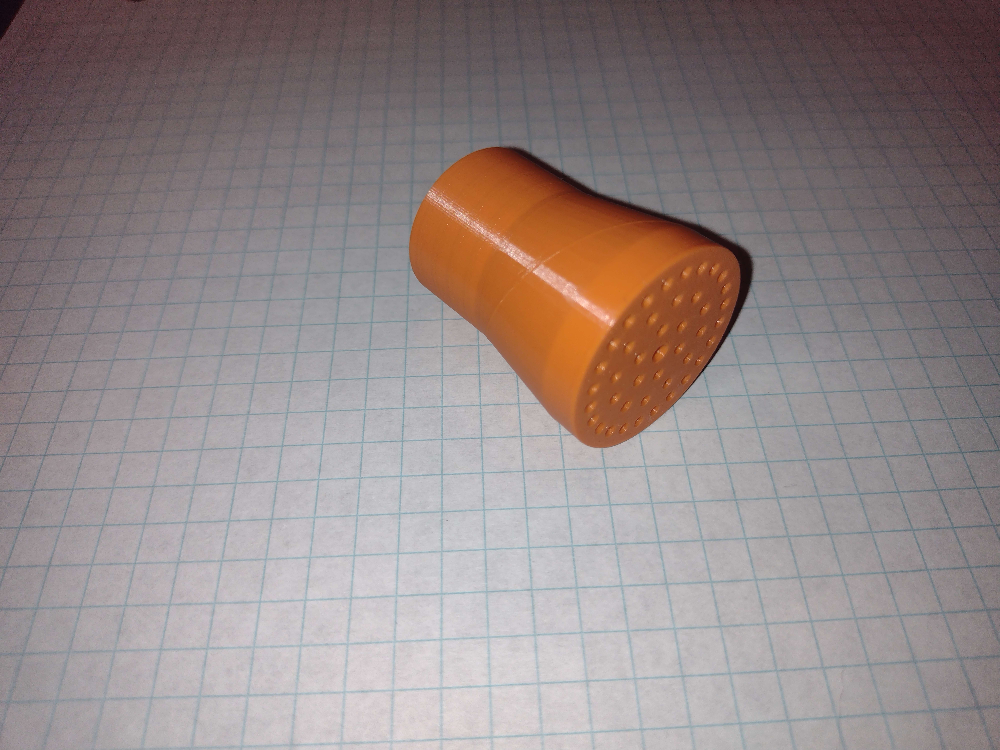
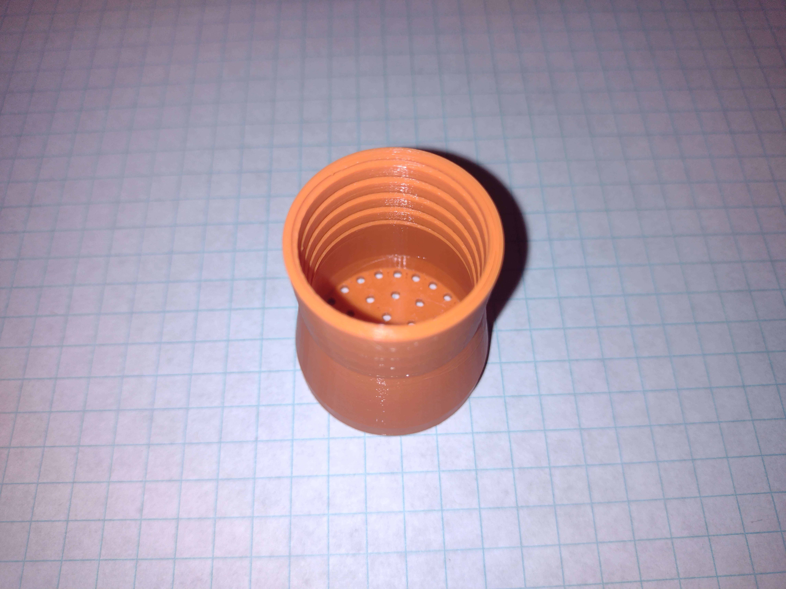
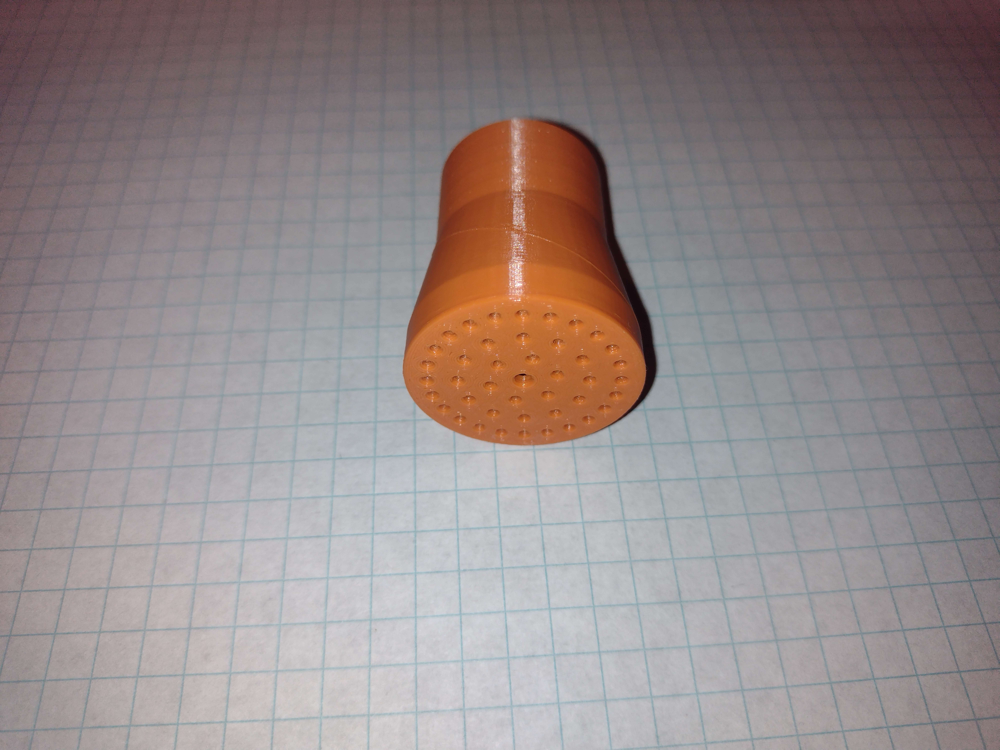

# 04001 - Watering Can Nozzle

This single-piece 3-D printable nozzle features an internal thread compatible with a generic watering can.

[3d model to print](resources/watering_can_nozzle_threaded_v1.3mf)

[FreeCAD file](resources/watering_can_nozzle.FCStd)

*Matt DiPalma, AMDG*

