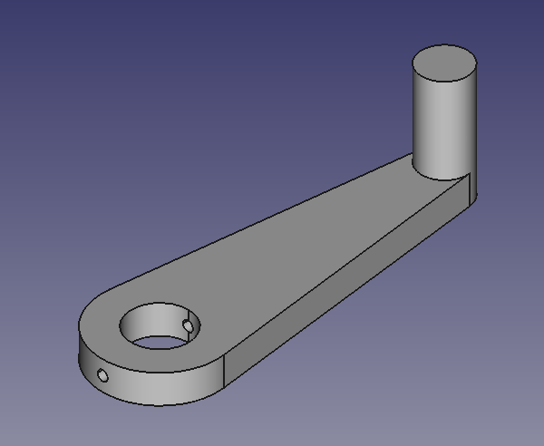

# 04003 - Hand-Crank

This prototype modular parametric hand crank is intended to be used on other prototypes. It is designed to be constructed from easily accessible materials and to be completely deconstructable.

This crank can be mounted to a drive shaft with a threaded cross-hole via a compatible screw.

The linked FreeCAD file is fully geometrically parametrized. The identifying part number also encodes all these geometric parameters. For example, the part number `04003_100_10_30_20_10_8_3.5` describes the geometry tabulated and shown below.

| Parameter                             |   Value   |
| :------------------------------------ | :-------: |
| Nominal Arm Length                    |  100 mm   |
| Body Thickness                        |   10 mm   |
| Handle Length                         |   30 mm   |
| Drive Shaft Diameter                  |   20 mm   |
| Drive Shaft Attachment Wall Thickness |   10 mm   |
| Handle Diameter                       |    8 mm   |
| Attachment Screw Hole Diameter        |  3.5 mm   |

[FreeCAD master geometry file](resources/04003.FCStd)

### Models

[04003_100_10_30_20_10_8_3.5.3mf](resources/04003_100_10_30_20_10_8_3.5.3mf)

*Matt DiPalma, AMDG*