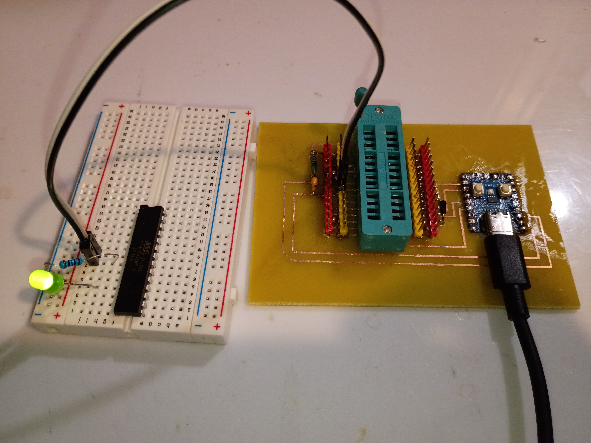

# 12001 - RP2040 AVR PCB

AVR (Atmega328P) programmer via RP2040 zero dev board and custom in-house built PCB.

## Objective: 
To address a lot of pending questions for future designs involving microcontrollers on MS-produced PCBs along with some programming and toolchain investigations, this is an RP2040-powered programmer for the Atmega328P. The stretch goal is to have this investigation complete by 2025-12-21.

## Target Project Milestones: 

-[Completed 2025-12-15]: [Simple test blink program for atmega328p (easy)](code/001_atmega328p_blink)

-[Completed 2025-12-15]: [Simple test blink program on waveshare rp2040 zero board (easy)](code/002_rp2040_blink)

-[Completed 2025-12-15]: [Serial communication to control LED on rp2040 zero (medium)](code/003_rp2040_serial_blink)

-[Completed 2025-12-19]: [Implement AVR ICSP protocol on rp2040, use oscilloscope to capture the output signal for debugging (hard)](code/005_rp2040_icsp)

-[Completed 2025-12-19]: [Computer program/script to send necessary serial commands to rp2040 to transmit the data and program the atmega328p (medium)](code/005_rp2040_icsp)

-[Completed 2025-12-20]: [PCB design for programmer circuit and some header pins/led on the atmega for simple debugging, like a dev board (medium)](cad/12001-001)

-[Completed 2025-12-20]: Create the actual PCB in house (hard) 

