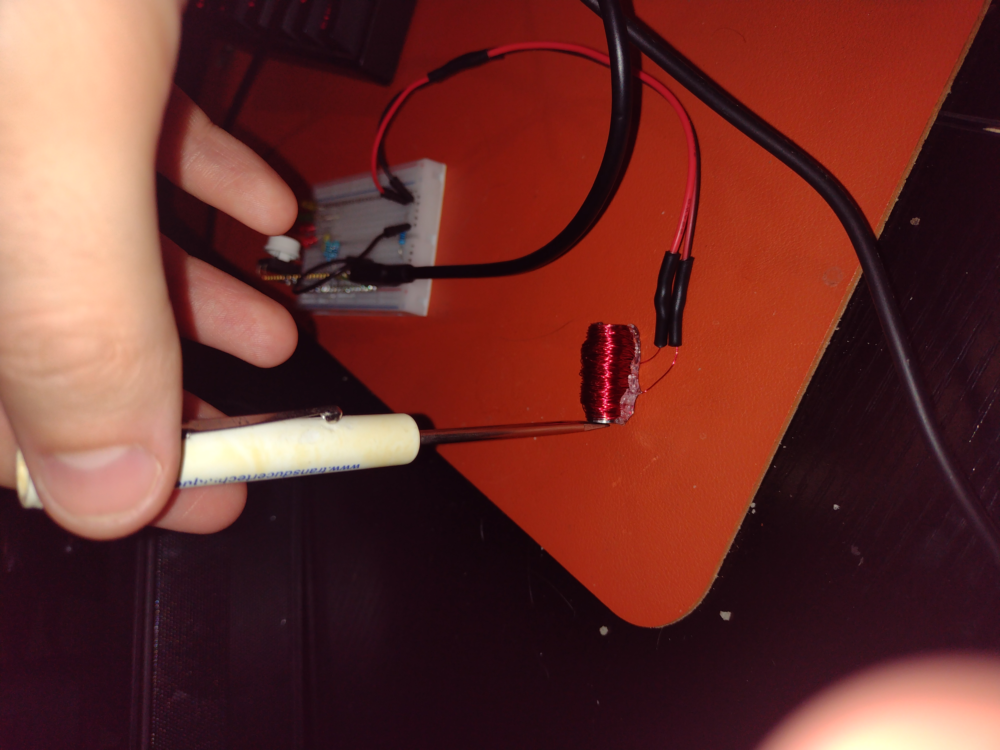
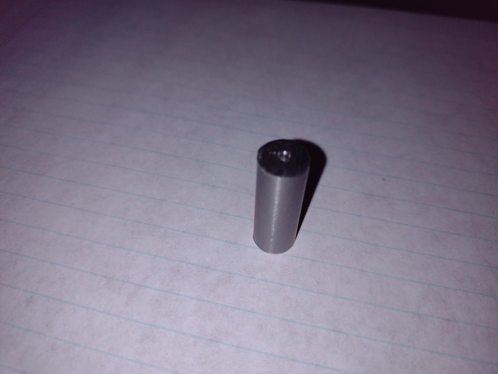
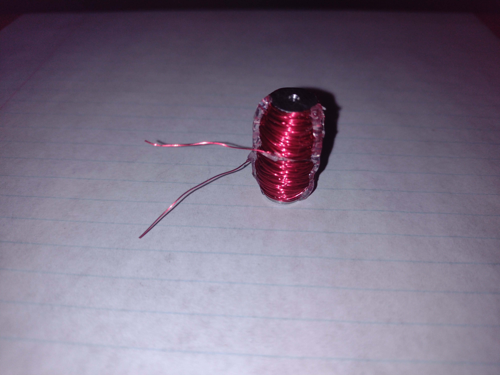

13001 GPIO Electromagnet
========================
*Matt DiPalma, AMDG*

Schedule
--------
  * Brainstorm - Feb 4, 2025
  * Acquire Parts - Feb 5, 2025
  * Start Build - Feb 15, 2025
  * Finish Build - Feb 15, 2025
  * Collect Data - Feb 15-16, 2025
  * Begin Report - Feb 16, 2025
  * Complete Report - WIP

Abstract
---------
As part of an attempt to design and fabricate a human-observable output for a low-power GPIO pin state, this project investigates the possibility of using an easily-manufactured electromagnet to move the needle of a compass. The project was a success, and various data and observations were collected.

Objective
---------
While LEDs, buzzers, motors, and other typical microcontroller output devices are commonplace, they are either too complex to be fabricated in the home shop, or their current draw exceeds the permissible value for a GPIO pin of an average microcontroller (10-20mA).

One "output" device that can be easily fabricated and can be setup to draw only a small amount of current is an electromagnet. At 15mA, the magnetic field generated will certainly not be strong enough to actuate a lever arm, like a relay, but it might be strong enough to affect the orientation of a compass needle placed very close to the electromagnet.

The objective of this project is to prove that a human-observable output for a standard microcontroller GPIO pin can, in fact, be fabricated from scratch from raw materials. The definitions of "scratch" and "raw materials" are debatable.

Parts List
----------
The following materials were used in the fabrication of the electromagnet:
  * 3/8" diameter stainless steel rod (alloy 416) (McMaster # 89095K56)
  * 30AWG enameled copper "magnet" wire
  * hot glue
  * sandpaper

The following materials were used to test the system:
  * solderless breadboard
  * 2x 100 ohm resistors
  * jumper cables
  * microcontroller (Raspberry Pi Pico)
  * compass

Design & Procedure
------------------

The electromagnet was produced as follows. A 1" length of the stainless steel rod was cut with a hacksaw (very easy). The enameled copper wire was wrapped 300 times around the steel rod. Hot glue was used sparingly to secure the windings. The enamel on the loose ends of the copper wire was removed with sandpaper.

Though not required, in order to simplify the use of the electromagnet, lead wires were soldered to the ends and heat-shrink tubing was used to further secure these joints.

Jumper wires were used to connect the electromagnet to a solderless breadboard. 200 ohms worth of resistors were placed in series with the electromagnet to reduce the max current draw on the microcontroller output pin to around 15mA. GPIO pin #0 was used for this investigation, and the C code used to activate this pin is included with this report.

The electromagnet was placed on top of a compass.

Results & Observations
----------------------
The 416 stainless steel rod is magnetic.

The resistance of the coil was measured to be 4.2 ohms.

When energized, the electromagnet gently attracts the needle of the compass. The needle swings and oscillates about the electromagnet, when it is energized, and about magnetic North, when the magnet is not energized.

The electromagnet was capable of drawing the needle from a maximum displaced angle of 60 degrees East or West, corresponding to roughly 3/4" lateral distance in each direction.

Discussion
----------
Only certain alloys of stainless steel are "ferromagnetic". All of these alloys are supposedly martensitic, which refers to the SAE 400-series of stainless steel. Cold working and annealing are also reported to improve ferromagnetic properties of stainless steel. The 416 alloy used in this investigation is common and purportedly "easy-to-machine" in its McMaster-Carr listing. However, this alloy is not common enough to be sourced from local hardware stores or on Amazon.

Winding the coil was relatively easy and quick. Because there were no caps or other features on the ends of the rod to retain the windings, at several points, the windings sprung off the ends of the rod, but they were easily recovered. The stainless core diameter is 3/8", and the coil outer diameter is 1/2", meaning the average diameter of the coil can be approximated as 7/16".

All electrical connections to the electromagnet were twisted together and soldered. The solder joints appeared strong and complete, however, I was unable to repeat the same 4.2 ohm coil resistance reading once I had soldered leader wires and jumper wires (4 joints). This might have been due to low-battery or some other issue with the multimeter.

Conclusions
-----------
  * Thin sections of stainless steel can be cut very easily by hand with a hacksaw.
  * Coils can be wound extremely quickly and easily, although having "bobbin-like" end features on the core can help simplify the process.
  * Heat-shrink tubing must be threaded onto the wires before the solder joint is made, and heat from the soldering iron is best kept away from the tubing until shrinking is desired.
  * A weak electromagnet can easily be fabricated in the home shop, and can produce a magnetic field strong enough to deflect the needle of a nearby compass, under only the power supplied through the GPIO pin of a microcontroller (15mA).