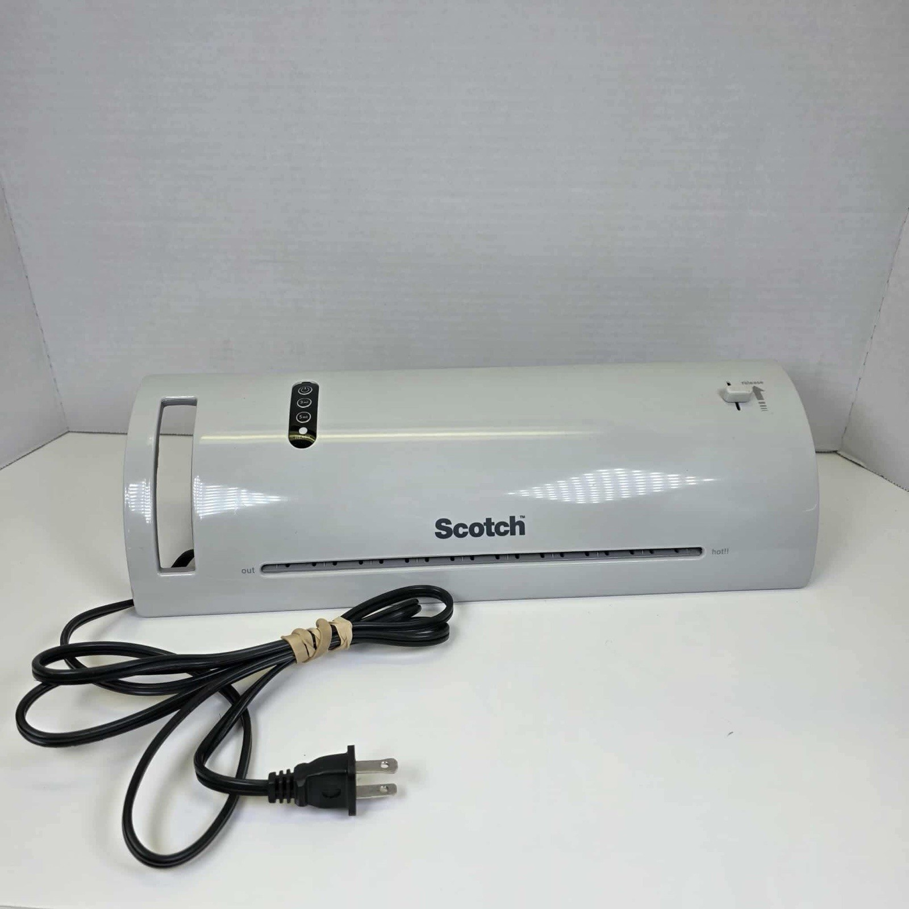

# 43001 - TL902 Laminator Mods
### *PCB Manufacturing Mods for TL902 Laminator*

Unadulturated Laminator:

## #1: Roller Temperature Increase

This very common modification puts a potentiometer in series with the thermistor to increase the target temperature in the control system.

## #2: Roller Separation Increase

This mod replaces the internal brackets that support the silicone rollers with 3D-printed versions that increase the roller separation enough to accept standard 0.8mm-1.6mm copper clad board.